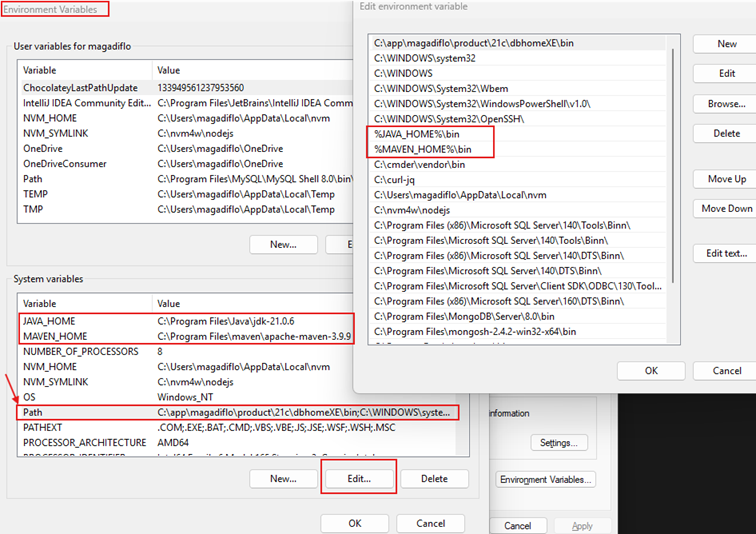
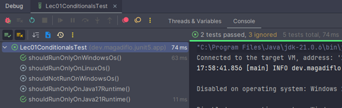
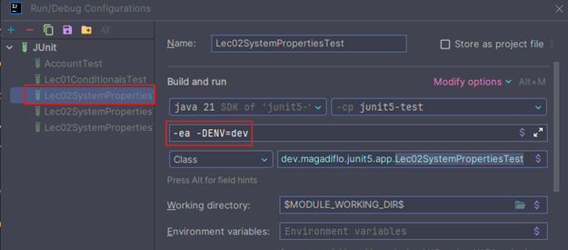
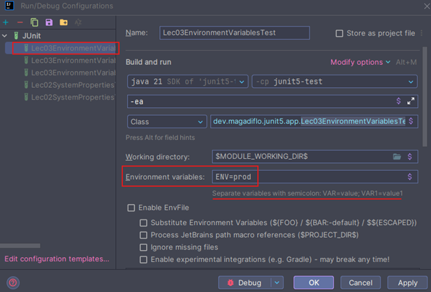
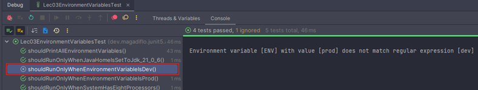
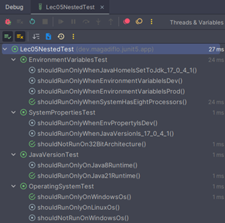
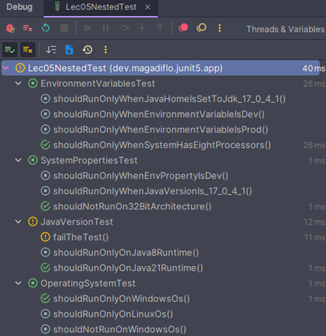

# 🧪 JUnit 5

---

## 📦 Creando y configurando el proyecto con JUnit 5

El primer paso para trabajar con `JUnit 5` en un proyecto de `Java puro` con `Maven` es declarar las dependencias y
configurar el plugin que permitirá ejecutar las pruebas.

````xml
<?xml version="1.0" encoding="UTF-8"?>
<project xmlns="http://maven.apache.org/POM/4.0.0"
         xmlns:xsi="http://www.w3.org/2001/XMLSchema-instance"
         xsi:schemaLocation="http://maven.apache.org/POM/4.0.0 http://maven.apache.org/xsd/maven-4.0.0.xsd">
    <modelVersion>4.0.0</modelVersion>

    <groupId>dev.magadiflo</groupId>
    <artifactId>junit5-test</artifactId>
    <version>1.0-SNAPSHOT</version>

    <properties>
        <maven.compiler.source>21</maven.compiler.source>
        <maven.compiler.target>21</maven.compiler.target>
        <project.build.sourceEncoding>UTF-8</project.build.sourceEncoding>
    </properties>
    <dependencies>
        <!-- JUnit 5 (Jupiter) -->
        <dependency>
            <groupId>org.junit.jupiter</groupId>
            <artifactId>junit-jupiter</artifactId>
            <version>5.13.4</version>
            <scope>test</scope>
        </dependency>

        <!-- AssertJ para aserciones modernas y expresivas -->
        <dependency>
            <groupId>org.assertj</groupId>
            <artifactId>assertj-core</artifactId>
            <version>3.25.3</version>
            <scope>test</scope>
        </dependency>

        <!-- SLF4J (API de logging independiente de la implementación) -->
        <dependency>
            <groupId>org.slf4j</groupId>
            <artifactId>slf4j-api</artifactId>
            <version>2.0.17</version>
        </dependency>

        <!-- Logback (implementación de logging basada en SLF4J, sucesor de Log4j) -->
        <dependency>
            <groupId>ch.qos.logback</groupId>
            <artifactId>logback-classic</artifactId>
            <version>1.5.18</version>
            <scope>compile</scope>
        </dependency>
    </dependencies>
    <build>
        <plugins>
            <!-- Plugin para ejecutar pruebas desde consola -->
            <plugin>
                <groupId>org.apache.maven.plugins</groupId>
                <artifactId>maven-surefire-plugin</artifactId>
                <version>3.5.4</version>
            </plugin>
        </plugins>
    </build>

</project>
````

### 📘 Sobre la dependencia `junit-jupiter`

La dependencia `junit-jupiter` es un "paquete todo en uno" que agrupa tres componentes principales:

- `junit-jupiter-api`: API principal para escribir pruebas con anotaciones como `@Test`, `@BeforeEach`, `@DisplayName`,
  etc.
- `junit-jupiter-engine`: motor de ejecución que permite correr las pruebas escritas con la API.
- `junit-jupiter-params`: módulo adicional para pruebas parametrizadas con `@ParameterizedTest`, `@ValueSource`,
  `@CsvSource`, entre otros.

El `scope` definido como `test` indica que estas dependencias se usan exclusivamente en el entorno de pruebas, y no se
incluyen en el empaquetado final de la aplicación. Esto es común en bibliotecas como `JUnit`, `Mockito` o `AssertJ`.

### 📘 Sobre la dependencia `assertj-core` (opcional, pero recomendable)

`AssertJ` es una librería que extiende las capacidades de `JUnit` y ofrece un estilo moderno para escribir aserciones
basado en el método `assertThat(...)`, ampliamente recomendado por su expresividad, legibilidad y capacidad de
encadenamiento.

Esta biblioteca se integra perfectamente con `JUnit 5` y ofrece una sintaxis fluida para validar resultados,
colecciones, excepciones, fechas, objetos personalizados, entre otros.

> `Nota`: Esta dependencia es opcional. Si solo se desea ejecutar pruebas básicas, basta con incluir `junit-jupiter`.
> Sin embargo, en este proyecto se ha agregado `assertj-core` para beneficiarnos de un estilo de aserción más legible,
> expresivo y alineado con buenas prácticas modernas.

Ventajas principales:

- ✅ Aserciones más legibles y naturales: `assertThat(valor).isEqualTo(...)`.
- ✅ Encadenamiento de condiciones en una sola línea.
- ✅ Mensajes de error más claros y detallados.
- ✅ Soporte para estructuras complejas como listas, mapas, streams, etc..

> En proyectos `Spring Boot`, `AssertJ` ya viene incluido de forma transitiva al usar `spring-boot-starter-test`. Sin
> embargo, en proyectos `Java puro` como este módulo, es necesario agregarlo explícitamente.

### 📝 Logging en el proyecto: SLF4J + Logback

En pruebas unitarias es común imprimir valores con `System.out.println(...)` para depurar, pero esto no es una buena
práctica en proyectos reales. La forma recomendada es usar un framework de `logging` que sea:

- 📊 Consistente en todo el proyecto.
- ⚙️ Configurable según el entorno (desarrollo, pruebas, producción).
- 🔍 Filtrable por niveles (DEBUG, INFO, WARN, ERROR).
- 🔌 Extensible (escribir logs en archivos, consola, sistemas externos, etc.).

Por eso agregamos las dependencias al `pom.xml`: `slf4j-api` y el `logback-classic`.

#### 📘 `¿Qué es SLF4J?`

- `SLF4J` (Simple Logging Facade for Java) es una fachada de logging.
- Define una API genérica para escribir logs, pero no implementa el almacenamiento de los mismos.
- Permite que el código de la aplicación sea independiente de la librería de logging concreta.
  > 👉 Con `SLF4J` escribes tus logs siempre igual (`logger.info(...)`, `logger.error(...)`), y detrás puedes cambiar de
  > implementación (`Logback`, `Log4j2`, `JUL`, etc.) sin modificar tu código.

#### 📘 `¿Qué es Logback?`

- `Logback` es una de las implementaciones más populares de `SLF4J`.
- Es el sucesor de `Log4j` y está diseñado para ser más rápido y flexible.
- Permite definir configuraciones avanzadas en el archivo `logback.xml` (nivel de logs, formato, appender a archivos,
  etc.).

### ⚙️ Sobre el plugin `maven-surefire-plugin`

El plugin `surefire` permite ejecutar pruebas desde la terminal usando `Maven`, sin necesidad de un entorno gráfico.
Aunque durante el desarrollo solemos usar el IDE (por ejemplo, `IntelliJ IDEA`, con `Ctrl + Shift + F10` para ejecutar
una clase o método de prueba), existen escenarios donde esto no es posible:

- Ejecución remota en servidores o entornos de integración continua `CI/CD`.
- Máquinas sin entorno gráfico o sin IDE instalado.
- Automatización de pruebas como parte de un pipeline.

En esos casos, este plugin permite ejecutar las pruebas con un simple comando:

````bash
$ mvn test
````

#### 💡 Buenas prácticas iniciales

- Usa nombres descriptivos en las pruebas (`shouldCalculateTotalCorrectly()` en vez de `test1()`).
- Aplica la convención `Given-When-Then` para estructurar el cuerpo de la prueba.
- Prefiere `AssertJ` frente a `Assertions.assertEquals(...)` por legibilidad.
- Mantén tus clases de prueba en un paquete paralelo a la lógica de negocio (ej: `src/test/java/dev/magadiflo/...`).

## ⚙️ Configuración de Maven y variables de entorno

Para ejecutar pruebas desde consola con `maven`, primero debemos instalarlo en la máquina local y configurar sus
variables de entorno.

### 📥 Instalación de Maven

- Ir a la página de maven y descargar el binario [Binary zip archive](https://maven.apache.org/download.cgi).
- En mi caso descargué el archivo: `apache-maven-3.9.9-bin.zip`.
- Descomprimimos el archivo en un directorio de nuestra preferencia, por ejemplo:
  `C:\Program Files\maven\apache-maven-3.9.9`.

### 🖥️ Configuración de variables de entorno (Windows)

- Ir a las variables de entorno del sistema en windows.
- En `System variables` creamos la variable `MAVEN_HOME`, similar a cómo creamos la variable `JAVA_HOME` para
  java.
- El valor de la variable `MAVEN_HOME` será la ruta de nuestro binario descargado:
  `MAVEN_HOME=C:\Program Files\maven\apache-maven-3.9.9`.
- En `System variables` editamos la variable `Path` la parte faltante a nuestra ruta de maven:
  `%MAVEN_HOME%\bin`.

Al final deberíamos tener algo como esto:



### ✅ Verificación de instalación

Cierra cualquier terminal abierta, abre una nueva ventana de cmd o PowerShell y ejecutamos `mvn -version`. Si todo está
configurado correctamente, deberíamos obtener una salida similar a:

````bash
$ mvn -version
Apache Maven 3.9.9 (8e8579a9e76f7d015ee5ec7bfcdc97d260186937)
Maven home: C:\Program Files\maven\apache-maven-3.9.9
Java version: 21.0.6, vendor: Oracle Corporation, runtime: C:\Program Files\Java\jdk-21.0.6
Default locale: en_US, platform encoding: UTF-8
OS name: "windows 11", version: "10.0", arch: "amd64", family: "windows"
````

## ▶️ Ejecutar pruebas: IDE vs Consola

En proyectos de `Java` con `Maven`, podemos ejecutar las pruebas de dos formas principales:

### 1️⃣ Desde el IDE (IntelliJ IDEA)

La opción más sencilla durante el desarrollo es ejecutar pruebas directamente desde el IDE:

- En `IntelliJ IDEA`, ubica el proyecto en el panel de `Maven`:
    ````bash
    $ Maven/junit5-test/Lifecycle/test
    ````
- Haz clic derecho en `test` y selecciona `Run junit5-test [test]`.

📌 Ventaja:

- Ideal para desarrollo rápido y depuración.
- Permite correr pruebas individuales, con cobertura y con depurador.

### 2️⃣ Desde la consola con Maven

También podemos ejecutar las pruebas sin depender de un IDE usando el comando básico `mvn test`. Esto es útil en:

- 🖥️ Servidores sin entorno gráfico.
- 🤖 Pipelines de CI/CD (GitHub Actions, Jenkins, GitLab CI, etc.).
- 📦 Automatización de validaciones antes de desplegar.

Ejemplo de ejecución (sin tests implementados aún):

````bash
D:\programming\spring\01.udemy\02.andres_guzman\03.junit_y_mockito_2023\java-spring-test-suite\junit5-test (feature/junit5)
$ mvn test
[INFO] Scanning for projects...
[INFO]
[INFO] ---------------------< dev.magadiflo:junit5-test >----------------------
[INFO] Building junit5-test 1.0-SNAPSHOT
[INFO]   from pom.xml
[INFO] --------------------------------[ jar ]---------------------------------
[INFO]
[INFO] --- resources:3.3.1:resources (default-resources) @ junit5-test ---
[INFO] Copying 0 resource from src\main\resources to target\classes
[INFO]
[INFO] --- compiler:3.13.0:compile (default-compile) @ junit5-test ---
[INFO] Nothing to compile - all classes are up to date.
[INFO]
[INFO] --- resources:3.3.1:testResources (default-testResources) @ junit5-test ---
[INFO] skip non existing resourceDirectory D:\programming\spring\01.udemy\02.andres_guzman\03.junit_y_mockito_2023\java-spring-test-suite\junit5-test\src\test\resources
[INFO]
[INFO] --- compiler:3.13.0:testCompile (default-testCompile) @ junit5-test ---
[INFO] Nothing to compile - all classes are up to date.
[INFO]
[INFO] --- surefire:3.5.4:test (default-test) @ junit5-test ---
[INFO] No tests to run.
[INFO] ------------------------------------------------------------------------
[INFO] BUILD SUCCESS
[INFO] ------------------------------------------------------------------------
[INFO] Total time:  3.345 s
[INFO] Finished at: 2025-09-29T16:05:28-05:00
[INFO] ------------------------------------------------------------------------
````

📌 Ventaja:

- Estándar en automatización y despliegues.
- Permite ejecutar todas las pruebas o un subconjunto (según configuración).

### 3️⃣ Ejecutar tests específicos con `@Tag`

`JUnit 5` permite categorizar pruebas con la anotación `@Tag`. Esto es útil para agrupar tests
(por ejemplo: `unit`, `integration`, `slow`, `account`).

Ejemplo de test con un `@Tag`:

````java
class AccountServiceTest {
    @Test
    @Tag("account")
    void shouldCreateAccountSuccessfully() {
        // lógica de prueba
    }
}
````

Para ejecutar solo los tests con un `tag específico`, debemos configurarlo en el plugin `maven-surefire-plugin`:

````xml

<plugin>
    <groupId>org.apache.maven.plugins</groupId>
    <artifactId>maven-surefire-plugin</artifactId>
    <version>3.5.4</version>
    <!-- Ejecutar un tag en específico -->
    <configuration>
        <groups>account</groups>
    </configuration>
</plugin>
````

Ahora, al ejecutar:

````bash
$ mvn test
````

Solo se ejecutarán los tests anotados con `@Tag("account")`.

📌 Nota importante:

- Si no configuramos `groups`, `Maven` ejecutará todas las pruebas.
- Podemos especificar múltiples grupos separados por comas: `<groups>unit,integration</groups>`

---

## 🏦 Creando la clase Account (Cuenta)

Antes de escribir pruebas unitarias, necesitamos una clase sencilla que represente un objeto de negocio.
En este caso, modelaremos una Cuenta bancaria (`Account`) con dos atributos principales:

- 👤 `person` → nombre del titular de la cuenta.
- 💰 `balance` → saldo de la cuenta, representado con `BigDecimal`.

````java
public class Account {
    private String person;
    private BigDecimal balance;

    public String getPerson() {
        return person;
    }

    public void setPerson(String person) {
        this.person = person;
    }

    public BigDecimal getBalance() {
        return balance;
    }

    public void setBalance(BigDecimal balance) {
        this.balance = balance;
    }
}
````

### 📘 Notas de diseño

- Usamos `BigDecimal` en lugar de double o float para representar dinero, ya que evita problemas de precisión en
  cálculos financieros.
- La clase está en su forma más simple (`POJO: Plain Old Java Object`), con atributos privados y getters/setters
  públicos.
- Al inicio solo contiene estado (datos), pero más adelante podemos extenderla con comportamiento (métodos) como
  `debit()`, `credit()`, etc. para enriquecer las pruebas.

## 🧪 Escribiendo y ejecutando nuestras primeras pruebas unitarias

Ahora que ya tenemos nuestra clase `Account`, vamos a dar el siguiente paso: crear su primera clase de pruebas unitarias
con `JUnit 5`.

### ⚡ Creando la clase de prueba desde IntelliJ IDEA

Podríamos crear la clase de prueba manualmente, pero `IntelliJ` nos facilita esta tarea con el atajo:

````bash
Ctrl + Shift + T
````

Este atajo puede hacer lo siguiente según el contexto:

- ✨ `Crear automáticamente una clase de prueba` a partir de la clase base (si el cursor está dentro de `Account`).
- 🔄 `Navegar entre clase y test`: si ya existe la clase de prueba, podemos saltar de la clase `Account` a `AccountTest`
  y viceversa.
- ➕` Agregar nuevos métodos de test` a la clase ya existente.

Al generarse automáticamente, la clase de prueba se verá así:

````java
package dev.magadiflo.junit5.app.model;

import static org.junit.jupiter.api.Assertions.*;

class AccountTest {

}
````

Fijémonos en la línea:

````java
import static org.junit.jupiter.api.Assertions.*; 
````

- Esta importación estática corresponde a `JUnit 5` y nos permite usar directamente sus métodos de aserción clásicos
  como: `assertEquals(...)`, `assertTrue(...)`, `assertThrows(...)`, etc.

Sin embargo, en este proyecto también incluimos `AssertJ`, que nos da un estilo de aserciones mucho más expresivo.
Para usarlo necesitamos añadir:

````java
import static org.assertj.core.api.Assertions.assertThat;
````

#### 🎯 Estrategia que seguiremos

- Mantendremos ambos estilos de aserciones (`JUnit` y `AssertJ`) dentro del proyecto.
- La idea es comparar las diferencias en expresividad y legibilidad.
- A medida que avancemos, verás cómo `AssertJ` se vuelve más natural en casos complejos (listas, excepciones, objetos
  anidados, etc.).

### 📝 Creando el primer método de prueba

Sigamos con el atajo para generar un método de prueba:

````bash
Alt + insert
Seleccionamos Test Method
````

Y seleccionamos `Test Method`. Esto generará un método vacío con la anotación `@Test`:

````java
class AccountTest {
    @Test
    void shouldHaveAvailableBalanceAfterDeposit() {
        // Aquí irá nuestra lógica de prueba
    }
}
````

💡 Buenas prácticas sobre visibilidad en pruebas

Por convención:

- La clase de prueba debería declararse con acceso por `default (package-private)`, es decir, `class AccountTest {}`,
  y no `public class AccountTest {}`.
- Lo mismo aplica a los métodos de prueba: `void shouldHaveAvailableBalanceAfterDeposit() {}` en lugar de
  `public void ....`

Esto se hace porque las pruebas son internas al módulo y no deberían estar expuestas públicamente fuera del contexto
de ejecución de los tests.

En otras palabras: las pruebas `no forman parte del API de tu aplicación, sino de su suite de verificación`.

## Creando nuestra primera prueba

### 1. Preparando la clase Account

Vamos a darle un constructor a nuestra clase `Account` que reciba dos parámetros: `person` y `balance`.

Pero de manera `intencional`, cometeremos un error: asignaremos solo el balance al atributo, dejando el person sin
asignar.

````java

public class Account {
    private String person;
    private BigDecimal balance;

    public Account(String person, BigDecimal balance) {
        this.balance = balance; // 👈 intencionalmente olvidamos asignar 'person'
    }

    /* getters and setters */
}
````

### 2. Escribiendo la prueba

Ahora, desde la clase de prueba, creamos un objeto con datos conocidos y validamos que el nombre de la persona sea
correctamente retornado:

````java
class AccountTest {
    @Test
    void shouldReturnCorrectPersonNameWhenAccountIsCreated() {
        Account account = new Account("Martín", new BigDecimal("2000"));

        String real = account.getPerson();

        // JUnit 5
        assertEquals("Martín", real);

        // AssertJ
        assertThat(real).isEqualTo("Martín");
    }
}
````

### 3. Ejecutando la prueba

Para correrla desde `IntelliJ` presionamos: `Ctrl + Shift + F10`. El resultado esperado es un fallo, ya que olvidamos
asignar el parámetro person en el constructor:

````bash
org.opentest4j.AssertionFailedError: 
Expected :Martín
Actual   :null
````

### 4. Corrigiendo la clase base

Al revisar el constructor notamos el problema: `faltó asignar person`. Lo corregimos así:

````java
public class Account {
    private String person;
    private BigDecimal balance;

    public Account(String person, BigDecimal balance) {
        this.person = person;   // ✅ corregido
        this.balance = balance;
    }
    /* Getters and Setters */
}
````

### 5. Volvemos a ejecutar

Ejecutamos otra vez la prueba y ahora sí:

> ✅ la prueba pasa exitosamente.

## 💰 Escribiendo pruebas para el balance (saldo)

Ahora validaremos que, al crear una cuenta con un saldo inicial, este sea positivo.

````java
class AccountTest {
    @Test
    void shouldHavePositiveBalanceWhenAccountIsCreated() {
        Account account = new Account("Martín", new BigDecimal("2000"));

        // JUnit 5
        assertEquals(2000D, account.getBalance().doubleValue());
        assertNotEquals(-1, account.getBalance().compareTo(BigDecimal.ZERO));
        assertEquals(1, account.getBalance().compareTo(BigDecimal.ZERO));

        // AssertJ
        assertThat(account.getBalance()).isEqualByComparingTo("2000");
        assertThat(account.getBalance().compareTo(BigDecimal.ZERO)).isNotEqualTo(-1);
        assertThat(account.getBalance().compareTo(BigDecimal.ZERO)).isGreaterThan(0);
    }
}
````

### 1. Comparación directa del saldo

Sobre: `assertEquals(2000D, account.getBalance().doubleValue())`

- Convertimos el `BigDecimal` en `double` para hacer la comparación numérica.
- Es una forma rápida, pero puede no ser la más precisa debido a las particularidades de los decimales en coma
  flotante.

### 2. Verificando que el saldo no sea negativo

Sobre: `assertNotEquals(-1, account.getBalance().compareTo(BigDecimal.ZERO))`

- `compareTo(BigDecimal.ZERO)` devuelve:
    - `-1` si es menor que 0
    - `0` si es igual a 0
    - `1` si es mayor que 0
- En este caso, aseguramos que el resultado `no sea -1`, es decir, que no sea negativo.

### 3. Verificando que el saldo es mayor que 0

Sobre: `assertEquals(1, account.getBalance().compareTo(BigDecimal.ZERO))`

- Aquí confirmamos explícitamente que el resultado sea `1`, o sea, que el saldo es estrictamente mayor que cero.

### ✨ Diferencias con AssertJ

- `isEqualByComparingTo("2000")` → compara directamente valores de tipo `BigDecimal` de manera precisa
  (mejor que convertir a double).
- `isGreaterThan(0)` → mucho más expresivo que `assertEquals(1, compareTo(...))`.
- El código resulta más legible y cercano al lenguaje natural.

### 📌 Conclusión

> Con `JUnit 5` puedes lograr las validaciones, pero `AssertJ` te permite escribir pruebas más expresivas y fáciles
> de leer, especialmente cuando trabajas con objetos como `BigDecimal`.

## 🧪 Test Driven Development (TDD)

Con TDD primero escribimos la prueba, luego implementamos la solución. Esto nos permite guiar el diseño del código a
través de los tests.

En este ejemplo trabajaremos con la clase `Account`. Queremos comprobar la igualdad de objetos:

### Caso 1: Comparación por referencia (default en Java)

Creamos dos cuentas distintas pero con los mismos valores:

````java
class AccountTest {
    @Test
    void shouldNotBeSameReferenceWhenAccountAreCreatedSeparately() {
        Account account1 = new Account("Liz Gonzales", new BigDecimal("2500.00"));
        Account account2 = new Account("Liz Gonzales", new BigDecimal("2500.00"));

        // JUnit 5
        assertNotEquals(account1, account2);

        // AssertJ
        assertThat(account1).isNotSameAs(account2);
    }
}
````

✅ Este test pasará porque, aunque los atributos sean iguales, las referencias de memoria son distintas.
Java, por defecto, compara los objetos por referencia.

### Caso 2: Nueva regla de negocio → Comparar por valor

El negocio ahora exige que dos cuentas con mismos datos deben ser consideradas iguales, aunque se hayan creado por
separado.

````java
class AccountTest {
    @Test
    void shouldBeEqualWhenAccountsHaveSameValues() {
        Account account1 = new Account("Liz Gonzales", new BigDecimal("2500.00"));
        Account account2 = new Account("Liz Gonzales", new BigDecimal("2500.00"));

        // JUnit 5
        assertEquals(account1, account2);

        // AssertJ
        assertThat(account1).isEqualTo(account2);
    }
}
````

🚨 Este test falla, porque aún seguimos comparando referencias de memoria. El mensaje de error será algo así:

````bash
org.opentest4j.AssertionFailedError: 
Expected :dev.magadiflo.junit5.app.model.Account@55634720
Actual   :dev.magadiflo.junit5.app.model.Account@4b0d79fc
````

### Caso 3: Implementamos equals() (y hashCode())

Para que la comparación se haga por valor, sobrescribimos el método `equals()` en la clase `Account`.

````java
public class Account {
    /* omitted code */
    @Override
    public boolean equals(Object o) {
        if (o == null || getClass() != o.getClass()) return false;
        Account account = (Account) o;
        return Objects.equals(person, account.person) && Objects.equals(balance, account.balance);
    }

    @Override
    public int hashCode() {
        return Objects.hash(person, balance);
    }
}
````

### Resultado final

Ahora, al ejecutar el test `shouldBeEqualWhenAccountsHaveSameValues()`, este pasa correctamente, porque la igualdad se
hace por valor.

> 📌 `Importante`: mantener también el test de referencia (`shouldNotBeSameReferenceWhenAccountsAreCreatedSeparately`)
> es útil para mostrar la diferencia entre referencia vs valor, reforzando el aprendizaje.

## 🧪 TDD para Débito y Crédito

Aplicando `Test Driven Development (TDD)` seguimos el ciclo clásico:

- ✍️ Escribir la prueba (rojo 🔴, porque fallará).
- 🔨 Implementar lo mínimo necesario para que la prueba pase.
- ✅ Refactorizar si es necesario, manteniendo todas las pruebas en verde.

### Paso 1: Definimos los métodos (aún sin lógica)

Primero declaramos los métodos en la clase `Account`, pero sin implementación:

````java
public class Account {
    /* omitted code */

    public void debit(BigDecimal amount) {
        // pendiente de implementación
    }

    public void credit(BigDecimal amount) {
        // pendiente de implementación
    }
    /* omitted code */
}
````

### Paso 2: Creamos las pruebas unitarias

Ahora escribimos dos tests:

- `shouldReduceBalanceWhenDebitIsApplied()` → valida que al debitar, el saldo disminuye.
- `shouldIncreaseBalanceWhenCreditIsApplied()` → valida que al acreditar, el saldo aumenta.

````java
class AccountTest {
    @Test
    void shouldReduceBalanceWhenDebitIsApplied() {
        Account account = new Account("Martín", new BigDecimal("2000"));
        account.debit(new BigDecimal("100")); // ejecutamos el método a probar

        // JUnit 5
        assertNotNull(account.getBalance());
        assertEquals(1900D, account.getBalance().doubleValue());
        assertEquals("1900", account.getBalance().toPlainString());

        // AssertJ
        assertThat(account.getBalance())
                .isNotNull()
                .isEqualByComparingTo("1900");
    }

    @Test
    void shouldIncreaseBalanceWhenCreditIsApplied() {
        Account account = new Account("Martín", new BigDecimal("2000"));
        account.credit(new BigDecimal("100")); // ejecutamos el método a probar

        // JUnit 5
        assertNotNull(account.getBalance());
        assertEquals(2100D, account.getBalance().doubleValue());
        assertEquals("2100", account.getBalance().toPlainString());

        // AssertJ
        assertThat(account.getBalance())
                .isNotNull()
                .isEqualByComparingTo("2100");
    }
}
````

🚨 Ambos tests fallarán, porque aún no hemos implementado la lógica de negocio:

````bash
org.opentest4j.AssertionFailedError: 
Expected :1900.0
Actual   :2000.0
````

````bash
org.opentest4j.AssertionFailedError: 
Expected :2100.0
Actual   :2000.0
````

### Paso 3: Implementamos la lógica

Ahora completamos los métodos en la clase Account:

````java
public class Account {
    public void debit(BigDecimal amount) {
        this.balance = this.balance.subtract(amount);
    }

    public void credit(BigDecimal amount) {
        this.balance = this.balance.add(amount);
    }
}
````

### ✅ Resultado Final

Al ejecutar nuevamente los tests, ahora sí pasan en verde 🎉, porque ya se actualiza correctamente el atributo
`balance`:

- `debit` → resta el monto al saldo.
- `credit` → suma el monto al saldo.

## ⚠️ Probando y afirmando excepciones

En este paso simularemos un `escenario de error controlado`: cuando se intente debitar más dinero del que la cuenta
posee. Para manejar este caso, crearemos una excepción personalizada llamada `InsufficientMoneyException`.

### 🛠️ Creando la excepción personalizada

````java
public class InsufficientMoneyException extends RuntimeException {
    public InsufficientMoneyException(String message) {
        super(message);
    }
}
````

Al extender de `RuntimeException`, no será obligatorio declararla en la firma del método
(`checked` vs `unchecked exception`).

### 🧪 TDD → Primero escribimos la prueba

Queremos que el método `debit()` lance la excepción si el monto (`amount`) excede al `balance` de la cuenta:

````java
class AccountTest {
    @Test
    void shouldThrowInsufficientMoneyExceptionWhenDebitExceedsBalance() {
        Account account = new Account("Martín", new BigDecimal("2000"));
        BigDecimal amount = new BigDecimal("5000");

        // JUnit 5
        InsufficientMoneyException exception = assertThrows(InsufficientMoneyException.class, () -> {
            account.debit(amount);
        }, "Se esperaba que InsufficientMoneyException fuera lanzado"); //<-- Nuestro mensaje a mostrar cuando falle
        assertEquals(InsufficientMoneyException.class, exception.getClass());
        assertEquals("Dinero insuficiente", exception.getMessage());

        // AssertJ
        assertThatThrownBy(() -> account.debit(amount))
                .isInstanceOf(InsufficientMoneyException.class)
                .hasMessage("Dinero insuficiente");
    }
}
````

🔎 Aquí estamos usando:

- `JUnit 5` → `assertThrows()`: captura y nos permite inspeccionar la excepción.
- `AssertJ` → `assertThatThrownBy()`: ofrece una API más expresiva y fluida.

### ❌ Fallo esperado antes de la implementación

Como aún no hemos implementado la lógica en `debit()`, el test fallará:

````bash
org.opentest4j.AssertionFailedError: Expected dev.magadiflo.junit5.app.exception.InsufficientMoneyException to be thrown, but nothing was thrown.
````

### ✅ Implementación mínima para pasar el test

````java
public class Account {
    /* omitted code */
    public void debit(BigDecimal amount) {
        if (amount.compareTo(this.balance) > 0) {
            throw new InsufficientMoneyException("Dinero insuficiente");
        }
        this.balance = this.balance.subtract(amount);
    }
    /* omitted code */
}
````

Con esta lógica:

- Si el `amount` es mayor que el `balance` → se lanza `InsufficientMoneyException`.
- Caso contrario → se descuenta el saldo normalmente.

### 🟢 Ejecución final

Tras implementar la lógica, volvemos a correr las pruebas y:

- El test de `JUnit 5` pasa ✅
- El test de `AssertJ` también pasa ✅

Esto valida que la excepción se lanzó correctamente solo en el caso esperado.

💡 Tip práctico:
> En `TDD`, las excepciones suelen ser una de las primeras reglas de negocio críticas que se prueban. Validar errores
> esperados no solo ayuda a robustecer la lógica, sino también a documentar qué casos no están permitidos en el dominio.

## Añadiendo la clase Bank y la relación con las cuentas

Hasta ahora nuestras pruebas se han centrado en operaciones individuales de la clase `Account`. El siguiente paso será
introducir una entidad más: `Bank`, que permita relacionar varias cuentas y realizar transferencias entre ellas.

Como seguimos la metodología TDD, primero escribiremos la prueba y recién después implementaremos el método real.

### Paso 1: Definimos el modelo Bank

Creamos una clase sencilla con un atributo `name` y un método `transfer()`, que por ahora no tiene implementación:

````java
public class Bank {
    private String name;

    /* Bank getters and getters */

    public void transfer(Account source, Account target, BigDecimal amount) {
        // TODO por implementar
    }
}
````

### Paso 2: Creamos el test de transferencia

Generamos una nueva clase de pruebas `BankTest`, donde definimos el caso de transferencia entre dos cuentas:

````java
class BankTest {
    @Test
    void shouldTransferMoneyBetweenAccountsCorrectly() {
        Account source = new Account("Martín", new BigDecimal("2000.50"));
        Account target = new Account("Alicia", new BigDecimal("1500.50"));

        Bank bank = new Bank();
        bank.setName("Banco BBVA");

        bank.transfer(source, target, new BigDecimal("500.50"));

        // JUnit 5
        assertEquals(1500D, source.getBalance().doubleValue());
        assertEquals(2001D, target.getBalance().doubleValue());

        // AssertJ
        assertThat(source.getBalance()).isEqualByComparingTo("1500");
        assertThat(target.getBalance()).isEqualByComparingTo("2001");
    }
}
````

Al ejecutar este test ahora mismo, fallará porque todavía no tenemos implementada la lógica del método `transfer()`:

````bash
org.opentest4j.AssertionFailedError: 
Expected :1500.0
Actual   :2000.5
````

### Paso 3: Implementamos el método transfer()

Con base en el test, la transferencia debe restar dinero de la cuenta de origen y sumarlo en la cuenta destino:

````java
public class Bank {
    private String name;

    public String getName() {
        return name;
    }

    public void setName(String name) {
        this.name = name;
    }

    public void transfer(Account source, Account target, BigDecimal amount) {
        source.debit(amount);
        target.credit(amount);
    }
}
````

Resultado final ✅

> Al volver a ejecutar el test, esta vez la prueba pasará, confirmando que el método `transfer()` cumple con el
> comportamiento esperado.

## 🏦 Probando y afirmando las relaciones entre Bank y Account

En esta lección agregaremos la relación entre `Bank` y `Account`:

- Un banco puede tener muchas cuentas `(1..N)`.
- Cada cuenta debe estar asociada a un banco `(1..1)`.

Para eso, en Bank incluimos una lista de cuentas, y en Account añadimos la referencia hacia su banco.

### 🛠️ Implementación inicial

````java
public class Bank {
    private String name;
    private List<Account> accounts = new ArrayList<>(); // ✅ inicializar para evitar NullPointerException

    public String getName() {
        return name;
    }

    public void setName(String name) {
        this.name = name;
    }

    public List<Account> getAccounts() {
        return accounts;
    }

    public void setAccounts(List<Account> accounts) {
        this.accounts = accounts;
    }

    public void addAccount(Account account) {
        this.accounts.add(account); // ⚠️ solo agrega, no establece relación inversa todavía
    }

    public void transfer(Account source, Account target, BigDecimal amount) {
        source.debit(amount);
        target.credit(amount);
    }
}
````

````java
public class Account {
    private String person;
    private BigDecimal balance;
    private Bank bank; // relación inversa

    public Account(String person, BigDecimal balance) {
        this.person = person;
        this.balance = balance;
    }

    public String getPerson() {
        return person;
    }

    public BigDecimal getBalance() {
        return balance;
    }

    public Bank getBank() {
        return bank;
    }

    public void setBank(Bank bank) {
        this.bank = bank;
    }
}
````

### ✅ Caso 1: El banco almacena correctamente sus cuentas

````java
class BankTest {
    @Test
    void shouldAssociateAccountsWithBankCorrectly() {
        Account source = new Account("Martín", new BigDecimal("2000.50"));
        Account target = new Account("Alicia", new BigDecimal("1500.50"));

        Bank bank = new Bank();
        bank.setName("Banco BBVA");
        bank.addAccount(source);
        bank.addAccount(target);

        // JUnit 5
        assertEquals(2, bank.getAccounts().size(), "El banco debe tener 2 cuentas");

        // AssertJ
        assertThat(bank.getAccounts())
                .hasSize(2)
                .containsExactly(source, target);
    }
}
````

Esta prueba pasa, porque el método `addAccount()` guarda correctamente las cuentas en la lista interna del banco.

### 🚨 Caso 2: Relación inversa (desde Account hacia Bank)

Ahora queremos verificar que también se pueda navegar desde la cuenta hacia el banco:

````java
class BankTest {
    @Test
    void shouldLinkAccountsToBankAndReflectOwnershipCorrectly() {
        Account source = new Account("Martín", new BigDecimal("2000.50"));
        Account target = new Account("Alicia", new BigDecimal("1500.50"));

        Bank bank = new Bank();
        bank.setName("Banco BBVA");
        bank.addAccount(source);
        bank.addAccount(target);

        // JUnit 5
        assertEquals(2, bank.getAccounts().size());
        assertEquals("Banco BBVA", source.getBank().getName());
        assertEquals("Banco BBVA", target.getBank().getName());
        assertTrue(bank.getAccounts().stream().anyMatch(a -> a.getPerson().equals("Martín")));

        // AssertJ
        assertThat(bank.getAccounts()).hasSize(2);
        assertThat(source.getBank().getName()).isEqualTo("Banco BBVA");
        assertThat(target.getBank().getName()).isEqualTo("Banco BBVA");
        assertThat(bank.getAccounts()).anyMatch(account -> account.getPerson().equals("Martín"));
    }
}
````

Pero aquí ocurre un `NullPointerException` ⛔:

````bash
java.lang.NullPointerException: Cannot invoke "dev.magadiflo.junit5.app.model.Bank.getName()" 
because the return value of "dev.magadiflo.junit5.app.model.Account.getBank()" is null
````

Esto pasa porque solo agregamos la cuenta al banco, pero no establecemos la relación inversa.

### 🔄 Solución: establecer la relación en addAccount()

````java
public class Bank {
    public void addAccount(Account account) {
        this.accounts.add(account);
        account.setBank(this); // 👈 relación bidireccional
    }
}
````

Ahora, al ejecutar el test nuevamente, todo pasa con éxito ✅.

### 📌 Conclusión:

Para manejar relaciones bidireccionales, debemos asegurarnos de mantener ambas partes sincronizadas:

- El banco debe conocer sus cuentas.
- Cada cuenta debe saber a qué banco pertenece.

## ✅ Usando el método assertAll

Cuando en un test escribimos varios `asserts`, si uno falla 👉 los demás `ya no se ejecutan`.
Esto puede dificultar el análisis porque no sabemos si otras verificaciones también fallarían.

Con `assertAll()` podemos agrupar varias aserciones y ver cuáles pasan y cuáles fallan, sin detenerse en la primera ❌.

### 🛠️ Ejemplo práctico

````java
class BankTest {
    @Test
    void shouldValidateBankAccountRelationshipsCollectively() {
        Account account1 = new Account("Martín", new BigDecimal("2000.50"));
        Account account2 = new Account("Alicia", new BigDecimal("1500.50"));
        Account account3 = new Account("Alex", new BigDecimal("1500.50"));

        Bank bank = new Bank();
        bank.setName("Banco BBVA");
        bank.addAccount(account1);
        bank.addAccount(account2);
        bank.addAccount(account3);

        // JUnit 5: agrupando asserts
        assertAll(
                () -> assertEquals(3, bank.getAccounts().size()),
                () -> assertEquals("Banco BBVA", account2.getBank().getName()),
                () -> assertTrue(bank.getAccounts().stream().anyMatch(a -> a.getPerson().equals("Alex")))
        );

        // JUnit 5 + AssertJ dentro del assertAll
        assertAll(
                () -> assertThat(bank.getAccounts()).hasSize(3),
                () -> assertThat(account1.getBalance()).isNotNull(),
                () -> assertThat(account1.getBalance()).isEqualByComparingTo("2000.50"),
                () -> assertThat(account1.getPerson()).isEqualTo("Martín")
        );
    }
}
````

### 🔍 Diferencia clave

- Sin `assertAll()` → se detiene en el primer fallo ❌.
- Con `assertAll()` → ejecuta todos los asserts y muestra un reporte detallado 📝.

Esto es especialmente útil en tests con múltiples validaciones, porque nos da una visión más completa de qué está
funcionando y qué no.

📌 Conclusión:
> `assertAll()` es ideal cuando queremos validar en bloque varias propiedades relacionadas, sin perder información de
> fallos intermedios.

## 💬 Agregando mensajes de falla en los métodos assertions

Muchas veces queremos un mensaje más descriptivo cuando un test falla. Para eso, tanto `JUnit 5` como `AssertJ`
permiten personalizar mensajes de error en sus assertions.

### 🛠️ Ejemplo práctico

````java

@Test
void shouldCreditAccountAndReflectUpdatedBalance() {
    Account account = new Account("Martín", new BigDecimal("2001"));
    account.credit(new BigDecimal("100"));

    // JUnit 5
    assertNotNull(account.getBalance(), "La cuenta no puede ser nula");
    assertEquals(2101D, account.getBalance().doubleValue(), "El valor obtenido no es igual al valor que se espera");
    assertEquals("2101", account.getBalance().toPlainString(), "El valor obtenido no es igual al valor que se espera");

    // AssertJ
    assertThat(account.getBalance())
            .withFailMessage("El saldo no coincide con el esperado")
            .isEqualByComparingTo("2101");
}
````

📉 Cuando el test falla

````bash
org.opentest4j.AssertionFailedError: El valor obtenido no es igual al valor que se espera ==> 
Expected :2100.0
Actual   :2101.0
````

### ⚠️ Cuidado con los Strings inmediatos

Hay un detalle importante: Si pasamos un `String` directo, como en los ejemplos de arriba, ese texto se instancia
siempre, incluso si el test pasa correctamente.

Esto significa un `gasto innecesario de memoria y CPU`, aunque mínimo, puede acumularse en proyectos con muchos tests.

### 🕒 Solución → Usar `lambdas` para mensajes diferidos

Para que el mensaje se construya `solo si el assert falla`, usamos expresiones lambda:

````java
class AccountTest {
    @Test
    void shouldCreditAccountAndReflectUpdatedBalance() {
        Account account = new Account("Martín", new BigDecimal("2001"));
        account.credit(new BigDecimal("100"));

        // JUnit 5
        assertNotNull(account.getBalance(), () -> "La cuenta no puede ser nula");
        assertEquals(2101D, account.getBalance().doubleValue(), () -> "El valor obtenido no es igual al valor que se espera");
        assertEquals("2101", account.getBalance().toPlainString(), () -> "El valor obtenido no es igual al valor que se espera");

        // AssertJ
        assertThat(account.getBalance())
                .withFailMessage(() -> "El saldo no coincide con el esperado")
                .isEqualByComparingTo("2101");
    }
}
````

### 📌 Conclusión

Siempre que sea posible, usa mensajes diferidos con lambdas. Así solo se crean cuando hay un fallo, evitando trabajo
innecesario cuando el test pasa.

## 🏷️ Usando anotaciones @DisplayName y @Disabled

En `JUnit 5` podemos hacer que nuestros tests sean más legibles y más expresivos gracias a dos anotaciones muy útiles:

- `@DisplayName` → Define un nombre descriptivo para el test (más allá del nombre del método).
- `@Disabled` → Marca un test como deshabilitado, de modo que no se ejecuta durante la corrida.

### ✨ @DisplayName

Por defecto, `JUnit` muestra como nombre del test el nombre del método. Con `@DisplayName`, podemos darle un alias
amigable que aparecerá en la consola o en los reportes de ejecución.

````java
class AccountTest {
    @Test
    @DisplayName("Verifying that two objects are equal")
    void shouldBeEqualWhenAccountsHaveSameValues() {
        Account account1 = new Account("Liz Gonzales", new BigDecimal("2500.00"));
        Account account2 = new Account("Liz Gonzales", new BigDecimal("2500.00"));

        // JUnit 5
        assertEquals(account1, account2);

        // AssertJ
        assertThat(account1).isEqualTo(account2);
    }
}
````

En la consola ya no veremos `shouldBeEqualWhenAccountsHaveSameValues`, sino: `Verifying that two objects are equal`.

### ✨ @Disabled

La anotación `@Disabled` se utiliza cuando queremos ignorar un test temporalmente. Esto es muy útil cuando el test
aún no está listo, depende de algo externo o está en mantenimiento.

````java
class AccountTest {
    @Test
    @Disabled("Se deshabilitó porque equals() fue sobreescrito y la comparación por referencia ya no aplica")
    void shouldNotBeSameReferenceWhenAccountAreCreatedSeparately() {
        Account account1 = new Account("Liz Gonzales", new BigDecimal("2500.00"));
        Account account2 = new Account("Liz Gonzales", new BigDecimal("2500.00"));

        // JUnit 5
        assertNotEquals(account1, account2);

        // AssertJ
        assertThat(account1).isNotSameAs(account2);
    }
}
````

> 🧪 Tests deshabilitados con propósito documentado
>
> Cuando un test deja de ser válido por cambios en la lógica, se recomienda deshabilitarlo temporalmente con una
> explicación clara usando `@Disabled("...")`. Esto evita confusión y facilita la trazabilidad en revisiones
> de código.

### 🖥️ Resultado en consola

Al ejecutar la suite de tests:

- ✅ Los tests ejecutados aparecen con check verde.
- 🚫 Los tests anotados con `@Disabled` aparecen con un ícono especial, indicando que fueron omitidos.


## 🔄 Ciclo de vida: anotaciones @BeforeEach y @AfterEach

En `JUnit 5`, cada vez que ejecutamos una clase de pruebas (por ejemplo, `AccountTest`):

- ✅ `Se crea una nueva instancia` de la clase por `cada método de test`.
- ✅ Los métodos de test se ejecutan en `orden aleatorio`.
- ✅ Esto garantiza que los tests sean `independientes` entre sí.

Para controlar lo que ocurre antes o después de cada test, `JUnit` nos da `hooks` (ganchos):

- `@BeforeEach` → se ejecuta `antes de cada test`.
- `@AfterEach` → se ejecuta `después de cada test`.

### ⚙️ Ejemplo con `@BeforeEach`

Refactoricemos los tests para inicializar un objeto común en un método anotado con `@BeforeEach`.

````java

class AccountTest {

    private static final Logger log = LoggerFactory.getLogger(AccountTest.class);
    private Account account;

    @BeforeEach
    void setUp() {
        log.info("Ejecutando @BeforeEach - iniciando recursos");
        this.account = new Account("Martín", new BigDecimal("2000"));
    }

    @Test
    void shouldReturnCorrectPersonNameWhenAccountIsCreated() {
        String real = account.getPerson();

        // JUnit 5
        assertEquals("Martín", real);

        // AssertJ
        assertThat(real).isEqualTo("Martín");
    }

    @Test
    void shouldReduceBalanceWhenDebitIsApplied() {
        account.debit(new BigDecimal("100"));

        // JUnit 5
        assertNotNull(account.getBalance());
        assertEquals(1900D, account.getBalance().doubleValue());
        assertEquals("1900", account.getBalance().toPlainString());

        // AssertJ
        assertThat(account.getBalance())
                .isNotNull()
                .isEqualByComparingTo("1900");
    }
}
````

> 📌 `Importante`: aunque un test modifique `account`, no afectará a los demás tests, porque antes de ejecutar cada
> método se vuelve a correr el `@BeforeEach`, creando una nueva instancia.

### 🧹 Ejemplo con `@AfterEach`

El `@AfterEach` se usa generalmente para:

- Liberar recursos.
- Cerrar conexiones.
- Escribir logs de limpieza.

````java
class AccountTest {

    private static final Logger log = LoggerFactory.getLogger(AccountTest.class);
    private Account account;

    @BeforeEach
    void setUp() {
        log.info("Ejecutando @BeforeEach - iniciando recursos");
        this.account = new Account("Martín", new BigDecimal("2000"));
    }

    @AfterEach
    void tearDown() {
        this.account = null;
        log.info("Ejecutando @AfterEach - recursos liberados");
    }

    @Test
    void shouldReturnCorrectPersonNameWhenAccountIsCreated() {
        String real = account.getPerson();

        // JUnit 5
        assertEquals("Martín", real);

        // AssertJ
        assertThat(real).isEqualTo("Martín");
    }
}
````

### 🚀 Conclusión

- `@BeforeEach`: prepara el estado inicial para cada test.
- `@AfterEach`: se encarga de la limpieza posterior.
- Esto asegura que los tests no dependan unos de otros y que siempre produzcan los mismos resultados al repetirse.

## 🔄 Ciclo de vida con las anotaciones @BeforeAll y @AfterAll

A diferencia de `@BeforeEach` y `@AfterEach` —que se ejecutan antes y después de cada método de prueba—,
las anotaciones `@BeforeAll` y `@AfterAll` se ejecutan una sola vez en todo el ciclo de la clase de pruebas:

- `@BeforeAll` ➝ se ejecuta antes de que se ejecute el primer test de la clase.
- `@AfterAll` ➝ se ejecuta una vez que todos los tests de la clase han finalizado.

Esto es útil para tareas de inicialización global, como abrir conexiones costosas, preparar datos compartidos,
o configurar un entorno común; y para tareas de limpieza, como liberar recursos al terminar todas las pruebas.

````java
class AccountTest {

    private static final Logger log = LoggerFactory.getLogger(AccountTest.class);
    private Account account;

    @BeforeAll
    static void beforeAll() {
        log.info("Iniciando la suite de pruebas de AccountTest");
    }

    @AfterAll
    static void afterAll() {
        log.info("Finalizando la suite de pruebas de AccountTest");
    }
}
````

📌 `Importante`: Los métodos anotados con `@BeforeAll` y `@AfterAll` deben ser `estáticos`, ya que pertenecen a la
clase y no a una instancia particular. Esto garantiza que sean comunes a todas las instancias de prueba creadas
durante la ejecución.

## 🖥️ Test condicionales con @EnabledOnOs, @EnabledOnJre

Los tests condicionales se ejecutan únicamente en ciertos contextos, por ejemplo:

- Ejecutar una prueba solo si el sistema operativo es `Windows` o `Linux`.
- Ejecutar una prueba solo si la versión de `Java` coincide con la que indiquemos.

📌 Ejemplo:

````java
class Lec01ConditionalsTest {

    private static final Logger log = LoggerFactory.getLogger(Lec01ConditionalsTest.class);

    @Test
    @EnabledOnOs(OS.WINDOWS)
    void shouldRunOnlyOnWindowsOs() {
        log.info("Ejecutando test para Windows");
    }

    @Test
    @EnabledOnOs(OS.LINUX)
    void shouldRunOnlyOnLinuxOs() {
        log.info("Ejecutando test para Linux");
    }

    @Test
    @DisabledOnOs(OS.WINDOWS)
    void shouldNotRunOnWindowsOs() {
        log.info("Este test no se está ejecutando en Windows");
    }

    @Test
    @EnabledOnJre(JRE.JAVA_21)
    void shouldRunOnlyOnJava21Runtime() {
        log.info("Este test solo debe ejecutarse si usa java 21");
    }

    @Test
    @EnabledOnJre(JRE.JAVA_17)
    void shouldRunOnlyOnJava17Runtime() {
        log.info("Este test solo debe ejecutarse si usa java 17");
    }
}
````

✅ Cuando ejecutamos esta clase, veremos que solo se ejecutan los tests que cumplen con las condiciones del entorno.
Los demás quedarán deshabilitados (se marcarán con un ícono distinto en el reporte de ejecución).



## ⚙️ Test condicionales con propiedades del sistema

También podemos condicionar la ejecución de pruebas según las propiedades del sistema (`System Properties`).

### Propiedades del Sistema (`System Properties`)

Cuando hablamos de propiedades del sistema en este contexto nos referimos a las que maneja la `JVM` 🟢.

Estas propiedades son un conjunto de pares `clave=valor` que describen el entorno de ejecución de Java y la propia
máquina virtual. Se pueden obtener en tiempo de ejecución con:

````bash
Properties props = System.getProperties(); 
````

Algunos ejemplos comunes que provee la JVM automáticamente:

- `java.version` → versión exacta de Java
- `os.name` → nombre del sistema operativo
- `user.home` → directorio del usuario actual
- `file.separator` → separador de archivos según el SO

Y además, el programador puede inyectar propiedades personalizadas con la opción `-D` al ejecutar la aplicación:

````bash
$ java -DENV=dev -jar mi-app.jar 
````

Esto agrega la propiedad `ENV=dev` a la `JVM` y luego podemos leerla en Java con:

````bash
System.getProperty("ENV"); 
````

Entonces sí: se trata de `propiedades del sistema gestionadas por la JVM`, tanto las predefinidas como las que uno
puede añadir.

Veamos los siguientes métodos test que están condicionados según algunas propiedades del sistema, excepto el primero que
imprime todas las propiedades del sistema.

````java
class Lec02SystemPropertiesTest {

    private static final Logger log = LoggerFactory.getLogger(Lec02SystemPropertiesTest.class);

    @Test
    void shouldPrintAllSystemProperties() {
        Properties properties = System.getProperties();
        properties.forEach((key, value) -> log.info("{}: {}", key, value));
    }

    @Test
    @EnabledIfSystemProperty(named = "java.version", matches = "21.0.6")
    void shouldRunOnlyOnExactJavaVersion_21_0_6() {
        log.info("Ejecutando test para la versión exacta de java 21.0.6");
    }

    @Test
    @DisabledIfSystemProperty(named = "os.arch", matches = ".*32.*")
    void shouldNotRunOn32BitArchitecture() {
        log.info("Solo se ejecutará si la arquitectura del SO no es de 32bits");
    }
}
````

🔎 En este ejemplo:

- Imprimimos todas las propiedades del sistema.
- Usamos `@EnabledIfSystemProperty` para habilitar un test solo si se cumple una versión exacta de Java.
- Usamos `@DisabledIfSystemProperty` para deshabilitar un test si la arquitectura es de 32 bits.

Esto nos permite crear condiciones muy específicas. A continuación se muestran todas las propiedades del sistema que
nos imprime el método de test `shouldPrintAllSystemProperties()`.

````
...Lec02SystemPropertiesTest -- java.specification.version: 21
...Lec02SystemPropertiesTest -- sun.cpu.isalist: amd64
...Lec02SystemPropertiesTest -- sun.jnu.encoding: Cp1252
...Lec02SystemPropertiesTest -- java.class.path: C:\Users\magadiflo\.m2\repository\org\junit\platform\junit-platform-launcher\1.13.4\junit-platform-launcher-1.13.4.jar;C:\Program Files\JetBrains\IntelliJ IDEA Community Edition 2024.3.5\lib\idea_rt.jar;C:\Program Files\JetBrains\IntelliJ IDEA Community Edition 2024.3.5\plugins\junit\lib\junit5-rt.jar;C:\Program Files\JetBrains\IntelliJ IDEA Community Edition 2024.3.5\plugins\junit\lib\junit-rt.jar;D:\programming\spring\01.udemy\02.andres_guzman\03.junit_y_mockito_2023\java-spring-test-suite\junit5-test\target\test-classes;D:\programming\spring\01.udemy\02.andres_guzman\03.junit_y_mockito_2023\java-spring-test-suite\junit5-test\target\classes;C:\Users\magadiflo\.m2\repository\org\junit\jupiter\junit-jupiter\5.13.4\junit-jupiter-5.13.4.jar;C:\Users\magadiflo\.m2\repository\org\junit\jupiter\junit-jupiter-api\5.13.4\junit-jupiter-api-5.13.4.jar;C:\Users\magadiflo\.m2\repository\org\opentest4j\opentest4j\1.3.0\opentest4j-1.3.0.jar;C:\Users\magadiflo\.m2\repository\org\junit\platform\junit-platform-commons\1.13.4\junit-platform-commons-1.13.4.jar;C:\Users\magadiflo\.m2\repository\org\apiguardian\apiguardian-api\1.1.2\apiguardian-api-1.1.2.jar;C:\Users\magadiflo\.m2\repository\org\junit\jupiter\junit-jupiter-params\5.13.4\junit-jupiter-params-5.13.4.jar;C:\Users\magadiflo\.m2\repository\org\junit\jupiter\junit-jupiter-engine\5.13.4\junit-jupiter-engine-5.13.4.jar;C:\Users\magadiflo\.m2\repository\org\junit\platform\junit-platform-engine\1.13.4\junit-platform-engine-1.13.4.jar;C:\Users\magadiflo\.m2\repository\org\assertj\assertj-core\3.25.3\assertj-core-3.25.3.jar;C:\Users\magadiflo\.m2\repository\net\bytebuddy\byte-buddy\1.14.11\byte-buddy-1.14.11.jar;C:\Users\magadiflo\.m2\repository\org\slf4j\slf4j-api\2.0.17\slf4j-api-2.0.17.jar;C:\Users\magadiflo\.m2\repository\ch\qos\logback\logback-classic\1.5.18\logback-classic-1.5.18.jar;C:\Users\magadiflo\.m2\repository\ch\qos\logback\logback-core\1.5.18\logback-core-1.5.18.jar
...Lec02SystemPropertiesTest -- java.vm.vendor: Oracle Corporation
...Lec02SystemPropertiesTest -- kotlinx.coroutines.debug.enable.mutable.state.flows.stack.trace: true
...Lec02SystemPropertiesTest -- sun.arch.data.model: 64
...Lec02SystemPropertiesTest -- idea.test.cyclic.buffer.size: 1048576
...Lec02SystemPropertiesTest -- user.variant: 
...Lec02SystemPropertiesTest -- java.vendor.url: https://java.oracle.com/
...Lec02SystemPropertiesTest -- user.timezone: America/Lima
...Lec02SystemPropertiesTest -- user.country.format: PE
...Lec02SystemPropertiesTest -- java.vm.specification.version: 21
...Lec02SystemPropertiesTest -- os.name: Windows 11
...Lec02SystemPropertiesTest -- sun.java.launcher: SUN_STANDARD
...Lec02SystemPropertiesTest -- user.country: US
...Lec02SystemPropertiesTest -- sun.boot.library.path: C:\Program Files\Java\jdk-21.0.6\bin
...Lec02SystemPropertiesTest -- sun.java.command: com.intellij.rt.junit.JUnitStarter -ideVersion5 -junit5 dev.magadiflo.junit5.app.Lec02SystemPropertiesTest,shouldPrintAllSystemProperties
...Lec02SystemPropertiesTest -- jdk.debug: release
...Lec02SystemPropertiesTest -- sun.cpu.endian: little
...Lec02SystemPropertiesTest -- user.home: C:\Users\magadiflo
...Lec02SystemPropertiesTest -- user.language: en
...Lec02SystemPropertiesTest -- sun.stderr.encoding: UTF-8
...Lec02SystemPropertiesTest -- java.specification.vendor: Oracle Corporation
...Lec02SystemPropertiesTest -- java.version.date: 2025-01-21
...Lec02SystemPropertiesTest -- java.home: C:\Program Files\Java\jdk-21.0.6
...Lec02SystemPropertiesTest -- file.separator: \
...Lec02SystemPropertiesTest -- java.vm.compressedOopsMode: Zero based
...Lec02SystemPropertiesTest -- sun.stdout.encoding: UTF-8
...Lec02SystemPropertiesTest -- line.separator: 

...Lec02SystemPropertiesTest -- java.vm.specification.vendor: Oracle Corporation
...Lec02SystemPropertiesTest -- java.specification.name: Java Platform API Specification
...Lec02SystemPropertiesTest -- intellij.debug.agent: true
...Lec02SystemPropertiesTest -- user.script: 
...Lec02SystemPropertiesTest -- sun.management.compiler: HotSpot 64-Bit Tiered Compilers
...Lec02SystemPropertiesTest -- java.runtime.version: 21.0.6+8-LTS-188
...Lec02SystemPropertiesTest -- user.name: magadiflo
...Lec02SystemPropertiesTest -- stdout.encoding: UTF-8
...Lec02SystemPropertiesTest -- path.separator: ;
...Lec02SystemPropertiesTest -- kotlinx.coroutines.debug.enable.creation.stack.trace: false
...Lec02SystemPropertiesTest -- os.version: 10.0
...Lec02SystemPropertiesTest -- java.runtime.name: Java(TM) SE Runtime Environment
...Lec02SystemPropertiesTest -- file.encoding: UTF-8
...Lec02SystemPropertiesTest -- java.vm.name: Java HotSpot(TM) 64-Bit Server VM
...Lec02SystemPropertiesTest -- java.vendor.url.bug: https://bugreport.java.com/bugreport/
...Lec02SystemPropertiesTest -- java.io.tmpdir: C:\Users\MAGADI~1\AppData\Local\Temp\
...Lec02SystemPropertiesTest -- java.version: 21.0.6
...Lec02SystemPropertiesTest -- jboss.modules.system.pkgs: com.intellij.rt
...Lec02SystemPropertiesTest -- user.dir: D:\programming\spring\01.udemy\02.andres_guzman\03.junit_y_mockito_2023\java-spring-test-suite\junit5-test
...Lec02SystemPropertiesTest -- os.arch: amd64
...Lec02SystemPropertiesTest -- java.vm.specification.name: Java Virtual Machine Specification
...Lec02SystemPropertiesTest -- user.language.format: es
...Lec02SystemPropertiesTest -- sun.os.patch.level: 
...Lec02SystemPropertiesTest -- native.encoding: Cp1252
...Lec02SystemPropertiesTest -- kotlinx.coroutines.debug.enable.flows.stack.trace: true
...Lec02SystemPropertiesTest -- java.library.path: C:\Program Files\Java\jdk-21.0.6\bin;C:\WINDOWS\Sun\Java\bin;C:\WINDOWS\system32;C:\WINDOWS;C:\app\magadiflo\product\21c\dbhomeXE\bin;C:\WINDOWS\system32;C:\WINDOWS;C:\WINDOWS\System32\Wbem;C:\WINDOWS\System32\WindowsPowerShell\v1.0\;C:\WINDOWS\System32\OpenSSH\;C:\Program Files\Java\jdk-21.0.6\bin;%MAVEN_HOME%\bin;C:\cmder\vendor\bin;C:\curl-jq;C:\Users\magadiflo\AppData\Local\nvm;C:\nvm4w\nodejs;C:\Program Files (x86)\Microsoft SQL Server\140\Tools\Binn\;C:\Program Files\Microsoft SQL Server\140\Tools\Binn\;C:\Program Files (x86)\Microsoft SQL Server\140\DTS\Binn\;C:\Program Files\Microsoft SQL Server\140\DTS\Binn\;C:\Program Files\Microsoft SQL Server\Client SDK\ODBC\130\Tools\Binn\;C:\Program Files (x86)\Microsoft SQL Server\160\DTS\Binn\;C:\Program Files\MongoDB\Server\8.0\bin;C:\Program Files\mongosh-2.4.2-win32-x64\bin;C:\ProgramData\chocolatey\bin;C:\Program Files\Kubernetes\Minikube;C:\Program Files\Git\cmd;;C:\Program Files\Docker\Docker\resources\bin;C:\Program Files\MySQL\MySQL Shell 8.0\bin\;C:\Users\magadiflo\AppData\Local\Microsoft\WindowsApps;C:\Users\magadiflo\AppData\Local\Programs\Microsoft VS Code\bin;C:\Program Files\JetBrains\IntelliJ IDEA Community Edition 2024.3.5\bin;;C:\Users\magadiflo\AppData\Local\GitHubDesktop\bin;C:\Users\magadiflo\AppData\Local\nvm;C:\nvm4w\nodejs;.
...Lec02SystemPropertiesTest -- java.vm.info: mixed mode, sharing
...Lec02SystemPropertiesTest -- stderr.encoding: UTF-8
...Lec02SystemPropertiesTest -- java.vendor: Oracle Corporation
...Lec02SystemPropertiesTest -- java.vm.version: 21.0.6+8-LTS-188
...Lec02SystemPropertiesTest -- sun.io.unicode.encoding: UnicodeLittle
...Lec02SystemPropertiesTest -- debugger.agent.enable.coroutines: true
...Lec02SystemPropertiesTest -- java.class.version: 65.0
````

### 🛠️ Creando propiedades personalizadas de la JVM

Podemos definir nuestras propiedades personalizadas desde la configuración del IDE o al ejecutar el proyecto.

En IntelliJ IDEA:

1. Abre el menú de `Run/Debug Configurations`.
2. Selecciona tu configuración (por ejemplo, `AuxiliaryTest`).
3. En la sección `Build and run`, agrega:
    ````bash
    -ea -DENV=dev 
    ````
   Con esto definimos una nueva propiedad llamada `ENV` con valor `dev`.

   

5. Ahora podemos usarla en un test:

````java
class Lec02SystemPropertiesTest {

    private static final Logger log = LoggerFactory.getLogger(Lec02SystemPropertiesTest.class);

    @Test
    @EnabledIfSystemProperty(named = "ENV", matches = "dev")
    void shouldRunOnlyWhenEnvPropertyIsDev() {
        log.info("Test ejecutado solo si existe la propiedad de sistema ENV con valor dev");
    }
}
````

De esta forma podemos condicionar la ejecución de tests a entornos específicos, como `dev`, `test`, `qa` o `prod`.

## Ejecuciones de test condicionales con @EnabledIfEnvironmentVariable

También podemos condicionar la ejecución de pruebas según las `variables de entorno`.

### Variables de entorno (`Environment Variables`)

Las variables de entorno son valores definidos en el `Sistema Operativo` 🖥️, los cuales afectan el comportamiento de
procesos y aplicaciones. Se representan como pares `CLAVE=VALOR` y suelen contener información relevante sobre el
entorno, como rutas de instalación, configuración de red o preferencias del usuario.

### Diferencias clave con las `System Properties` (JVM)

- `System Properties` ➝ Propiedades internas manejadas por la `JVM` ☕ (ej. `java.version`, `user.home`).
- `Environment Variables` ➝ Variables externas definidas en el `SO` 🌍 (ej. `JAVA_HOME`, `PATH`, `USER`).

> Ambas pueden condicionar la ejecución de tests, pero provienen de orígenes distintos:
> la `JVM` vs. el `Sistema Operativo`.

## Ejecuciones de test condicionales con @EnabledIfEnvironmentVariable

Al igual que hicimos con los `System Properties` (JVM), ahora nos toca imprimir las variables de entorno del sistema
operativo:

````java
class Lec03EnvironmentVariablesTest {

    private static final Logger log = LoggerFactory.getLogger(Lec03EnvironmentVariablesTest.class);

    @Test
    void shouldPrintAllEnvironmentVariables() {
        Map<String, String> getenv = System.getenv();
        getenv.forEach((key, value) -> log.info("{}: {}", key, value));
    }
}
````

El test anterior imprime todas las variables de entorno de nuestro sistema operativo.

````
...Lec03EnvironmentVariablesTest -- USERDOMAIN_ROAMINGPROFILE: SysEngJava
...Lec03EnvironmentVariablesTest -- EFC_17216_1262719628: 1
...Lec03EnvironmentVariablesTest -- NVM_SYMLINK: C:\nvm4w\nodejs
...Lec03EnvironmentVariablesTest -- PROCESSOR_LEVEL: 6
...Lec03EnvironmentVariablesTest -- SESSIONNAME: Console
...Lec03EnvironmentVariablesTest -- ALLUSERSPROFILE: C:\ProgramData
...Lec03EnvironmentVariablesTest -- PROCESSOR_ARCHITECTURE: AMD64
...Lec03EnvironmentVariablesTest -- PSModulePath: C:\Program Files\WindowsPowerShell\Modules;C:\WINDOWS\system32\WindowsPowerShell\v1.0\Modules;C:\Program Files (x86)\Microsoft SQL Server\140\Tools\PowerShell\Modules\
...Lec03EnvironmentVariablesTest -- SystemDrive: C:
...Lec03EnvironmentVariablesTest -- MAVEN_HOME: C:\Program Files\maven\apache-maven-3.9.9
...Lec03EnvironmentVariablesTest -- USERNAME: magadiflo
...Lec03EnvironmentVariablesTest -- EFC_17216_1592913036: 1
...Lec03EnvironmentVariablesTest -- ProgramFiles(x86): C:\Program Files (x86)
...Lec03EnvironmentVariablesTest -- FPS_BROWSER_USER_PROFILE_STRING: Default
...Lec03EnvironmentVariablesTest -- EFC_17216_3789132940: 1
...Lec03EnvironmentVariablesTest -- PATHEXT: .COM;.EXE;.BAT;.CMD;.VBS;.VBE;.JS;.JSE;.WSF;.WSH;.MSC
...Lec03EnvironmentVariablesTest -- DriverData: C:\Windows\System32\Drivers\DriverData
...Lec03EnvironmentVariablesTest -- OneDriveConsumer: C:\Users\magadiflo\OneDrive
...Lec03EnvironmentVariablesTest -- IntelliJ IDEA Community Edition: C:\Program Files\JetBrains\IntelliJ IDEA Community Edition 2024.3.5\bin;
...Lec03EnvironmentVariablesTest -- MAVEN: C:\Program Files\maven\apache-maven-3.9.9
...Lec03EnvironmentVariablesTest -- ProgramData: C:\ProgramData
...Lec03EnvironmentVariablesTest -- ProgramW6432: C:\Program Files
...Lec03EnvironmentVariablesTest -- HOMEPATH: \Users\magadiflo
...Lec03EnvironmentVariablesTest -- PROCESSOR_IDENTIFIER: Intel64 Family 6 Model 165 Stepping 3, GenuineIntel
...Lec03EnvironmentVariablesTest -- ProgramFiles: C:\Program Files
...Lec03EnvironmentVariablesTest -- PUBLIC: C:\Users\Public
...Lec03EnvironmentVariablesTest -- windir: C:\WINDOWS
...Lec03EnvironmentVariablesTest -- =::: ::\
...Lec03EnvironmentVariablesTest -- LOCALAPPDATA: C:\Users\magadiflo\AppData\Local
...Lec03EnvironmentVariablesTest -- ChocolateyLastPathUpdate: 133949561237953560
...Lec03EnvironmentVariablesTest -- USERDOMAIN: SysEngJava
...Lec03EnvironmentVariablesTest -- FPS_BROWSER_APP_PROFILE_STRING: Internet Explorer
...Lec03EnvironmentVariablesTest -- LOGONSERVER: \\SYSENGJAVA
...Lec03EnvironmentVariablesTest -- JAVA_HOME: C:\Program Files\Java\jdk-21.0.6
...Lec03EnvironmentVariablesTest -- OneDrive: C:\Users\magadiflo\OneDrive
...Lec03EnvironmentVariablesTest -- APPDATA: C:\Users\magadiflo\AppData\Roaming
...Lec03EnvironmentVariablesTest -- ChocolateyInstall: C:\ProgramData\chocolatey
...Lec03EnvironmentVariablesTest -- CommonProgramFiles: C:\Program Files\Common Files
...Lec03EnvironmentVariablesTest -- Path: C:\app\magadiflo\product\21c\dbhomeXE\bin;C:\WINDOWS\system32;C:\WINDOWS;C:\WINDOWS\System32\Wbem;C:\WINDOWS\System32\WindowsPowerShell\v1.0\;C:\WINDOWS\System32\OpenSSH\;C:\Program Files\Java\jdk-21.0.6\bin;%MAVEN_HOME%\bin;C:\cmder\vendor\bin;C:\curl-jq;C:\Users\magadiflo\AppData\Local\nvm;C:\nvm4w\nodejs;C:\Program Files (x86)\Microsoft SQL Server\140\Tools\Binn\;C:\Program Files\Microsoft SQL Server\140\Tools\Binn\;C:\Program Files (x86)\Microsoft SQL Server\140\DTS\Binn\;C:\Program Files\Microsoft SQL Server\140\DTS\Binn\;C:\Program Files\Microsoft SQL Server\Client SDK\ODBC\130\Tools\Binn\;C:\Program Files (x86)\Microsoft SQL Server\160\DTS\Binn\;C:\Program Files\MongoDB\Server\8.0\bin;C:\Program Files\mongosh-2.4.2-win32-x64\bin;C:\ProgramData\chocolatey\bin;C:\Program Files\Kubernetes\Minikube;C:\Program Files\Docker\Docker\resources\bin;C:\Program Files\Git\cmd;C:\Program Files\MySQL\MySQL Shell 8.0\bin\;C:\Users\magadiflo\AppData\Local\Microsoft\WindowsApps;C:\Users\magadiflo\AppData\Local\Programs\Microsoft VS Code\bin;C:\Program Files\JetBrains\IntelliJ IDEA Community Edition 2024.3.5\bin;;C:\Users\magadiflo\AppData\Local\GitHubDesktop\bin;C:\Users\magadiflo\AppData\Local\nvm;C:\nvm4w\nodejs
...Lec03EnvironmentVariablesTest -- OS: Windows_NT
...Lec03EnvironmentVariablesTest -- COMPUTERNAME: SYSENGJAVA
...Lec03EnvironmentVariablesTest -- NVM_HOME: C:\Users\magadiflo\AppData\Local\nvm
...Lec03EnvironmentVariablesTest -- PROCESSOR_REVISION: a503
...Lec03EnvironmentVariablesTest -- CommonProgramW6432: C:\Program Files\Common Files
...Lec03EnvironmentVariablesTest -- EFC_17216_2775293581: 1
...Lec03EnvironmentVariablesTest -- ComSpec: C:\WINDOWS\system32\cmd.exe
...Lec03EnvironmentVariablesTest -- EFC_17216_2283032206: 1
...Lec03EnvironmentVariablesTest -- SystemRoot: C:\WINDOWS
...Lec03EnvironmentVariablesTest -- TEMP: C:\Users\MAGADI~1\AppData\Local\Temp
...Lec03EnvironmentVariablesTest -- HOMEDRIVE: C:
...Lec03EnvironmentVariablesTest -- USERPROFILE: C:\Users\magadiflo
...Lec03EnvironmentVariablesTest -- TMP: C:\Users\MAGADI~1\AppData\Local\Temp
...Lec03EnvironmentVariablesTest -- CommonProgramFiles(x86): C:\Program Files (x86)\Common Files
...Lec03EnvironmentVariablesTest -- NUMBER_OF_PROCESSORS: 8

````

### Usando variables de entorno

````java
class Lec03EnvironmentVariablesTest {

    private static final Logger log = LoggerFactory.getLogger(Lec03EnvironmentVariablesTest.class);

    @Test
    @EnabledIfEnvironmentVariable(named = "JAVA_HOME", matches = "C:\\\\Program Files\\\\Java\\\\jdk-21.0.6")
    void shouldRunOnlyWhenJavaHomeIsSetToJdk_21_0_6() {
        log.info("Ejecutando test porque cumple la condición de la variable de entorno");
    }

    @Test
    @EnabledIfEnvironmentVariable(named = "NUMBER_OF_PROCESSORS", matches = "8")
    void shouldRunOnlyWhenSystemHasEightProcessors() {
        log.info("Ejecutando test solo si tiene 8 procesadores");
    }
}
````

📌 Para el caso de `JAVA_HOME`, se usan cuatro barras invertidas (`\\\\`) en el código fuente para que Java y la
expresión regular interpreten correctamente el carácter `\`.

- `Doble backslash (\\)` para que la expresión regular lo interprete como un carácter literal.
- `Doble backslash adicional` para que Java compile correctamente el string.

Resultado: `\\\\` en el código fuente para representar `\\` en la expresión regular, que a su vez representa `\` en la
ruta real.

### ⚙️ Creando nuestras propias variables de entorno

````java
class Lec03EnvironmentVariablesTest {

    private static final Logger log = LoggerFactory.getLogger(Lec03EnvironmentVariablesTest.class);

    @Test
    @EnabledIfEnvironmentVariable(named = "ENV", matches = "dev")
    void shouldRunOnlyWhenEnvironmentVariableIsDev() {
        log.info("Ejecutando test solo si la variable de entorno ENV del sistema operativo es dev");
    }

    @Test
    @EnabledIfEnvironmentVariable(named = "ENV", matches = "prod")
    void shouldRunOnlyWhenEnvironmentVariableIsProd() {
        log.info("Ejecutando test solo si la variable de entorno ENV del sistema operativo es prod");
    }
}
````

Si ejecutamos todos los test, los anteriores no serán ejecutados, ya que no se encuentra la variable `ENV`.
Para que funcione debemos crear nuestra propia variable de entorno en el `IDE`:

1. En el apartado de ejecución del proyecto, clic en el menú y seleccionamos: `Edit configurations... ⚙️`
2. En la parte derecha, sección `Environment variables`, agregamos: `ENV=prod`.
3. Guardamos y ejecutamos seleccionando la configuración `Lec03EnvironmentVariablesTest`.

   

📸 Resultado:

- El test `shouldRunOnlyWhenEnvironmentVariableIsDev()` ❌ no se ejecuta.
- El test `shouldRunOnlyWhenEnvironmentVariableIsProd()` ✅ sí se ejecuta.



## ⚖️ Ejecución de test condicional con Assumptions programáticamente

Los `assumptions` permiten condicionar la ejecución de un test de forma programática. Su comportamiento es similar a
las anotaciones `@EnabledIf...`, pero en lugar de declararse como metadatos,
`se evalúan en tiempo de ejecución dentro del propio código del test`.

En pocas palabras:

- ✅ Si la condición se cumple → el test continúa ejecutándose normalmente.
- 🚫 Si la condición no se cumple → el test se marca como `deshabilitado` (no falla, solo no se ejecuta)

### ▶️ Usando Assumptions.assumeTrue(...)

Con `assumeTrue(...)` el flujo del test se detiene inmediatamente si la condición es falsa.

````java
class Lec04AssumptionsProgrammaticallyTest {

    private static final Logger log = LoggerFactory.getLogger(Lec04AssumptionsProgrammaticallyTest.class);

    @Test
    void shouldRunBalanceAccountTestOnlyIfEnvIsDev() {
        boolean isDev = "dev".equals(System.getenv("ENV"));
        Assumptions.assumeTrue(isDev); // ✅ Si es true, continúa; 🚫 caso contrario, queda deshabilitado.

        Account account = new Account("Martín", new BigDecimal("2000"));

        // JUnit 5
        assertEquals("2000", account.getBalance().toPlainString());

        // AssertJ
        assertThat(account.getBalance())
                .withFailMessage("El saldo inicial no coincide con el esperado")
                .isEqualByComparingTo("2000");
    }
}
````

📌 Resultado en consola:

- Si `ENV=dev` → el test se ejecuta ✅.
- Si `ENV≠dev` → el test aparece como skipped (omitido) ⏭️.

### ▶️ Usando Assumptions.assumingThat(...)

En cambio, `assumingThat(...)` no deshabilita todo el test, sino solo el bloque de código pasado como lambda.

- Si la condición es falsa → se ignora el bloque, pero el test sigue ejecutando el resto del código.
- En consola aparece como ejecutado ✅, aunque el bloque condicionado no se haya corrido.

````java
class Lec04AssumptionsProgrammaticallyTest {

    private static final Logger log = LoggerFactory.getLogger(Lec04AssumptionsProgrammaticallyTest.class);

    @Test
    void shouldRunBalanceAssertionOnlyIfEnvIsQa() {
        boolean isDev = "qa".equals(System.getenv("ENV"));

        // JUnit 5
        Assumptions.assumingThat(isDev, () -> {
            Account account = new Account("Martín", new BigDecimal("2000"));

            // AssertJ
            assertThat(account.getBalance())
                    .withFailMessage("El saldo inicial no coincide con el esperado")
                    .isEqualByComparingTo("2000");
        });

        log.info("El test continuó ejecutándose aunque la condición no se cumpliera");
    }
}
````

📌 Resultado en consola:

- Si `ENV=qa` → se ejecuta el bloque del lambda.
- Si `ENV≠qa` → se omite el bloque, pero el test igual aparece como ejecutado ✅.

## 🧩 Clases de test anidadas usando @Nested

La anotación `@Nested` permite `agrupar pruebas dentro de clases anidadas`. Esto facilita la organización lógica de los
tests y mejora la legibilidad, especialmente cuando tenemos distintos contextos o condiciones de ejecución.

📌 Reglas importantes

- Cada clase anidada puede tener sus propios `hooks locales` (`@BeforeEach`, `@AfterEach`).
- Los hooks de `nivel global` (`@BeforeAll`, `@AfterAll`) solo se aplican en la clase principal (no en las anidadas).
- Los resultados en consola muestran claramente el `método fallido y la clase contenedora`, lo que facilita la
  trazabilidad.

### Ejemplo de tests agrupados con condiciones

````java
class Lec05NestedTest {

    private static final Logger log = LoggerFactory.getLogger(Lec05NestedTest.class);

    @Nested
    class OperatingSystemTest {
        @Test
        @EnabledOnOs(OS.WINDOWS)
        void shouldRunOnlyOnWindowsOs() {
            log.info("Ejecutando test para Windows");
        }

        @Test
        @EnabledOnOs(value = OS.LINUX, disabledReason = "Test que se ejecuta solo en Linux")
        void shouldRunOnlyOnLinuxOs() {
            log.info("Ejecutando test para Linux");
        }

        @Test
        @DisabledOnOs(value = OS.WINDOWS, disabledReason = "Si es windows este test se deshabilitará")
        void shouldNotRunOnWindowsOs() {
            log.info("Este test no se ejecuta en Windows");
        }
    }

    @Nested
    class JavaVersionTest {

        @Test
        @EnabledOnJre(JRE.JAVA_8)
        void shouldRunOnlyOnJava8Runtime() {
            log.info("Test que se ejecuta solo si usa java 8");
        }

        @Test
        @EnabledOnJre(JRE.JAVA_21)
        void shouldRunOnlyOnJava21Runtime() {
            log.info("Test que se ejecuta solo si usa java 21");
        }
    }

    @Nested
    class SystemPropertiesTest {

        @Test
        @EnabledIfSystemProperty(named = "java.version", matches = "17.0.4.1")
        void shouldRunOnlyWhenJavaVersionIs_17_0_4_1() {
            log.info("Ejecutando test para la versión exacta de java 17.0.4.1");
        }

        @Test
        @DisabledIfSystemProperty(named = "os.arch", matches = ".*32.*")
        void shouldNotRunOn32BitArchitecture() {
            log.info("Solo se ejecutará si la arquitectura del SO no es de 32bits");
        }

        @Test
        @EnabledIfSystemProperty(named = "ENV", matches = "dev")
        void shouldRunOnlyWhenEnvPropertyIsDev() {
            log.info("Test ejecutado solo si existe la propiedad de sistema DEV con valor dev");
        }
    }

    @Nested
    class EnvironmentVariablesTest {

        @Test
        @EnabledIfEnvironmentVariable(named = "JAVA_HOME", matches = "C:\\\\Program Files\\\\Java\\\\jdk-17.0.4.1")
        void shouldRunOnlyWhenJavaHomeIsSetToJdk_17_0_4_1() {
            log.info("Ejecutando test porque cumple la condición de la variable de entorno");
        }

        @Test
        @EnabledIfEnvironmentVariable(named = "NUMBER_OF_PROCESSORS", matches = "8")
        void shouldRunOnlyWhenSystemHasEightProcessors() {
            log.info("Ejecutando test solo si tiene 8 procesadores");
        }

        @Test
        @EnabledIfEnvironmentVariable(named = "ENV", matches = "dev")
        void shouldRunOnlyWhenEnvironmentVariableIsDev() {
            log.info("Ejecutando test solo si su variable de entorno del SO es dev");
        }

        @Test
        @EnabledIfEnvironmentVariable(named = "ENV", matches = "prod")
        void shouldRunOnlyWhenEnvironmentVariableIsProd() {
            log.info("Ejecutando test solo si su variable de entorno del SO es prod");
        }
    }
}
````

📸 Ejecución en `IntelliJ IDEA`:



### ❌ Manejo de fallos en clases anidadas

Si un método falla dentro de una clase anidada, en la consola se muestra tanto el método fallido como la clase que lo
contiene, lo que facilita identificar el contexto.

````java
class Lec05NestedTest {

    private static final Logger log = LoggerFactory.getLogger(Lec05NestedTest.class);

    @Nested
    class JavaVersionTest {

        @Test
        void failTheTest() {
            // JUnit 5
            Assertions.fail("Fallando para ver el comportamiento");
        }
    }
}
````

📸 Resultado en consola:



