# 📈 Cobertura de Código con JaCoCo y Spring Boot

---

### 🧩 Proyecto base

Este módulo parte del proyecto `spring-rest-api`, desarrollado durante el curso de `Andrés Guzmán`, alojado en el
repositorio `java-spring-test-suite`.

La integración de `JaCoCo` y los ejemplos aquí presentados son fruto de una investigación técnica complementaria,
orientada a entender cómo se aplica la cobertura de código en proyectos reales con `Spring Boot`.

### 📚 Fuentes consultadas

- [JaCoCo Code Coverage with Spring Boot (Truong Bui - medium)](https://medium.com/@truongbui95/jacoco-code-coverage-with-spring-boot-835af8debc68)
- [Intro to JaCoCo (Baeldung)](https://www.baeldung.com/jacoco)
- ChatGPT, ClaudeAI, Copilot

> 💡 `Nota`. Siempre es recomendable verificar documentación oficial y ejemplos aplicados a `Spring Boot 3+`
> porque hubo cambios al plugin y el manejo del reporte.

---

## ⚙️ Dependencias iniciales del proyecto

Antes de integrar `JaCoCo`, se presenta el `pom.xml` base del proyecto. Este incluye dependencias comunes para una
API REST con Spring Boot, MapStruct, OpenAPI, etc.

````xml
<?xml version="1.0" encoding="UTF-8"?>
<project xmlns="http://maven.apache.org/POM/4.0.0" xmlns:xsi="http://www.w3.org/2001/XMLSchema-instance"
         xsi:schemaLocation="http://maven.apache.org/POM/4.0.0 https://maven.apache.org/xsd/maven-4.0.0.xsd">
    <modelVersion>4.0.0</modelVersion>
    <parent>
        <groupId>org.springframework.boot</groupId>
        <artifactId>spring-boot-starter-parent</artifactId>
        <version>3.5.6</version>
        <relativePath/> <!-- lookup parent from repository -->
    </parent>
    <groupId>dev.magadiflo</groupId>
    <artifactId>spring-jacoco</artifactId>
    <version>0.0.1-SNAPSHOT</version>
    <name>spring-jacoco</name>
    <description>Demo project for Spring Boot</description>
    <properties>
        <java.version>21</java.version>
        <org.mapstruct.version>1.6.3</org.mapstruct.version>
        <lombok-mapstruct-binding.version>0.2.0</lombok-mapstruct-binding.version>
        <openapi.version>2.8.13</openapi.version>
    </properties>
    <dependencies>
        <dependency>
            <groupId>org.springframework.boot</groupId>
            <artifactId>spring-boot-starter-data-jpa</artifactId>
        </dependency>
        <dependency>
            <groupId>org.springframework.boot</groupId>
            <artifactId>spring-boot-starter-validation</artifactId>
        </dependency>
        <dependency>
            <groupId>org.springframework.boot</groupId>
            <artifactId>spring-boot-starter-web</artifactId>
        </dependency>

        <!--Agregado manualmente-->
        <dependency>
            <groupId>org.springdoc</groupId>
            <artifactId>springdoc-openapi-starter-webmvc-ui</artifactId>
            <version>${openapi.version}</version>
        </dependency>
        <dependency>
            <groupId>org.mapstruct</groupId>
            <artifactId>mapstruct</artifactId>
            <version>${org.mapstruct.version}</version>
        </dependency>
        <!--/Agregado manualmente-->
        <dependency>
            <groupId>com.mysql</groupId>
            <artifactId>mysql-connector-j</artifactId>
            <scope>runtime</scope>
        </dependency>
        <dependency>
            <groupId>org.projectlombok</groupId>
            <artifactId>lombok</artifactId>
            <optional>true</optional>
        </dependency>
        <dependency>
            <groupId>org.springframework.boot</groupId>
            <artifactId>spring-boot-starter-test</artifactId>
            <scope>test</scope>
        </dependency>
        <dependency>
            <groupId>org.springframework.boot</groupId>
            <artifactId>spring-boot-starter-webflux</artifactId>
            <scope>test</scope>
        </dependency>
    </dependencies>

    <build>
        <plugins>
            <!--MapStruct-->
            <plugin>
                <groupId>org.apache.maven.plugins</groupId>
                <artifactId>maven-compiler-plugin</artifactId>
                <version>${maven-compiler-plugin.version}</version>
                <configuration>
                    <source>${java.version}</source>
                    <target>${java.version}</target>
                    <annotationProcessorPaths>
                        <path>
                            <groupId>org.projectlombok</groupId>
                            <artifactId>lombok</artifactId>
                            <version>${lombok.version}</version>
                        </path>
                        <path>
                            <groupId>org.mapstruct</groupId>
                            <artifactId>mapstruct-processor</artifactId>
                            <version>${org.mapstruct.version}</version>
                        </path>
                        <path>
                            <groupId>org.projectlombok</groupId>
                            <artifactId>lombok-mapstruct-binding</artifactId>
                            <version>${lombok-mapstruct-binding.version}</version>
                        </path>
                    </annotationProcessorPaths>
                </configuration>
            </plugin>
            <!--/MapStruct-->
            <plugin>
                <groupId>org.springframework.boot</groupId>
                <artifactId>spring-boot-maven-plugin</artifactId>
                <configuration>
                    <excludes>
                        <exclude>
                            <groupId>org.projectlombok</groupId>
                            <artifactId>lombok</artifactId>
                        </exclude>
                    </excludes>
                </configuration>
            </plugin>
        </plugins>
    </build>

</project>
````

## 🧪 Estructura de pruebas en el proyecto

Para este proyecto, `las métricas de cobertura de código estarán basadas únicamente en pruebas unitarias`.
Esto se alinea con el estándar corporativo utilizado junto con `JaCoCo` + `SonarQube`, donde:

> 🚫 Las pruebas de integración `no participan en el cálculo de cobertura`.

Aunque en este proyecto `únicamente utilizamos las pruebas unitarias` para el cálculo de cobertura, mantenemos las
pruebas de integración porque forman parte esencial de un entorno empresarial real. Su presencia nos permite simular un
escenario donde coexisten distintos niveles de pruebas y evaluar cómo interactúan al momento de ejecutar los procesos
de validación. Esto refleja de manera más precisa el contexto en el que normalmente se desarrollan y despliegan
aplicaciones en producción.

### ✅ Pruebas Unitarias (sí contribuyen a cobertura)

Evalúan la lógica de negocio de manera aislada. Se simulan dependencias externas como repositorios o llamadas HTTP para
evitar efectos colaterales y mantener ejecuciones rápidas.

| Clase de test         | Sufijo distintivo | `@Tag` asociado | Herramienta principal |
|:----------------------|-------------------|-----------------|----------------------:|
| AccountControllerTest | `Test`            | `unit`          |             `MockMvc` |
| AccountServiceTest    | `Test`            | `unit`          |             `Mockito` |

- 🛠️ Ejecutan solo JUnit y mocks.
- ⚡ Son rápidas y determinísticas.
- 📈 Alimentan las métricas de cobertura con JaCoCo.

### ❌ Pruebas de Integración (no cuentan para cobertura)

Ejecutan componentes reales: base de datos, capa web, repositorio. Verifican el comportamiento end-to-end.

| Clase de test       | Sufijo distintivo | `@Tag` asociado | Infraestructura |
|:--------------------|-------------------|-----------------|----------------:|
| AccountControllerIT | `IT`              | `integration`   | `WebTestClient` |
| AccountRepositoryIT | `IT`              | `integration`   |    `MySQL` real |

- 🧩 Validan funcionalidad completa.
- 🚀 Se ejecutan en pipelines CI/CD como etapa separada.
- 🛑 Si fallan, pueden bloquear un despliegue.

Aunque son críticas en producción, `no se usan para cobertura`, ya que pueden dar una falsa sensación de calidad al
ejecutar código que no está correctamente validado con asserts.

#### 🎛️ Ejecución selectiva con Maven

La separación por `@Tags` y sufijos nos permite filtrar qué tipo de pruebas ejecutar:

````bash
# Ejecutar solo pruebas unitarias
mvn test -Dgroups="unit"

# Ejecutar solo pruebas de integración
mvn test -Dgroups="integration"

# Ejecutar ambos tipos
mvn test -Dgroups="unit,integration"

# Excluir integración
mvn test -DexcludedGroups="integration"
````

Esto es exactamente como se organizan los pipelines corporativos en `GitHub Actions`, `GitLab CI` o `Jenkins`.

### ✅ En esta guía

Solo se utilizarán las `pruebas unitarias` para:

| Objetivo                    | Herramienta |
|-----------------------------|-------------|
| Medir cobertura             | ✅ JaCoCo    |
| Analizar calidad del código | ✅ SonarQube |
| Cumplir Quality Gates       | ✅ CI/CD     |

> 📍 Esta guía se enfoca exclusivamente en la `medición de cobertura de código`, por lo tanto, hacemos uso
> exclusívamente de las `Pruebas Unitarias`, que es lo que evalúa `JaCoCo` y herramientas como `SonarQube`.

### 📌 ¿Por qué solo pruebas unitarias para cobertura?

Aunque `JaCoCo` **técnicamente puede medir cualquier tipo de prueba** que se ejecute en la JVM (unitarias, integración,
E2E), en entornos corporativos se mide exclusivamente la `cobertura de pruebas unitarias`.

### 🎯 Razones fundamentales:

#### 1️⃣ Estándar de la industria

- Herramientas como `SonarQube` (líder en análisis de código estático) `solo consideran` `pruebas unitarias` para
  `métricas de cobertura` por defecto.
- Los `Quality Gates` corporativos establecen umbrales basados en `cobertura unitaria` (ej: `80% mínimo`).

#### 2️⃣ Velocidad y eficiencia en CI/CD

- Las pruebas unitarias son `rápidas` (milisegundos) y se ejecutan en cada commit.
- Las pruebas de integración son `lentas` (segundos/minutos) y requieren infraestructura (BD, servicios externos).
- Medir cobertura con tests lentos haría inviable el feedback rápido en pipelines.

#### 3️⃣ Propósitos diferentes

- `Cobertura unitaria` → Mide `calidad del código` y diseño testeable.
- `Pruebas de integración` → Validan `funcionalidad completa` del sistema.
- Mezclar ambas distorsiona la métrica: alta cobertura podría venir solo de tests de integración, ocultando código no
  testeado unitariamente.

#### 4️⃣ Aislamiento y mantenibilidad

- Las pruebas unitarias verifican `lógica de negocio pura`, sin dependencias externas.
- Medir cobertura aquí incentiva código `desacoplado, SOLID y mantenible`.

### 📊 Flujo corporativo estándar

```
Cobertura de Código (JaCoCo/SonarQube):
└── Pruebas Unitarias ✅ (se miden)

Validación de Funcionalidad (CI/CD Pipeline):
├── Pruebas Unitarias ✅
└── Pruebas de Integración ✅ (importantes pero no se miden para cobertura)
```

> 💡 **En resumen:** Las pruebas de integración son **críticas para validar funcionalidad**, pero no se usan para
> métricas de cobertura porque tienen un propósito distinto y ralentizarían el proceso de análisis de calidad de código.

### 🧹 ¿Qué pasa con las pruebas de integración?

Las siguientes clases de prueba, son pruebas de integración que trabajamos en el proyecto `spring-rest-api`
(aunque aquí están renombradas siguiendo una convención de nombres) y que en este proyecto de JaCoCo no las vamos a
considerar:

| Clase no considerada |                  Motivo |
|:---------------------|------------------------:|
| AccountControllerIT  | `Prueba de Integración` |
| AccountRepositoryIT  | `Prueba de Integración` |

Estas pruebas son valiosas para validar funcionalidad `end-to-end`, pero
`no se consideran para métricas de cobertura` en pipelines corporativos. Se recomienda ejecutarlas en etapas
separadas del `CI/CD`, con herramientas como `Jenkins`, `GitHub Actions` o `GitLab CI`.

### 🏢 Flujo típico en empresas

````scss
1. Commit código
2. Pipeline CI/CD ejecuta:
   ├─ Pruebas Unitarias → JaCoCo genera reporte → SonarQube valida umbral
   └─ Pruebas Integración → Validan funcionalidad completa
3. Si AMBAS pasan → Deploy ✅
4. Si alguna falla → Deploy bloqueado ❌
````

### 🧭 Ruta de aprendizaje alineada al mundo real

#### 1. 🧪 Proyecto actual: `JaCoCo`

- Solo `Pruebas Unitarias`.
- Configurar reportes de cobertura.

#### 2. 📊 Siguiente proyecto: `SonarQube`

- Solo `Pruebas Unitarias`.
- Integrar reportes de `JaCoCo` con SonarQube.
- Configurar Quality Gates (umbrales de cobertura).

#### 3. 🚀 Proyecto Futuro: `CI/CD (Jenkins/GitHub Actions)`

- Pruebas unitarias (para cobertura)
- Pruebas de integración (para validación funcional)
- Pipeline completo que ejecuta ambas en stages separados

## 📌 ¿Qué es JaCoCo?

Las `pruebas unitarias` juegan un rol clave en el aseguramiento de calidad. Nos permiten validar la lógica de cada
método y componente sin depender de infraestructura externa. Una vez implementadas, surge la gran pregunta:

> **¿Cuánto del código de producción está siendo realmente probado?**

Ahí aparece `JaCoCo (Java Code Coverage)`. Es la herramienta estándar en el ecosistema Java para
`medir la cobertura de código ejecutado por pruebas unitarias`. Gracias a esta métrica se pueden detectar:

- Código no ejecutado por las pruebas.
- Ramas lógicas sin validar.
- Secciones con potenciales defectos ocultos.

### 🧠 ¿Qué es la cobertura de código?

La `cobertura de código` es una métrica que indica qué porcentaje del código fuente ha sido ejecutado durante las
pruebas automatizadas. Nos ayuda a:

- Identificar áreas no testeadas.
- Detectar código muerto o innecesario.
- Priorizar mejoras en la suite de pruebas.
- Aumentar la confianza antes de un despliegue.

### 🔍 ¿Qué cubre exactamente JaCoCo?

`JaCoCo` genera métricas detalladas sobre:

| Métrica | Qué mide                        | Relevancia                             |
|---------|---------------------------------|----------------------------------------|
| Líneas  | Líneas ejecutadas               | Visión general del alcance del testing |
| Ramas   | Condicionales y flujos alternos | Detecta lógicas no ejercitadas         |
| Métodos | Métodos testeados               | Indica cobertura funcional             |
| Clases  | Código de producción alcanzado  | Nivel global de la app                 |

### 🎯 Objetivo corporativo típico

> Al menos `80%+` `de cobertura unitaria` en proyectos críticos.

### 🏢 Estándar corporativo actual

En empresas que integran `JaCoCo` + `SonarQube` + `CI/CD`, la `cobertura` se calcula exclusivamente con
`pruebas unitarias`. Razones:

- ✅ Se ejecutan rápido y en cada commit.
- ✅ `SonarQube` solo considera cobertura unitaria por defecto.
- ✅ Dan métricas estables y comparables.
- ⚠️ Pruebas de integración no reflejan calidad del código línea a línea.

````scss
Cobertura de Código (JaCoCo/SonarQube)
└── ✅ Pruebas Unitarias

Validación Funcional
├── ✅ Pruebas Unitarias
└── ✅ Pruebas de Integración (pipelines separados)
````

### 🏁 Conclusión

`JaCoCo` es una herramienta poderosa para medir la calidad de nuestras `Pruebas Unitarias`. En esta guía nos
enfocaremos exclusivamente en `Pruebas Unitarias`, que son las que realmente se consideran para métricas de cobertura
en entornos empresariales.

Las pruebas de integración siguen siendo importantes, pero se ejecutan en etapas separadas del pipeline y no se
incluyen en los reportes de cobertura.

- ✅ **Cobertura de código = Pruebas unitarias**
- 🔁 **Validación funcional = Pruebas de integración**

## 🔧 Configuración de JaCoCo en el proyecto

En proyectos Java con Maven, `JaCoCo se integra como plugin`, no como dependencia. Esto significa que
`no necesitamos agregar nada` en `<dependencies>`, solo configurar el plugin en la sección `<build>` del `pom.xml`.

### ⚙️ Plugin básico de JaCoCo

````xml

<project>
    <properties>
        <!-- JaCoCo Properties -->
        <jacoco.version>0.8.12</jacoco.version>
    </properties>
    <build>
        <plugins>
            <!--JaCoCo Maven Plugin-->
            <plugin>
                <groupId>org.jacoco</groupId>
                <artifactId>jacoco-maven-plugin</artifactId>
                <version>${jacoco.version}</version>
                <executions>
                    <!--Preparar agente de JaCoCo antes de ejecutar tests-->
                    <execution>
                        <id>prepare-agent</id>
                        <goals>
                            <goal>prepare-agent</goal>
                        </goals>
                    </execution>

                    <!--Generar reporte después de ejecutar tests-->
                    <execution>
                        <id>report</id>
                        <phase>test</phase>
                        <goals>
                            <goal>report</goal>
                        </goals>
                    </execution>
                </executions>
            </plugin>
            <!--/JaCoCo Maven Plugin-->
        </plugins>
    </build>
</project>
````

### 🧩 Explicación técnica

| Elemento                     | Qué hace                                                                                |
|------------------------------|-----------------------------------------------------------------------------------------|
| `<executions>`               | Define las fases del ciclo de vida Maven donde se ejecutará el plugin.                  |
| `<execution>`                | Cada ejecución tiene un propósito: preparar el agente o generar el reporte.             |
| `<goal>prepare-agent</goal>` | Instrumenta el código antes de ejecutar los tests para rastrear qué líneas se ejecutan. |
| `<goal>report</goal>`        | Genera el reporte de cobertura en `target/site/jacoco/index.html` (HTML, XML).          |
| `<phase>test</phase>`        | Ejecuta el reporte justo después de las `pruebas unitarias`.                            |

### 🧪 ¿Qué pruebas se miden con esta configuración?

Esta configuración está diseñada para medir `únicamente pruebas unitarias`, siguiendo el enfoque corporativo:

- ✅ `Pruebas unitarias` → Se ejecutan en la fase `test` → JaCoCo las mide.
- ❌ `Pruebas de integración` → No se ejecutan en esta fase → No se miden.

> 📌 `Importante`: En entornos empresariales, `SonarQube` solo analiza cobertura generada por `pruebas unitarias`.
> Por eso, esta configuración excluye pruebas de integración y se alinea con los `Quality Gates` corporativos.

## 🚀 Ejecución de Test Unitarios y Análisis del Reporte de JaCoCo

Cada vez que ejecutamos nuestras pruebas con `JUnit`, el agente de `JaCoCo` se engancha automáticamente en la JVM para
capturar la ejecución del código. Ese rastreo se almacena en un archivo binario ubicado en:

````bash
target/jacoco.exec
````

Ese `.exec` no se puede leer a simple vista. Necesitamos que `JaCoCo` lo procese para generar informes entendibles por
humanos y herramientas como `SonarQube`.

La buena noticia es que, además del archivo binario, se genera un directorio con reportes visuales ubicado en:

````bash
target/site/jacoco/
````

Dentro encontraremos los reportes en distintos formatos: `HTML`, `CSV` y `XML`.

### ✅ Ejecutando únicamente los test unitarios

Recordemos que en este proyecto contamos con pruebas unitarias y pruebas de integración. Sin embargo,
`solo las pruebas unitarias son consideradas para la cobertura de código`.

Limpiamos primero el proyecto para eliminar cualquier resultado previo:

````bash
$ mvn clean
````

Luego ejecutamos únicamente los tests anotados con `@Tag("unit")`. Al finalizar veremos el resultado de ejecución y la
generación del reporte de cobertura, algo así como:

````bash
D:\programming\spring\01.udemy\02.andres_guzman\03.junit_y_mockito_2023\java-spring-test-suite\spring-jacoco (feature/spring-jacoco)
$ mvn test -Dgroups=unit
[INFO] Scanning for projects...
[INFO]
[INFO] --------------------< dev.magadiflo:spring-jacoco >---------------------
[INFO] Building spring-jacoco 0.0.1-SNAPSHOT
[INFO]   from pom.xml
[INFO] --------------------------------[ jar ]---------------------------------
[INFO]
[INFO] --- jacoco:0.8.12:prepare-agent (prepare-agent) @ spring-jacoco ---
...
[INFO] argLine set to -javaagent:C:\\Users\\magadiflo\\.m2\\repository\\org\\jacoco\\org.jacoco.agent\\0.8.12\\org.jacoco.agent-0.8.12-runtime.jar=destfile=D:\\programming\\spring\\01.udemy\\02.andres_guzman\\03.junit_y_mockito_2023\\java-spring-test-suite\\spring-jacoco\\target\\jacoco.exec
...
[INFO]
[INFO] -------------------------------------------------------
[INFO]  T E S T S
[INFO] -------------------------------------------------------
[INFO] Running dev.magadiflo.app.unit.controller.AccountControllerTest
12:59:06.380 [main] INFO org.springframework.test.context.support.AnnotationConfigContextLoaderUtils -- Could not detect default configuration classes for test class [dev.magadiflo.app.unit.controller.AccountControllerTest]: AccountControllerTest does not declare any static, non-private, non-final, nested classes annotated with @Configuration.
12:59:06.831 [main] INFO org.springframework.boot.test.context.SpringBootTestContextBootstrapper -- Found @SpringBootConfiguration dev.magadiflo.app.SpringRestApiApplication for test class dev.magadiflo.app.unit.controller.AccountControllerTest
...
[INFO] Tests run: 11, Failures: 0, Errors: 0, Skipped: 0, Time elapsed: 0.679 s -- in dev.magadiflo.app.unit.service.AccountServiceTest
[INFO]
[INFO] Results:
[INFO]
[INFO] Tests run: 17, Failures: 0, Errors: 0, Skipped: 0
[INFO]
[INFO]
[INFO] --- jacoco:0.8.12:report (report) @ spring-jacoco ---
[INFO] Loading execution data file D:\programming\spring\01.udemy\02.andres_guzman\03.junit_y_mockito_2023\java-spring-test-suite\spring-jacoco\target\jacoco.exec
[INFO] Analyzed bundle 'spring-jacoco' with 20 classes
[INFO] ------------------------------------------------------------------------
[INFO] BUILD SUCCESS
[INFO] ------------------------------------------------------------------------
[INFO] Total time:  22.251 s
[INFO] Finished at: 2025-10-28T12:59:15-05:00
[INFO] ------------------------------------------------------------------------
````

Todo correcto. Nuestras pruebas unitarias pasaron y la cobertura ya fue registrada.

### 📌 Objetivo principal en este proyecto

Queremos enfocarnos únicamente en entender y evaluar la cobertura de código de pruebas unitarias, así que los reportes
que consultaremos y analizaremos siempre serán los generados en:

````bash
target/site/jacoco/index.html 
````

A continuación se muestra el directorio `target/` luego de ejecutar las pruebas, donde se evidencian los artefactos
generados:

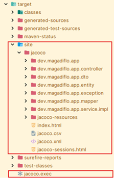

### 📊 Interpretación del reporte de cobertura de JaCoCo

Una vez ejecutadas las pruebas unitarias, `JaCoCo` genera un reporte HTML en `target/site/jacoco/index.html`.
Este reporte muestra métricas clave por `paquete`, `clase` y `método`. A continuación se explica cómo leerlo y qué
decisiones tomar en base a los resultados.

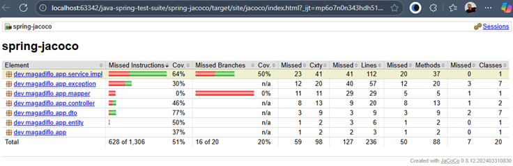

Lo primero que podemos observar es el resumen general ubicado en la fila `Total` del reporte:

| Métrica       | No Cubiertos | Cubiertos          | Cubiertos (%)       | Interpretación de los cubiertos                                                      |
|:--------------|--------------|--------------------|---------------------|--------------------------------------------------------------------------------------|
| Instrucciones | 628 de 1306  | 1306 - 628 = `678` | 678 de 1306 `(51%)` | 🟡 Moderado - Mitad del código ejecutado. Mínimo aceptable es 70-80%                 |
| Ramas         | 16 de 20     | 20 - 16 = `4`      | 4 de 20 `(20%)`     | 🔴 Crítico - Solo 1 de cada 5 condiciones (if/switch) tiene ambos caminos testeados  |
| Cxty          | 59 de 98     | 98 - 59 = `39`     | 39 de 98 `(39%)`    | 🔴 Bajo - Complejidad ciclomática cubierta insuficiente. Faltan caminos de ejecución |
| Clases        | 7 de 20      | 20 - 7 = `13`      | 13 de 20 `(65%)`    | 🟡 Aceptable - 7 clases sin ningún test                                              |
| Métodos       | 50 de 88     | 88 - 50 = `38`     | 38 de 88 `(43%)`    | 🔴 Bajo - Más de la mitad de métodos sin testear                                     |
| Líneas        | 127 de 236   | 236 - 127 = `109`  | 109 de 236 `(46%)`  | 🔴 Bajo - Menos de la mitad del código cubierto                                      |

🎯 Cobertura total del proyecto:

- Instrucciones: `51%` (678 de 1306)
- Ramas: `20%` (4 de 20)
- Clases: `65%` (13 de 20)
- Métodos: `43%` (38 de 88)
- Líneas: `46%` (109 de 236)

📌 `Conclusión global`: La cobertura actual está muy por debajo del estándar mínimo esperado en entornos empresariales.

- 🎯 Objetivo mínimo típico:
    - Instrucciones: `70-80% de cobertura`
    - Ramas: `60%+ de cobertura`
- ✅ Estado actual:
    - Instrucción: `51%` → 🔴 Insuficiente (faltan ~25-30 puntos)
    - Ramas: `20%`  → 🔴 Crítico (faltan ~40 puntos)
    - Métodos: `43%` → 🔴 Bajo

### 📦 ¿Qué paquetes necesitan más atención?

| Paquete                          | Cobertura | Acción recomendada                                                 |
|----------------------------------|-----------|--------------------------------------------------------------------|
| `dev.magadiflo.app.mapper`       | 0% ❌      | Escribir pruebas unitarias que ejerzan la lógica de mapeo          |
| `dev.magadiflo.app.exception`    | 30% ⚠️    | Probar flujos donde se lancen excepciones personalizadas           |
| `dev.magadiflo.app.controller`   | 46%       | Aumentar los casos en MockMvc (errores, datos inválidos, vacíos)   |
| `dev.magadiflo.app.service.impl` | 64%       | Probar ramas de negocio adicionales                                |
| `dto` y `entity`                 | 50–77%    | Se cubrirán de forma indirecta con mejoras en service y controller |

💡 Es decir, no se necesita testear cada DTO directamente, sino usar casos que los utilicen desde servicios y
controladores.

### ✅ Plan claro de mejora

Para alcanzar ese `objetivo > 80%` podríamos hacer lo siguiente:

| Acción                                                       | Impacto en cobertura |
|--------------------------------------------------------------|----------------------|
| Aumentar casos en servicios, incluyendo errores              | ↑↑ significativo     |
| Agregar pruebas a controladores simulando entradas inválidas | ↑ alto               |
| Probar mappers con entradas reales y nulas                   | ↑ moderado           |
| Lanzamiento de excepciones personalizadas                    | ↑ moderado           |

### 🔎 Inspeccionando paquetes en el reporte

Ingresamos en el paquete `dev.magadiflo.app.service.impl`. Dentro se encuentra únicamente la clase
`AccountServiceImpl`. Según el reporte, esta clase presenta:

- `64%` de cobertura de instrucciones
- `50%` de cobertura de ramas

Lo cual nos indica que aún existe una parte importante del flujo sin ejecutar por pruebas unitarias.

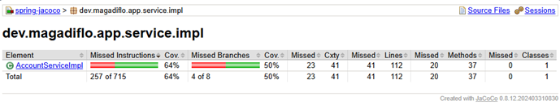

Si abrimos la clase, se observa que algunos métodos cuentan con cobertura completa, mientras que otros no se ejecutan
en absoluto durante las pruebas:

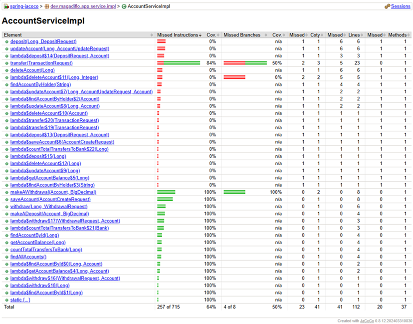

Por ejemplo, el método `deposit(Long, DepositRequest)` aparece totalmente marcado en rojo. Esto significa que ninguna
línea o rama de código en ese método ha sido ejercitada por los tests:

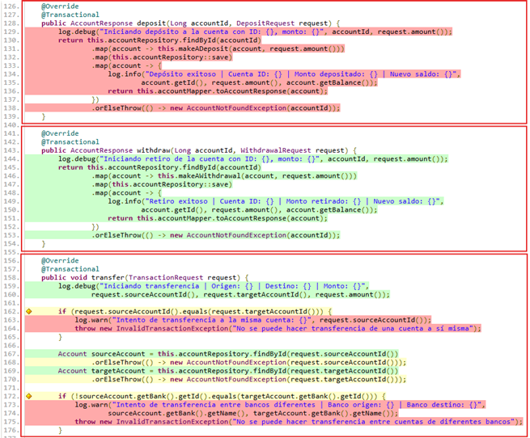

En contraste, el método `withdraw(...)` aparece completamente en verde, lo que indica que todas las instrucciones
y ramas que contiene han sido cubiertas por los tests unitarios.

## 🧠 Análisis del reporte de cobertura

El informe HTML de `JaCoCo` ayuda a interpretar visualmente el estado de cobertura usando dos tipos de indicadores:

### ⭐ Indicadores de ramas (rombos)

| Símbolo     | Significado              |
|:------------|--------------------------|
| 🔺 Rojo     | Ninguna rama probada     |
| 🔶 Amarillo | Algunas ramas probadas   |
| 💚 Verde    | Todas las ramas probadas |

Estos se aplican en estructuras condicionales como `if`, `else`, `switch` o cualquier bifurcación de lógica.

### 🎨 Indicadores de líneas (fondo de color)

| Color    | Significado                      |
|----------|----------------------------------|
| 🟥 Rojo  | Línea no ejecutada               |
| 🟩 Verde | Línea ejecutada al menos una vez |

## 📐 Métricas clave en JaCoCo

`JaCoCo` enfoca la cobertura en tres estadísticas principales:

| Métrica                 | Qué representa                           | Para qué nos sirve                                    |
|-------------------------|------------------------------------------|-------------------------------------------------------|
| Cobertura de líneas     | Proporción de instrucciones ejecutadas   | Mide qué tanto del código fue recorrido               |
| Cobertura de ramas      | Porcentaje de caminos lógicos cubiertos  | Identifica lógica condicional no probada              |
| Complejidad ciclomática | Cantidad de flujos de ejecución posibles | Indica el número mínimo de casos de prueba necesarios |

### 📌 Ejemplo útil

Si un método no contiene `if`, `switch` ni bifurcaciones, su `complejidad ciclomática es 1`, porque solo existe una
ruta lógica que recorrer.

Cuanta más lógica y decisiones incluya el código, mayor será la complejidad y `más tests necesitaremos` para cubrirlo
completamente.

## 🚀 Mejorando la Cobertura de Código

Conociendo ya cómo interpretar el reporte generado por `JaCoCo`, ahora llegó el momento emocionante:
`aumentar nuestra cobertura con nuevos tests`. No buscamos alcanzar todavía un estándar corporativo `(80% o más)`,
aunque sería genial. El objetivo es practicar cómo cada test adicional impacta directamente en nuestros indicadores de
calidad.

En el análisis previo detectamos algo clave en la clase `AccountServiceImpl`:

| Método         | Estado                        | Acción                  |
|----------------|-------------------------------|-------------------------|
| `withdraw(..)` | Totalmente probado ✅          | Nada que hacer          |
| `deposit(..)`  | Completamente sin cobertura ❌ | Crear pruebas unitarias |

Así que nos centraremos en `deposit(..)` y añadiremos dos casos esenciales:

1. Depósito exitoso cuando la cuenta existe.
2. Excepción cuando la cuenta no existe durante el depósito.

A continuación se muestra los nuevos test añadidos a la clase de prueba unitaria: `AccountServiceTest`.

````java

@Tag("unit")
@ExtendWith(MockitoExtension.class)
class AccountServiceTest {
    @Mock
    private AccountRepository accountRepository;
    @Mock
    private BankRepository bankRepository;
    @Mock
    private AccountMapper accountMapper;
    @InjectMocks
    private AccountServiceImpl accountServiceUnderTest;

    /* other methods */

    @Test
    void shouldDepositAmountSuccessfullyWhenAccountExists() {
        // given
        Account accountBeforeDeposit = AccountTestFactory.createAccount(1L, "Milagros", new BigDecimal("2000"));
        Account accountAfterDeposit = AccountTestFactory.createAccount(1L, "Milagros", new BigDecimal("2500"));
        Bank bank = AccountTestFactory.createBank(1L, "BCP", accountBeforeDeposit, accountAfterDeposit);
        DepositRequest request = new DepositRequest(new BigDecimal("500"));
        AccountResponse expectedResponse = AccountTestFactory.toAccountResponse(accountAfterDeposit);

        Mockito.when(this.accountRepository.findById(1L)).thenReturn(Optional.of(accountBeforeDeposit));
        Mockito.when(this.accountRepository.save(accountBeforeDeposit)).thenReturn(accountBeforeDeposit); // Ya mutado
        Mockito.when(this.accountMapper.toAccountResponse(accountBeforeDeposit)).thenReturn(expectedResponse);

        // when
        AccountResponse actualResponse = this.accountServiceUnderTest.deposit(1L, request);

        // then
        assertThat(accountBeforeDeposit.getBalance())
                .isEqualByComparingTo("2500");
        assertThat(actualResponse)
                .isNotNull()
                .extracting(AccountResponse::id, AccountResponse::holder, AccountResponse::balance, AccountResponse::bankName)
                .containsExactly(1L, "Milagros", new BigDecimal("2500"), bank.getName());
        Mockito.verify(this.accountRepository).findById(1L);
        Mockito.verify(this.accountRepository).save(accountBeforeDeposit);
        Mockito.verify(this.accountMapper).toAccountResponse(accountBeforeDeposit);
    }

    @Test
    void shouldThrowAccountNotFoundExceptionWhenAccountDoesNotExistDuringDeposit() {
        // given
        DepositRequest request = new DepositRequest(new BigDecimal("500"));
        Mockito.when(this.accountRepository.findById(1L)).thenReturn(Optional.empty());

        // when
        assertThatThrownBy(() -> this.accountServiceUnderTest.deposit(1L, request))
                .isInstanceOf(AccountNotFoundException.class)
                .hasMessage("No se encontró la cuenta con ID: 1");

        // then
        Mockito.verify(this.accountRepository).findById(1L);
        Mockito.verifyNoMoreInteractions(this.accountRepository, this.accountMapper);
    }
}
````

### ▶ Ejecutando nuevamente los tests

Procedemos a ejecutar los test unitarios anteponiendo el `clean` en el comando de maven para limpiar el directorio
`/target` antes de ejecutar los test.

````bash
D:\programming\spring\01.udemy\02.andres_guzman\03.junit_y_mockito_2023\java-spring-test-suite\spring-jacoco (feature/spring-jacoco)
$ mvn clean test -Dgroups=unit
[INFO] Scanning for projects...
...
[INFO] -------------------------------------------------------
[INFO]  T E S T S
[INFO] -------------------------------------------------------
[INFO] Running dev.magadiflo.app.unit.controller.AccountControllerTest
...
[INFO] Tests run: 13, Failures: 0, Errors: 0, Skipped: 0, Time elapsed: 1.664 s -- in dev.magadiflo.app.unit.service.AccountServiceTest
[INFO]
[INFO] Results:
[INFO]
[INFO] Tests run: 19, Failures: 0, Errors: 0, Skipped: 0
[INFO]
[INFO]
[INFO] --- jacoco:0.8.12:report (report) @ spring-jacoco ---
[INFO] Loading execution data file D:\programming\spring\01.udemy\02.andres_guzman\03.junit_y_mockito_2023\java-spring-test-suite\spring-jacoco\target\jacoco.exec
[INFO] Analyzed bundle 'spring-jacoco' with 20 classes
[INFO] ------------------------------------------------------------------------
[INFO] BUILD SUCCESS
[INFO] ------------------------------------------------------------------------
[INFO] Total time:  22.257 s
[INFO] Finished at: 2025-10-28T17:34:11-05:00
[INFO] ------------------------------------------------------------------------
````

Resultado:

| Antes                 |                 Ahora |
|-----------------------|----------------------:|
| ✅ 17 tests ejecutados | ✅ 19 tests ejecutados |

### 📈 ¿Qué cambió en el reporte?

Luego de recargar `target/site/jacoco/index.html`, entramos nuevamente a `AccountServiceImpl.java` y vemos el cambio:

📌 El método `deposit(..)` ahora luce completamente en verde ✅

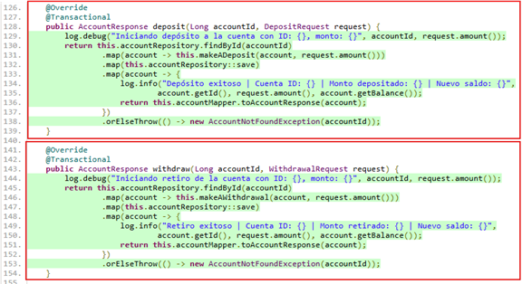

Eso significa:

- Todas las líneas fueron ejecutadas al menos una vez.
- Las ramas de esta lógica de negocio fueron cubiertas.
- Nuestra puntuación global de cobertura acaba de subir.

### 🎯 Conclusión de esta mejora

Cada test unitario que escribimos:

- ✅ valida la lógica de negocio.
- ✅ reduce riesgo de errores.
- ✅ mejora nuestros indicadores de calidad.
- ✅ impacta visualmente en JaCoCo.

Hicimos una intervención mínima, enfocada y efectiva. Con esa misma técnica podremos seguir elevando la calidad del
software hasta alcanzar el porcentaje corporativo esperado.

## 🧼 Excluyendo clases irrelevantes de la cobertura de código

En proyectos reales, no todo el código debe ser considerado para métricas de cobertura. Clases como la principal de la
aplicación (`SpringRestApiApplication`), `DTOs`, `entidades JPA`, `mappers` o `configuraciones` suelen inflar o
sesgar los reportes de cobertura, sin aportar valor real al análisis de calidad.

### 🎯 ¿Por qué excluir clases?

- No contienen lógica funcional.
- No aportan valor al testing (ej. getters/setters, anotaciones).
- No se espera que tengan cobertura (ej. clases de arranque, configuración).
- Son generadas automáticamente (ej. MapStruct, Lombok).

> 📌 `Objetivo`: Mantener métricas realistas, enfocadas en clases funcionales (servicios, controladores, validadores).

### 📸 Ejemplo: clase principal incluida en el reporte

En el reporte de `JaCoCo`, observamos que el paquete `dev.magadiflo.app` aparece con cobertura parcial.

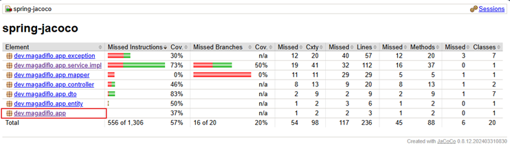

Al inspeccionar, vemos que se está evaluando la clase `SpringRestApiApplication`, que solo contiene el método `main`.

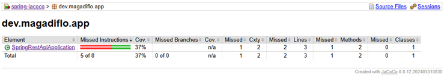

### 🚫 ¿Cómo excluir clases en JaCoCo?

Para excluir clases del reporte de cobertura, se utiliza la etiqueta `<excludes>` dentro de la configuración del
plugin de `JaCoCo` en el `pom.xml`. Se deben especificar las rutas compiladas en bytecode (`.class`), usando patrones
tipo `**/package/ClassName.class`.

#### 🧪 Ejemplo básico: excluir clase principal

````xml

<plugin>
    <groupId>org.jacoco</groupId>
    <artifactId>jacoco-maven-plugin</artifactId>
    <version>${jacoco.version}</version>
    <configuration>
        <excludes>
            <exclude>dev/magadiflo/app/SpringRestApiApplication.class</exclude>
        </excludes>
    </configuration>
    <executions>
        <!-- prepare-agent, report -->
    </executions>
</plugin>
````

### 🚀 Resultado después de excluir la clase principal

A continuación procedemos a ejecutar los test con el comando `mvn clean test -Dgroups=unit`.

````bash
D:\programming\spring\01.udemy\02.andres_guzman\03.junit_y_mockito_2023\java-spring-test-suite\spring-jacoco (feature/spring-jacoco)
$ mvn clean test -Dgroups=unit
...
[INFO]
[INFO] Tests run: 19, Failures: 0, Errors: 0, Skipped: 0
[INFO]
[INFO]
[INFO] --- jacoco:0.8.12:report (report) @ spring-jacoco ---
[INFO] Loading execution data file D:\programming\spring\01.udemy\02.andres_guzman\03.junit_y_mockito_2023\java-spring-test-suite\spring-jacoco\target\jacoco.exec
[INFO] Analyzed bundle 'spring-jacoco' with 19 classes
[INFO] ------------------------------------------------------------------------
[INFO] BUILD SUCCESS
[INFO] ------------------------------------------------------------------------
[INFO] Total time:  23.380 s
[INFO] Finished at: 2025-10-29T10:36:34-05:00
[INFO] ------------------------------------------------------------------------
````

Procedemos a revisar el reporte y observamos que ya no aparece el paquete `dev.magadiflo.app`. Recordemos que dentro
de dicho paquete está la clase que acabamos de excluir.

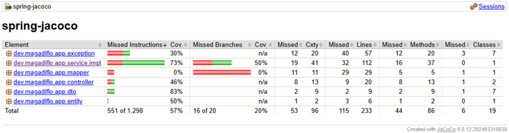

## 🏢 Mejores prácticas corporativas: exclusión por paquetes

En empresas, se excluyen paquetes completos que contienen clases no funcionales:

````xml

<plugin>
    <groupId>org.jacoco</groupId>
    <artifactId>jacoco-maven-plugin</artifactId>
    <version>${jacoco.version}</version>
    <configuration>
        <excludes>
            <!-- Clases de arranque -->
            <exclude>**/SpringRestApiApplication.class</exclude>

            <!-- DTOs y entidades JPA -->
            <exclude>**/dto/**</exclude>
            <exclude>**/entity/**</exclude>

            <!-- Mappers y configuraciones -->
            <exclude>**/mapper/**</exclude>
            <exclude>**/config/**</exclude>

            <!-- Excepciones personalizadas -->
            <exclude>**/exception/*Exception.class</exclude>

            <!-- Clases generadas automáticamente -->
            <exclude>**/*MapperImpl.class</exclude>
        </excludes>
    </configuration>
    <executions>
        <!-- prepare-agent, report -->
    </executions>
</plugin>
````

> 🧠 `Tip`: Usa patrones genéricos (`**/dto/**`, `**/*Exception.class`) para excluir múltiples clases sin necesidad
> de listarlas una por una.

### 📌 Sobre la exclusión de excepciones

Con la línea:

````xml

<exclude>**/exception/*Exception.class</exclude>
````

Estamos excluyendo todas las clases que terminan en `...Exception.class` dentro del paquete `exception`, como:

- `BankNotFoundException`
- `AccountNotFoundException`
- `InvalidTransactionException`
- `InsufficientBalanceException`
- `DatabaseOperationException`
- `EntityNotFoundException`

Estas clases no contienen lógica funcional compleja y no requieren pruebas unitarias. Por tanto,
`no deben influir en las métricas de cobertura`.

### ✅ ¿Qué clase se mantiene?

Dentro del mismo paquete `exception`, tenemos la clase:

- `GlobalExceptionHandler`

Como no termina en `Exception`, `no será excluida` por el patrón anterior. Esto es correcto y deseado, ya que:

- Contiene lógica condicional (`@ExceptionHandler`)
- Construye respuestas HTTP
- Registra logs con distintos niveles (INFO, WARN, ERROR)
- Tiene un método auxiliar (`businessException`) que debe ser testeado

> 🎯 `Conclusión`: El patrón `*Exception.class` excluye solo las clases de excepción personalizadas, manteniendo
> `GlobalExceptionHandler` dentro del reporte de cobertura.

### 🚀 Resultado después de excluir por paquetes

A continuación procedemos a ejecutar los test con el comando `mvn clean test -Dgroups=unit`.

````bash
D:\programming\spring\01.udemy\02.andres_guzman\03.junit_y_mockito_2023\java-spring-test-suite\spring-jacoco (feature/spring-jacoco)
$ mvn clean test -Dgroups=unit
...
[INFO] Tests run: 19, Failures: 0, Errors: 0, Skipped: 0
[INFO]
[INFO]
[INFO] --- jacoco:0.8.12:report (report) @ spring-jacoco ---
[INFO] Loading execution data file D:\programming\spring\01.udemy\02.andres_guzman\03.junit_y_mockito_2023\java-spring-test-suite\spring-jacoco\target\jacoco.exec
[INFO] Analyzed bundle 'spring-jacoco' with 4 classes
[INFO] ------------------------------------------------------------------------
[INFO] BUILD SUCCESS
[INFO] ------------------------------------------------------------------------
[INFO] Total time:  21.849 s
[INFO] Finished at: 2025-10-29T11:41:21-05:00
[INFO] ------------------------------------------------------------------------
````

Procedemos a revisar el reporte y observamos que ya no aparecen los paquetes excluídos, lo que indica que realizamos
correctamente la exclusión.

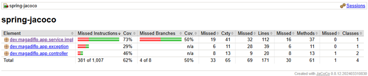

Si ingresamos dentro del paquete de excepciones vemos que solo se encuentra la clase que no excluímos
(`GlobalExceptionHandler`).

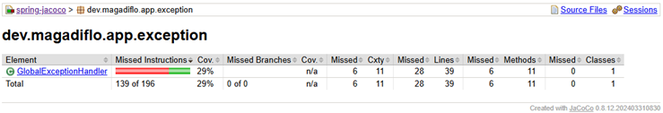

### ✅ Beneficios de excluir correctamente

- Métricas más precisas y enfocadas.
- Reportes más limpios y legibles.
- Alineación con Quality Gates de SonarQube.
- Comparabilidad con estándares corporativos.
