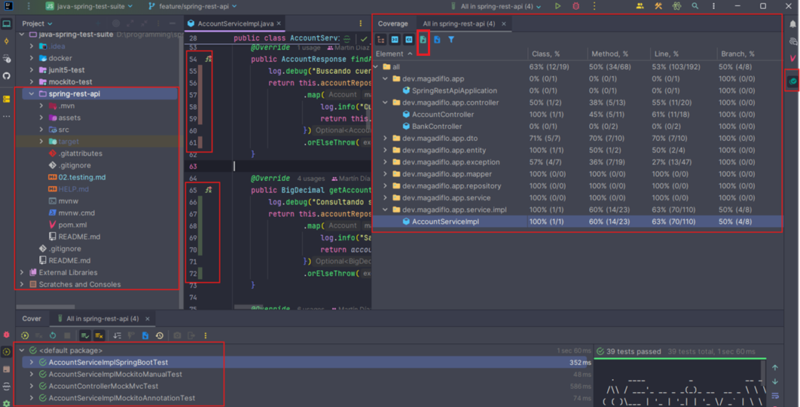
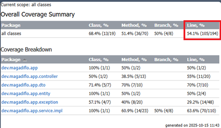

# 🧮 Cobertura de código (Code Coverage)

---

La `cobertura de código` es una métrica que indica qué porcentaje del código fuente ha sido ejecutado durante la
ejecución de las pruebas automatizadas.

Nos ayuda a identificar `qué partes de la aplicación están correctamente verificadas mediante tests` y cuáles aún no
se han probado.

En `IntelliJ IDEA`, podemos generar un reporte de cobertura de manera sencilla:

1. En la vista del proyecto, hacemos clic derecho sobre la raíz del proyecto (`spring-rest-api`).
2. Seleccionamos la opción `More Run/Debug` → `Run 'All Tests' with Coverage`.
3. `IntelliJ` ejecutará todos los tests disponibles (`unitarios`, de `integración`, etc.) y al finalizar mostrará un
   reporte visual con el nivel de cobertura alcanzado.

El resultado se mostrará directamente en la vista del `IDE`, con un resumen general de los paquetes, clases y métodos
cubiertos por las pruebas, similar a la siguiente imagen:

Incluso el resultado lo podemos exportar en formato `html` desde la propia vista del IDE para verlo en cualquier
navegador.

### 📊 Interpretando el reporte de cobertura

Al ejecutar las pruebas con cobertura, `IntelliJ` genera un reporte que resume qué porcentaje del código fue ejecutado
durante los tests.

Las columnas las podemos interpretar de la siguiente manera:

| Columna       | Descripción                                                                                                                                                               |
|---------------|---------------------------------------------------------------------------------------------------------------------------------------------------------------------------|
| **Package**   | Muestra el nombre del paquete analizado.                                                                                                                                  |
| **Class, %**  | Mide qué porcentaje de clases tienen cobertura parcial o total. Si una clase nunca se ejecuta en tests, no cuenta.                                                        |
| **Method, %** | Mide qué métodos han sido ejecutados durante las pruebas. `Ideal: > 70 %` (significa que la mayoría del comportamiento se probó).                                         |
| **Branch, %** | Mide cuántas rutas condicionales (`if`, `for`, `try/catch`, etc.) se probaron. `Ideal: > 70 %`, para asegurar que se probaron tanto caminos “positivos” como “negativos”. |
| **Line, %**   | Mide líneas ejecutadas respecto al total. Es la `métrica más usada para evaluar la cobertura global`.                                                                     |

🟩🟨🟥 Colores en el reporte (dentro del IDE)

- 🟩 Verde: código cubierto por pruebas.
- 🟨 Amarillo: cobertura parcial (solo una parte de las ramas fue ejecutada).
- 🟥 Rojo: código no cubierto.
- ⬜ Gris: código no aplicable (por ejemplo, interfaces o clases sin lógica ejecutable).

### 🧭 1. Resumen general del proyecto

En la tabla `“Overall Coverage Summary”`, vemos nuestras métricas globales:

| Métrica      | % Cobertura | Total (cubiertos / totales) | Qué significa                                                                     |
|--------------|-------------|-----------------------------|-----------------------------------------------------------------------------------|
| **Class %**  | **68.4%**   | (13 / 19)                   | 13 de 19 clases tienen al menos una parte probada                                 |
| **Method %** | **51.4%**   | (36 / 70)                   | 36 de 70 métodos fueron ejecutados por algún test                                 |
| **Branch %** | **50%**     | (4 / 8)                     | Solo la mitad de las ramas condicionales (if/else, switch, etc.) fueron cubiertas |
| **Line %**   | **54.1%**   | (105 / 194)                 | Se ejecutaron 105 de 194 líneas de código durante los tests                       |

> La cobertura global real de código es del `54.1 %`.

### 🧭 2. Cobertura por paquete

| Paquete             | Line % | Observación                                                                         |
|---------------------|--------|-------------------------------------------------------------------------------------|
| `dev.magadiflo.app` | 50 %   | Clase principal (`SpringRestApiApplication`), no relevante testearla mucho          |
| `controller`        | 55 %   | Cobertura media; sería bueno tener tests de integración con MockMvc o WebTestClient |
| `dto`               | 70 %   | Buena cobertura, probablemente tests indirectos o simples getters/setters           |
| `entity`            | 50 %   | Normal que sea baja; usualmente se prueba mediante repositorios o servicios         |
| `exception`         | 29.2 % | Muy baja; sería ideal incluir pruebas de manejo de errores                          |
| `service.impl`      | 63.6 % | Tu capa de negocio está razonablemente cubierta, aunque aún puede mejorar           |

### 🎯 3. Conclusión y recomendación

- Cobertura global actual: 🟠 `54.1 %`
- Meta recomendada: 🟢 `≥ 70 – 80 %`
- Nuestra situación:
    - Estamos por debajo del rango recomendado, lo cual es normal en etapas tempranas del proyecto.
    - Significa que nuestros tests actuales ejercitan un poco más de la mitad del código fuente.

### 📈 Recomendaciones para mejorar:

- Enfócate en los servicios y controladores, que son los puntos más críticos.
- Agrega pruebas negativas (errores, excepciones, validaciones).
- Aumenta el uso de MockMvc / WebTestClient y Mockito para cubrir ramas condicionales.
- No te obsesiones con 100 % — busca un equilibrio entre cobertura y valor real de los tests.
