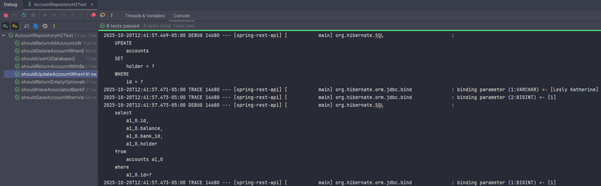
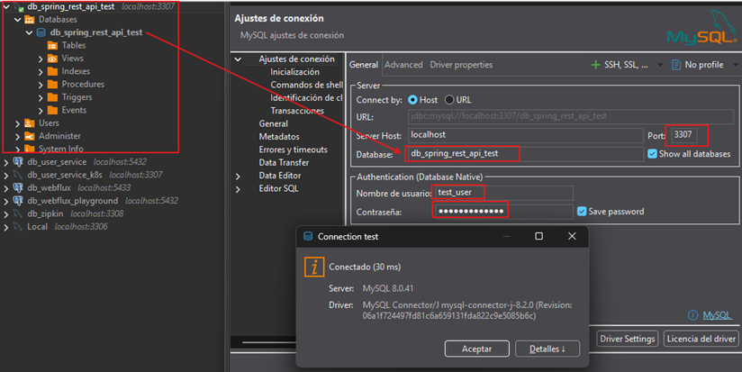

# 🚀 Integration Test - Test de Repositorios (`@DataJpaTest`)

---

Los `tests de integración` validan que los distintos componentes de la aplicación (repositorios, servicios,
controladores, etc.) `interactúen correctamente entre sí` y con dependencias externas como `bases de datos`,
`colas de mensajes` o `servicios HTTP`.

En este caso, probaremos la integración entre `Spring Data JPA` y una base de datos, usando primero `H2`
(`en memoria`) y más adelante `MySQL`, para simular entornos más realistas.

## ⚙️ Configurar H2 como base de datos en memoria

En el proyecto `spring-rest-api`, agregamos la dependencia de `H2` en el `pom.xml` con el scope limitado a `test`.

### 📦 Motivo

Usamos `H2` para ejecutar pruebas rápidas en memoria sin depender de una base real. Más adelante, reemplazaremos
esta configuración por `MySQL` o `Testcontainers`, pero `H2` nos permite practicar el flujo de integración sin
sobrecargar el entorno.

````xml

<dependency>
    <groupId>com.h2database</groupId>
    <artifactId>h2</artifactId>
    <scope>test</scope> <!-- Importante: solo se usará durante los tests -->
</dependency>
````

💡 Nota profesional:
> Aunque `H2` es muy útil en fases iniciales, `no siempre refleja el comportamiento real` de `MySQL` o `PostgreSQL`,
> por lo que en entornos reales se recomienda pasar pronto a `Testcontainers` o bases de datos reales en `Docker`.

### 🧱 Perfiles para pruebas

En lecciones anteriores definimos un `application.yml` dentro de `/src/test/resources` para aislar la configuración
de pruebas del entorno principal (`/src/main/resources`).

Ahora organizaremos nuestros archivos de configuración de la siguiente manera:

📁 Estructura recomendada

````
src/
├── main/
│   └── resources/
│       ├── application.yml
│       ├── application-dev.yml
│       ├── application-qa.yml
│       └── application-prod.yml
└── test/
    └── resources/
        ├── application.yml               # Config base común a todos los tests
        ├── application-test.yml          # Perfil de pruebas con MySQL real o contenedores
        └── application-test-h2.yml       # Perfil alternativo con base en memoria H2
````

🧩 Propósito de cada archivo

| Archivo                   | Propósito                                               | Uso típico                          |
|---------------------------|---------------------------------------------------------|-------------------------------------|
| `application.yml`         | Configuración base (puerto aleatorio, nombre app, logs) | Se carga en todos los tests         |
| `application-test.yml`    | Configuración de pruebas con MySQL o Testcontainers     | Ideal para CI/CD o integración real |
| `application-test-h2.yml` | Configuración ligera con H2                             | Ideal para pruebas locales rápidas  |

💬 Nota:
> Mantener esta separación de perfiles te permite cambiar fácilmente entre entornos de prueba
> (`H2` ↔ `MySQL` ↔ `Testcontainers`) sin modificar el código fuente, solo ajustando el perfil activo.

## 🧠 Autoconfiguración de H2

Spring Boot detecta automáticamente la dependencia `com.h2database:h2` y `autoconfigura el datasource`
(driver, URL y dialecto), por lo que `no es necesario` definir manualmente esas propiedades para que funcione.

Sin embargo, en entornos profesionales `sí se suele personalizar` la configuración para:

- Asignar nombres de base de datos específicos.
- Controlar el cierre del contexto.
- Emular el comportamiento de `MySQL` (con `MODE=MySQL`).

🧩 Conclusión:

- Si solo usamos `H2` para pruebas básicas, basta con la dependencia.
- Pero para escenarios más realistas (emulación de MySQL, logs SQL, control de ciclo de vida), la configuración
  personalizada es una buena práctica.

## ⚙️ Configuración base (`application.yml`) en Test

📍 Ubicación: `/src/test/resources/application.yml`

````yml
# Configuración BASE para todos los perfiles de test
server:
  port: 0  # Puerto aleatorio para evitar conflictos

spring:
  application:
    name: spring-rest-api
  jpa:
    hibernate:
      ddl-auto: create-drop # Crea el schema al levantar el CONTEXTO y se elimina al terminar
    properties:
      hibernate:
        format_sql: true
        show_sql: false
  sql:
    init:
      mode: never # No cargamos datos automáticamente. Cada test cargará lo que necesite con @Sql.

# Logging para tests - queremos ver qué pasa pero sin saturar
logging:
  level:
    root: INFO
    dev.magadiflo.app: DEBUG
    org.hibernate.SQL: DEBUG                              # Muestra las consultas SQL
    org.hibernate.orm.jdbc.bind: TRACE                    # Muestra parámetros enviados al SQL
    org.springframework.test: DEBUG                       # Información del contexto de test
````

🧠 Explicación de configuración

- `ddl-auto: create-drop` → crea el esquema al iniciar el contexto de Spring (primera vez que se necesita) y lo destruye
  al finalizarlo (cuando ya no hay más tests que lo usen). Un contexto puede ser reutilizado por
  `múltiples clases de test`.
- ¿Qué es un "contexto de Spring? Spring cachea contextos según:
    - Anotaciones de test (`@SpringBootTest`, `@DataJpaTest`, `@WebMvcTest`, etc.)
    - Perfiles activos (`@ActiveProfiles`)
    - Configuraciones adicionales (`@TestPropertySource`, `webEnvironment`, etc.)
- El esquema (`create-drop`) se ejecuta por cada contexto único. Si múltiples clases de test usan: la misma anotación,
  el mismo perfil, la misma configuración, Spring REUTILIZA el contexto (1 solo `create-drop` para todas esas clases).
  Si cambia cualquiera de esos elementos → Se crea un nuevo contexto (nuevo `create-drop`).
- `format_sql: true` → formatea las sentencias SQL en el log, lo que facilita su lectura.
- `show_sql: false` → desactiva la impresión directa en consola con el prefijo `Hibernate:`. Las consultas siguen
  visibles gracias al logger `org.hibernate.SQL: DEBUG`, que ofrece más control y mejor formato.
- En tests usamos `show_sql: false` para evitar duplicidad en consola, ya que el logger `org.hibernate.SQL` ya imprime
  las consultas. En desarrollo no es necesario desactivarlo porque no se activa automáticamente.
- `mode: never` → no queremos carga automática de datos. Cada test cargará lo que necesite con `@Sql`.
- `root: WARN` → reduce el ruido en consola; solo se muestran advertencias o errores globales.
- `dev.magadiflo.app: DEBUG` → habilita logs detallados para nuestras clases.
- `org.hibernate.SQL: DEBUG` → muestra las sentencias SQL generadas.
- `org.hibernate.orm.jdbc.bind: TRACE` → muestra los valores de los parámetros enviados al SQL (Hibernate 6.x)
- `org.springframework.test: DEBUG` → vemos información del contexto de test.

💡 Recomendación:
> Estos niveles de log son muy útiles en etapa de pruebas, pero en producción deben reducirse a `INFO` o `WARN`
> para evitar sobrecargar los logs.

## ⚙️ Perfil `test-h2` — Base de datos en memoria

📍 Ubicación: `/src/test/resources/application-test-h2.yml`

````yml
spring:
  config:
    activate:
      on-profile: test-h2 # ← Opcional: el nombre del archivo ya indica el perfil
  datasource:
    url: jdbc:h2:mem:db_test;MODE=MySQL;DB_CLOSE_DELAY=-1;DB_CLOSE_ON_EXIT=FALSE
    driver-class-name: org.h2.Driver
    username: sa
    password:
  h2:
    console:
      enabled: true
      path: /h2-console
  jpa:
    database-platform: org.hibernate.dialect.H2Dialect
````

🔍 Notas claves

- Este archivo se aplica automáticamente cuando se activa el perfil `test-h2`, por ejemplo con
  `@ActiveProfiles("test-h2")` en nuestras pruebas.
- La propiedad `spring.config.activate.on-profile: test-h2` `es opcional` en archivos que ya siguen la convención
  `application-{profile}.yml`. Se usa principalmente en archivos con múltiples bloques de configuración o con nombres
  personalizados.
- Podemos omitirla sin afectar el comportamiento, siempre que el nombre del archivo coincida con el perfil activo.
- `spring.datasource.url`
    - `jdbc:h2:mem:db_test_h2` → base de datos en memoria (no persiste en disco).
    - `DB_CLOSE_ON_EXIT=FALSE` → evita el cierre automático al terminar la JVM (útil para inspección).
    - `DB_CLOSE_DELAY=-1` → mantiene viva la BD incluso sin conexiones activas. La BD no se cierra automáticamente
      cuando se cierra la última conexión.
    - `MODE=MySQL` → hace que `H2` interprete la sintaxis SQL como `MySQL` (útil para dialectos y queries nativos).
- `spring.datasource.username/password`: define credenciales de acceso al motor `H2`. Para entrar por navegador a la
  consola `H2`, necesitamos:
    - Activar la consola con `spring.h2.console.enabled=true`
    - Acceder vía `http://localhost:{puerto}/h2-console`
    - Usar el mismo `jdbc:h2:mem:db_test` como `URL`
    - Username `sa` (usuario por defecto de `H2`)
    - Password (dejar vacío)

⚠️ Importante: Acceder durante un test en ejecución
> La BD `H2` en memoria (`mem:`) solo existe mientras la aplicación está corriendo.
>
> Para inspeccionar datos durante un test podríamos usar `Thread.sleep(300000);` dentro del código del test para pausar
> por 5 minutos, por ejemplo, luego acceder a la url, consultar las tablas, etc.

## 📒 Activación de Perfiles en Tests

### ✏️ En `/main`

Cuando usamos el siguiente archivo de configuración base en `src/main/resources/application.yml`
(desarrollo/producción):

````yml
# application.yml en /main
spring:
  profiles:
    active: dev  # ← Esto ACTIVA un perfil por defecto
````

Esto dice: `Cuando arranques la aplicación, usa el perfil dev automáticamente`. Por lo tanto, al ejecutar:

````bash
$ java -jar app.jar
````

Sin especificar nada, usará `dev` porque está configurado como perfil activo por defecto. Si queremos cambiarlo, basta
con ejecutar el siguiente comando:

````bash
$ java -jar app.jar --spring.profiles.active=prod
````

### 🧪 En `/test`

También podemos tener un archivo de configuración base `application.yml` y archivos específicos para distintos
perfiles (`test`, `test-h2`, `test-mysql`, etc).

Por ejemplo, en el perfil `test-h2` correspondiente al archivo `src/test/resources/application-test-h2.yml`:

````yml
# application-test-h2.yml en /test
spring:
  config:
    activate:
      on-profile: test-h2  # ← Esto NO activa, solo DECLARA cuándo aplicar este archivo
````

La configuración anterior `NO activa el perfil`, solo dice:
"Este archivo `application-test-h2.yml` se aplicará cuando el perfil `test-h2` esté activo.
**Es una declaración condicional, no una activación.**

#### 📢 Importante

> En archivos que siguen la convención `application-{profile}.yml`, como `application-test-h2.yml`, la configuración
> anterior es `opcional`.
>
> Spring Boot ya sabe que debe aplicar ese archivo si el perfil `test-h2` está activo
> (por ejemplo, con `@ActiveProfiles("test-h2")` en nuestros tests). Se recomienda usar la configuración anterior
> solo si necesitamos mayor control o si el archivo contiene múltiples bloques para distintos perfiles.

#### 📋 Comparación clara

| Propiedad                           | Propósito                             | Dónde se usa                                                                                      |
|-------------------------------------|---------------------------------------|---------------------------------------------------------------------------------------------------|
| `spring.profiles.active`            | `ACTIVA` un perfil por defecto        | Principalmente en `/main`. También puede usarse en `/test`, aunque se prefiere `@ActiveProfiles`. |
| `spring.config.activate.on-profile` | `DECLARA` cuándo aplicar este archivo | Archivos específicos de perfil (`application-{profile}.yml`)                                      |

## 🔧 Entonces, ¿cómo se activan los perfiles en tests?

Existen tres formas principales de activar un perfil en las pruebas:

### 🥇 `Opción 1`: Con `@ActiveProfiles` (la más común y recomendada)

````java

@SpringBootTest
@ActiveProfiles("test-h2")  // ← Activa explícitamente el perfil test-h2 para este test
class BankRepositoryTest {
    // Spring cargará: application.yml + application-test-h2.yml
}
````

Es la forma más clara y explícita: Cada clase define qué perfil usará, lo que facilita el mantenimiento y la lectura.

### 🥈 `Opción 2`: Con `spring.profiles.active` en `application.yml` de `/test`

````yml
# application.yml en src/test/resources
spring:
  profiles:
    active: test-h2  # ← Perfil por defecto para TODOS los tests
````

Con esta configuración, todos los tests usarán `test-h2` a menos que lo sobrescribamos con una anotación
`@ActiveProfiles` específica.

### 🥉 `Opción 3`: Parámetro en línea con `Maven` (o Gradle)

````bash
$ mvn test -Dspring.profiles.active=test-h2
````

Esta opción `activa globalmente el perfil` `test-h2` durante la ejecución del comando. Sin embargo, tiene matices
importantes:

- Se aplicará solo a las clases que no tengan la anotación `@ActiveProfiles`.
- Si una clase de test ya define su perfil con `@ActiveProfiles("otro-perfil")`, esa configuración tendrá prioridad
  sobre el parámetro de línea de comandos.

En resumen:
> El parámetro `-Dspring.profiles.active=...` es útil para definir un perfil por defecto cuando ejecutamos una suite
> global, pero no sobrescribirá los perfiles definidos explícitamente en las clases de test.

### 📢 Recomendación Empresarial

> Evitemos definir `spring.profiles.active` dentro del `application.yml` de `/test`. En su lugar, usemos
> `@ActiveProfiles` en cada clase de test.
>
> Esto nos brinda:
> - `Flexibilidad`: Cada clase elige su perfil sin afectar a las demás.
> - `Claridad`: Al leer el test, se ve inmediatamente qué perfil usa.
> - `Compatibilidad CI/CD`: Podemos ejecutar suites diferentes según su perfil

## 🚀 ¿Qué pasa cuando ejecutamos `mvn test`?

Si tenemos múltiples clases de test con distintos perfiles y ejecutamos:

````bash
$ mvn test
````

1. `Maven` ejecuta todas las clases de test detectadas bajo `src/test/java`.
2. `Spring TestContext Framework` inicia un `ApplicationContext` **para cada clase de test**, a menos que pueda
   reutilizar uno con la misma configuración.
3. En cada clase:
    - Si tiene `@ActiveProfiles("...")` → activa ese perfil.
    - Si no tiene `@ActiveProfiles`, usa el perfil por defecto (el definido en `application.yml` o ninguno si no hay).
4. Por lo tanto:
    - Las clases con `@ActiveProfiles("test-h2")` cargarán: `application.yml + application-test-h2.yml`.
    - Las que tienen `@ActiveProfiles("test-mysql")` cargarán: `application.yml + application-test-mysql.yml`.
    - Así sucesivamente.
    - Las clases sin `@ActiveProfiles` usarán solo: `application.yml` (base) o cualquier perfil que esté activo
      globalmente vía `spring.profiles.active` en `application.yml`, si existiera.

> 🎯 No es necesario especificar el perfil con `-Dspring.profiles.active=...` al ejecutar `mvn test`, si ya hemos
> declarado ese perfil en la clase de test con `@ActiveProfiles`, porque Spring lo reconocerá automáticamente.

> 💡 Los perfiles declarados mediante `@ActiveProfiles` tienen prioridad sobre aquellos definidos a través de
> propiedades del entorno, es decir, siempre tienen mayor precedencia que cualquier valor establecido externamente.
>
> En otras palabras, `@ActiveProfiles` tiene prioridad sobre `-Dspring.profiles.active=....`

## 📘 Ejecutar un grupo de tests según su perfil

En una aplicación con múltiples clases de test que usan distintos perfiles mediante `@ActiveProfiles(...)`, es común
querer ejecutar únicamente un subconjunto de pruebas — por ejemplo, solo las de integración que usan el perfil
`test-integration3`.

Dado que `mvn test` ejecuta `todas` las pruebas encontradas, existen dos formas recomendadas de filtrar los tests
según su tipo o perfil asociado:

### 🏷️ Opción 1: Por nombre de clase (`-Dtest=...`)

Podemos ejecutar únicamente los tests cuyo nombre coincida con un patrón. Por ejemplo, si nuestras clases siguen una
convención como:

````
AccountRepositoryH2Test.java
AccountRepositoryMysqlTest.java
BankIntegration3Test.java
BankIntegration2Test.java
````

Entonces, podemos ejecutar únicamente los tests que correspondan al perfil `test-integration3` con:

````bash
$ mvn test -Dtest=*Integration3Test
````

Con este comando, en realidad no filtramos por perfil, sino por `nombre de clase`. Se asume que la clase
`BankIntegration3Test.java` tiene internamente definido el perfil `@ActiveProfiles("test-integration3");` por tanto,
al ejecutar este patrón, se ejecutarán solo las pruebas cuyo nombre coincida y que, a su vez, usan ese perfil.

✅ Ventajas:

- No depende de configuración adicional.
- Ideal cuando las clases siguen una convención de nombres por perfil (`*IntegrationTest`, `*RepositoryTest`,
  `*ContainerTest`, etc.).
- Fácil de integrar en pipelines o comandos rápidos.

### 🏷️ Opción 2: Por etiquetas (`@Tag`)

`JUnit 5` permite clasificar y agrupar pruebas de forma lógica usando la anotación `@Tag`, sin depender del nombre de
la clase.

Esto resulta muy útil para ejecutar únicamente subconjuntos de tests (por ejemplo, solo los de integración,
o los lentos).

````java

@Tag("integration3")
@ActiveProfiles("test-integration3")
class BankIntegration3Test {
    /* code */
}
````

Una vez definida la etiqueta, podemos ejecutar solo los tests que coincidan con ella. El comando a usar depende de
la versión del plugin `Maven Surefire` configurado en tu proyecto:

- `Surefire "clásico"` (JUnit 4 / TestNG / compatibilidad heredada). Usa la opción `-Dgroups` para filtrar por etiquetas
  o grupos.
    ````bash
    mvn test -Dgroups=integration3
    ````

- `JUnit Platform moderno` (Surefire ≥ 2.22.0). Usa `-DincludeTags`, que es la forma nativa de `JUnit 5` para incluir
  etiquetas.
    ````bash
    $ mvn test -DincludeTags=integration3 
    ````

💡 Recomendación oficial
> A partir de las versiones recientes de `Maven Surefire`, se recomienda usar `-DincludeTags` en lugar de `-Dgroups`,
> ya que `-Dgroups` se mantiene solo por compatibilidad con versiones anteriores.

⚠️ Nota práctica (entorno actual)

> En este proyecto (`Spring Boot 3.5.6` + `Surefire 3.5.4`), el comando funcional es `-Dgroups`, mientras que
> `-DincludeTags` no ejecuta los tests etiquetados.
>
> Esto indica que, aunque el plugin está actualizado, `Maven` sigue interpretando la configuración con el modo de
> compatibilidad activa para `groups`.

🧠 Nota importante

> El parámetro `-Dspring.profiles.active=...` **no filtra las pruebas.** Solo define qué perfil se activa globalmente,
> pero no evita que se ejecuten otras clases con `@ActiveProfiles`.
>
> Por tanto, para ejecutar solo un grupo de tests, debemos filtrar explícitamente con nombre (`-Dtest=...`)
> o etiqueta (`-Dgroups=...` o `-DincludeTags=...`).

## 📂 Scripts SQL para Tests

Definimos y organizamos los scripts SQL que inicializan y limpian la base de datos durante las pruebas de integración,
garantizando que cada ejecución empiece en un estado limpio y controlado.

### 🧱 Estructura de directorios

Ubicación base: `/src/test/resources/`

````
src/test/resources/
├── application.yml                 # Configuración base común
├── application-test.yml            # Configuración con MySQL (pendiente)
├── application-test-h2.yml         # Configuración con H2 (en memoria)
└── sql-test/
    ├── cleanup-h2.sql              # Limpieza específica para H2
    ├── cleanup-mysql.sql           # Limpieza específica para MySQL
    └── data-test.sql               # Datos compartidos (única fuente de verdad)
````

Mantener los scripts en un subdirectorio como `sql-test/` mejora la organización, permite diferenciar claramente los
datos de prueba de los de desarrollo y facilita su reutilización en distintos perfiles (`test`, `test-h2`, etc.).

### 🧼 Limpieza de datos (`cleanup-h2.sql` y `cleanup-mysql.sql`)

Los scripts de limpieza eliminan datos entre ejecuciones de tests, asegurando que cada prueba comience con un estado
consistente sin depender de los resultados de ejecuciones previas.

`cleanup-h2.sql`

````sql
-- Limpieza de datos para H2
-- Desactiva temporalmente las validaciones de integridad referencial
SET REFERENTIAL_INTEGRITY FALSE;

-- Limpia las tablas en cualquier orden (sin preocuparte por FKs)
TRUNCATE TABLE accounts;
TRUNCATE TABLE banks;

-- Reactiva las validaciones
SET REFERENTIAL_INTEGRITY TRUE;
````

- `SET REFERENTIAL_INTEGRITY FALSE` desactiva temporalmente las restricciones de integridad referencial
  (`foreign keys`).
- Esto permite truncar tablas en cualquier orden sin errores.
- Se reactivan al final para restaurar la consistencia.

`cleanup-mysql.sql`

````sql
-- Limpieza de datos para MySQL
-- Desactiva temporalmente las validaciones de foreign keys
SET FOREIGN_KEY_CHECKS = 0;

-- Limpia las tablas en cualquier orden
TRUNCATE TABLE accounts;
TRUNCATE TABLE banks;

-- Reactivar verificación de foreign keys
SET FOREIGN_KEY_CHECKS = 1;
````

- `SET FOREIGN_KEY_CHECKS = 0` desactiva la verificación de claves foráneas.
- Ideal cuando se tiene un modelo relacional con dependencias.
- Es equivalente al comportamiento de `SET REFERENTIAL_INTEGRITY FALSE` en `H2`.

### 💾 Carga de datos (`data-test.sql`)

`data-test.sql`

````sql
-- Datos de prueba compartidos entre H2 y MySQL
-- Este archivo es la ÚNICA FUENTE DE VERDAD para los datos de test

-- Bancos
INSERT INTO banks(name, total_transfers)
VALUES('BCP', 0),
('BBVA', 0),
('Interbank', 0),
('Scotiabank', 0);

-- Cuentas
INSERT INTO accounts(holder, balance, bank_id)
VALUES('Lesly Águila', 3000.00, 1),
('Cielo Fernández', 2000.00, 1),
('Susana Alvarado', 5000.00, 2),
('Briela Cirilo', 1000.00, 2),
('Milagros Díaz', 3500.00, 3),
('Kiara Lozano', 100.00, 4),
('Analucía Urbina', 4000.00, 4),
('Yrma Guerrero', 7000.00, 4);
````

- Mantener un único archivo de datos base evita duplicación y divergencia entre entornos.
- Los IDs no se definen explícitamente para aprovechar la generación automática (`AUTO_INCREMENT` o secuencias).
- Los nombres y montos están diseñados para permitir pruebas predecibles y consistentes.

### 🧩 Clase de constantes para scripts

Ubicación: `/src/test/java/dev/magadiflo/app/constants/TestScripts.java`

````java

@UtilityClass
public class TestScripts {
    // Limpieza por BD
    public static final String CLEANUP_H2 = "/sql-test/cleanup-h2.sql";
    public static final String CLEANUP_MYSQL = "/sql-test/cleanup-mysql.sql";

    // Datos compartidos
    public static final String DATA_TEST = "/sql-test/data-test.sql";

    // Combinación comunes
    public static final String[] H2_INIT = {CLEANUP_H2, DATA_TEST};
    public static final String[] MYSQL_INIT = {CLEANUP_MYSQL, DATA_TEST};
}
````

📘 Ventajas de esta práctica:

| ✅ Beneficio                               | Descripción                                     |
|-------------------------------------------|-------------------------------------------------|
| **Centralización**                        | Si cambias una ruta, solo lo haces en un lugar. |
| **Autocompletado del IDE**                | Reduce errores de tipeo al usar `@Sql`.         |
| **Verificación en tiempo de compilación** | Evita fallos silenciosos por rutas incorrectas. |

## 🧪 Pruebas de Integración con `@DataJpaTest` usando `H2`

Antes de continuar con la implementación, vale la pena aclarar `por qué` las pruebas con `@DataJpaTest` se consideran
`pruebas de integración` y `no unitarias`.

Esta distinción es clave para entender el propósito y alcance de los tests sobre repositorios.

### 💡 ¿Por qué no se consideran unitarias?

Basado en una excelente explicación de
[Stack Overflow](https://stackoverflow.com/questions/23435937/how-to-test-spring-data-repositories):

- En resumen, no hay forma razonable de realizar pruebas unitarias sobre los repositorios de Spring Data JPA,
  ya que sería demasiado complejo simular todas las partes de la API JPA necesarias para arrancar los repositorios.
- Además, `no hay código propio que probar`, ya que los repositorios son implementaciones generadas por Spring.
- Por tanto, `las pruebas de integración son el enfoque más sensato` porque lo que realmente nos interesa validar son:
    - 🧩 El mapeo de entidades (`Entity mappings`)
    - ⚙️ La semántica de las consultas (`Query semantics`)

### 🧱 En resumen

- `Las pruebas unitarias` verifican el comportamiento de piezas de código aisladas, sin depender de otros módulos ni
  recursos externos. Ejemplo: probar un método de servicio o una clase utilitaria usando `Mockito`.


- `Las pruebas de integración`, en cambio, validan la interacción entre distintos componentes del sistema (por ejemplo,
  `repositorios` + `base de datos`). En este caso, al usar una base en memoria (`H2`), nuestras pruebas están
  interactuando con un módulo de persistencia real, lo que las convierte automáticamente en `pruebas de integración`.

[Fuente original en Stack Overflow](https://stackoverflow.com/questions/23435937/how-to-test-spring-data-repositories)

> Para abreviar, no hay forma de realizar `pruebas unitarias` de los repositorios `Spring Data JPA` razonablemente por
> una razón simple: es demasiado engorroso simular todas las partes de la API JPA que invocamos para arrancar los
> repositorios. De todos modos, las pruebas unitarias no tienen mucho sentido aquí, ya que normalmente no está
> escribiendo ningún código de implementación usted mismo, por lo que las `pruebas de integración` son el enfoque más
> razonable.
>
> Si lo piensa, **no hay código que escriba para sus repositorios, por lo que no hay necesidad de escribir pruebas
> unitarias.** Simplemente, no hay necesidad de hacerlo, ya que puede confiar en nuestra base de prueba para detectar
> errores básicos. Sin embargo, definitivamente `se necesitan pruebas de integración` para probar dos aspectos de su
> capa de persistencia, porque son los aspectos relacionados con su dominio:
>
> * Entity mappings
> * Query semantics

### ⚠️ Buenas prácticas

Solo tiene sentido testear los `métodos personalizados` que nosotros definimos en los repositorios:

- Métodos derivados de `naming convention` (`findByEmail`, `findByBalanceGreaterThan`, etc.)
- Consultas personalizadas con `@Query`
- `Consultas nativas` o `JPQL`
- Relaciones entre entidades (joins, lazy/eager loading, etc.)

No es necesario probar los métodos básicos como `findAll()`, `save()`, `deleteById()`, etc., ya que forman parte
de la infraestructura probada de `Spring Data JPA`.

✅ **Conclusión**

Las pruebas con `@DataJpaTest` son `pruebas de integración` enfocadas en la capa de persistencia.
Permiten verificar la correcta integración entre `Spring Data JPA`, `Hibernate` y la `base de datos` (`H2` o `MySQL`),
asegurando que el modelo de dominio y las consultas funcionen tal como se espera en tiempo de ejecución.

### 🎯 La anotación `@DataJpaTest`

📘 [Referencia oficial — Spring Boot Documentation](https://docs.spring.io/spring-boot/docs/1.5.2.RELEASE/reference/html/boot-features-testing.html)

La anotación `@DataJpaTest` se utiliza cuando queremos `probar la capa de persistencia` (`repositorios JPA`) de una
aplicación Spring Boot. Por defecto, esta anotación:

- Configura una `base de datos embebida en memoria` (como `H2`, `HSQL` o `Derby`).
- Escanea las clases anotadas con `@Entity` para registrar las entidades `JPA`.
- Configura los repositorios de `Spring Data JPA` (`@Repository`).
- Excluye el resto de los beans (`@Service`, `@Controller`, `@Component`, etc.) del contexto de pruebas.

Es decir, el contexto cargado es `parcial` y contiene `solo lo necesario` para probar la capa de acceso a datos.

### 🎯 Comportamiento transaccional de la anotacíon `@DataJpaTest`

Los tests anotados con `@DataJpaTest` son `transaccionales por defecto`.
Esto significa que:

- Cada método de prueba se ejecuta dentro de una `transacción`.
- Al finalizar la prueba, `Spring revierte automáticamente la transacción`.
- Como resultado, `la base de datos vuelve a su estado original`, garantizando un entorno limpio y repetible.

🔁 Ejemplo conceptual

````
@BeforeEach -> Inserta datos (por SQL o @Sql)
@Test       -> Ejecuta operaciones del repositorio
@AfterEach  -> Rollback automático → BD limpia
````

Esto evita efectos colaterales entre pruebas y permite ejecutar cada test de forma independiente.

### 🚫 Lo que NO carga `@DataJpaTest`

El contexto `no incluye beans de otras capas`, como:

- `@Component`
- `@Service`
- `@Controller`

Esto tiene un propósito: `aislar la capa de persistencia` para asegurar que lo que se prueba es la interacción entre
tus repositorios y la base de datos (no la lógica de negocio ni los controladores web).

Si necesitas acceder a servicios o lógica adicional, puedes complementarlo con @Import o usar @SpringBootTest (para
pruebas de integración completas).

### ⚙️ Configuración inicial de prueba de repositorio con `@DataJpaTest` (perfil `test-h2`)

Antes de continuar, recordemos que una `prueba de integración` valida cómo los componentes interactúan entre sí y con
sus dependencias externas (por ejemplo, una base de datos). En este caso, verificamos la integración entre
`Spring Data JPA` y `H2` como base de datos en memoria.

````java

@Slf4j
@ActiveProfiles("test-h2")
@Sql(scripts = TestScripts.DATA_TEST, executionPhase = Sql.ExecutionPhase.BEFORE_TEST_CLASS)
@DataJpaTest
class AccountRepositoryH2Test {

    @Autowired
    private AccountRepository accountRepository;

    @Autowired
    private DataSource dataSource;

    // Solo verificamos que estamos usando la base de datos h2
    @Test
    void shouldUseH2Database() throws SQLException {
        String url = this.dataSource.getConnection().getMetaData().getURL();
        log.info("Usando base de datos: {}", url);
        assertThat(url).contains("h2");
    }
}
````

📘 Explicación detallada

- `@ActiveProfiles("test-h2")`. Activa explícitamente el perfil `test-h2`, lo que hace que Spring cargue la combinación
  de:
    - `application.yml` (base)
    - `application-test-h2.yml` (configuración específica)


- `@Sql`. Se usa para ejecutar scripts SQL antes o después de las pruebas.
    ````
    @Sql(scripts = TestScripts.DATA_TEST, executionPhase = Sql.ExecutionPhase.BEFORE_TEST_CLASS)
    ````
    - `TestScripts.DATA_TEST`: constante que apunta al script `/sql-test/data-test.sql`.
    - `BEFORE_TEST_CLASS`: ejecuta el script una sola vez por clase de prueba, antes de cualquier método.
    - No usamos `AFTER_TEST_METHOD` porque cada prueba con `@DataJpaTest` se ejecuta en una `transacción` con `rollback`
      automático.
    - Los datos se cargan una sola vez y cada método de prueba deja la base en su estado original gracias al rollback
      automático.


- `@DataJpaTest`. Configura automáticamente solo los componentes de la capa JPA:
    - Escanea entidades `(@Entity`) y repositorios (`@Repository`).
    - Configura un `DataSource` (por defecto H2 si no se define otro).
    - Activa transacciones automáticas con rollback al finalizar cada prueba.
    - Equivale a un slice test (prueba de “rebanada” de la aplicación).
    - No carga `@Service`, `@Controller`, ni otros beans fuera del contexto de persistencia.
    - Se usa `@DataJpaTest` para aislar la lógica de persistencia, evitando el arranque completo de Spring Boot. Esto
      reduce el tiempo de ejecución y mejora la confiabilidad de las pruebas de base de datos.

🎯 Resumen:

- `@DataJpaTest` es `@Transactional`, es decir cada test hace rollback automático.
- `BEFORE_TEST_CLASS` + `@DataJpaTest`, los datos se cargan 1 vez, permanecen intactos entre métodos test por el
  rollback aplicado por defecto gracias al `@DataJpaTest`.
- No necesitamos `BEFORE_TEST_METHOD` en tests de repositorio.
- No necesitamos `cleanup-h2.sql` porque el `rollback` se encarga.

El siguiente log muestra el resultado luego de ejecutar la prueba de integración `AccountRepositoryH2Test`.

````bash
2025-10-17T14:54:41.751-05:00 DEBUG 10720 --- [spring-rest-api] [           main] sContextBeforeModesTestExecutionListener : Before test method: class [AccountRepositoryH2Test], method [shouldUseH2Database], class annotated with @DirtiesContext [false] with mode [null], method annotated with @DirtiesContext [false] with mode [null]
2025-10-17T14:54:41.753-05:00 DEBUG 10720 --- [spring-rest-api] [           main] t.c.t.TransactionalTestExecutionListener : Explicit transaction definition [PROPAGATION_REQUIRED,ISOLATION_DEFAULT] found for test class [dev.magadiflo.app.integration.repository.AccountRepositoryH2Test] and test method [shouldUseH2Database]
2025-10-17T14:54:41.753-05:00 DEBUG 10720 --- [spring-rest-api] [           main] org.springframework.test.context.cache   : Spring test ApplicationContext cache statistics: [DefaultContextCache@1703e50d size = 1, maxSize = 32, parentContextCount = 0, hitCount = 6, missCount = 1, failureCount = 0]
2025-10-17T14:54:41.753-05:00 DEBUG 10720 --- [spring-rest-api] [           main] t.c.t.TransactionalTestExecutionListener : No method-level @Rollback override: using default rollback [true] for test method [void dev.magadiflo.app.integration.repository.AccountRepositoryH2Test.shouldUseH2Database() throws java.sql.SQLException]
2025-10-17T14:54:41.761-05:00 DEBUG 10720 --- [spring-rest-api] [           main] o.s.t.c.transaction.TransactionContext   : Began transaction (1) for test class [dev.magadiflo.app.integration.repository.AccountRepositoryH2Test]; test method [shouldUseH2Database]; transaction manager [org.springframework.orm.jpa.JpaTransactionManager@1e4d93f7]; rollback [true]
2025-10-17T14:54:42.161-05:00  INFO 10720 --- [spring-rest-api] [           main] d.m.a.i.r.AccountRepositoryH2Test        : Usando base de datos: jdbc:h2:mem:6952d30f-7a0c-463e-a2a6-37a576307e61
2025-10-17T14:54:42.221-05:00 DEBUG 10720 --- [spring-rest-api] [           main] o.s.t.c.transaction.TransactionContext   : Rolled back transaction (1) for test class [dev.magadiflo.app.integration.repository.AccountRepositoryH2Test]; test method [shouldUseH2Database]
2025-10-17T14:54:42.221-05:00 DEBUG 10720 --- [spring-rest-api] [           main] .c.s.DirtiesContextTestExecutionListener : After test method: class [AccountRepositoryH2Test], method [shouldUseH2Database], class annotated with @DirtiesContext [false] with mode [null], method annotated with @DirtiesContext [false] with mode [null] 
````

📖 Interpretación:

- La prueba confirmó que la BD activa es H2.
- Se abrió una transacción para el test.
- Al finalizar, se ejecutó el rollback automático.

### 🧩 Obtener todas las cuentas registradas

Este test valida que el método personalizado `getAllAccounts()` del repositorio `AccountRepository` devuelva
correctamente todas las cuentas almacenadas en la base de datos `H2` de pruebas.

Además, se verifica que la lista no esté vacía, tenga la cantidad esperada de registros (8), y contenga titulares
específicos que se insertaron previamente mediante el script `data-test.sql`.

````java

@Slf4j
@ActiveProfiles("test-h2")
@Sql(scripts = TestScripts.DATA_TEST, executionPhase = Sql.ExecutionPhase.BEFORE_TEST_CLASS)
@DataJpaTest
class AccountRepositoryH2Test {

    @Autowired
    private AccountRepository accountRepository;

    @Test
    void shouldReturnAllAccountsWhenDatabaseIsInitialized() {
        // when
        List<AccountResponse> accounts = this.accountRepository.getAllAccounts();

        // then
        assertThat(accounts)
                .isNotEmpty()
                .hasSize(8)
                .extracting(AccountResponse::holder)
                .contains("Lesly Águila", "Briela Cirilo", "Milagros Díaz");
    }
}
````

- Este test se ejecuta dentro de una transacción administrada por `@DataJpaTest`, por lo que cualquier modificación se
  revierte automáticamente.
- La aserción con `extracting(AccountResponse::holder)` permite validar valores de un campo específico de todos los
  elementos de la colección, facilitando la verificación semántica del contenido.

### 🧩 Verificar que todas las cuentas tengan un banco asociado

Este test confirma que cada cuenta obtenida por el método `getAllAccounts()` tenga todos sus campos válidos y, en
particular, que posea un banco asociado.

Se valida que ningún registro tenga valores nulos o en blanco, y además se comprueba que al menos una cuenta pertenece
al banco BCP, garantizando que los datos fueron cargados correctamente desde el script SQL.

````java

@Slf4j
@ActiveProfiles("test-h2")
@Sql(scripts = TestScripts.DATA_TEST, executionPhase = Sql.ExecutionPhase.BEFORE_TEST_CLASS)
@DataJpaTest
class AccountRepositoryH2Test {

    @Autowired
    private AccountRepository accountRepository;

    @Test
    void shouldHaveAssociatedBankForAllAccountsWhenFetchingAccounts() {
        // when
        List<AccountResponse> accounts = this.accountRepository.getAllAccounts();

        // then
        assertThat(accounts)
                .isNotEmpty()
                .hasSize(8)
                .allSatisfy(account -> {
                    assertThat(account.id()).isNotNull();
                    assertThat(account.holder()).isNotBlank();
                    assertThat(account.balance()).isNotNull().isPositive();
                    assertThat(account.bankName())
                            .withFailMessage("La cuenta con ID %d (titular: %s) debe tener banco asociado",
                                    account.id(), account.holder())
                            .isNotBlank();
                });

        // Verificación adicional: Al menos una cuenta es del BCP
        assertThat(accounts)
                .extracting(AccountResponse::bankName)
                .contains("BCP");
    }
}
````

- Se usa `allSatisfy(...)` de `AssertJ` para validar que todas las cuentas cumplan simultáneamente con las condiciones
  de integridad.
- El método `withFailMessage(...)` agrega contexto al error, mostrando exactamente cuál cuenta no cumple la condición,
  lo que facilita la depuración.
- Esta prueba también demuestra cómo validar relaciones entre entidades (cuenta → banco) sin necesidad de usar joins
  explícitos en el test.

### 🧩 Buscar una cuenta por su ID

Este test valida que el método `findById()` del repositorio `AccountRepository` retorne correctamente una cuenta
existente en la base de datos según su identificador.

Se verifica tanto la información de la cuenta (titular, balance) como la relación con su banco asociado (Bank).

````java

@Slf4j
@ActiveProfiles("test-h2")
@Sql(scripts = TestScripts.DATA_TEST, executionPhase = Sql.ExecutionPhase.BEFORE_TEST_CLASS)
@DataJpaTest
class AccountRepositoryH2Test {

    @Autowired
    private AccountRepository accountRepository;

    @Test
    void shouldReturnAccountWithBankWhenFindByIdExists() {
        // given
        Long accountId = 1L;

        // when
        Optional<Account> optionalAccount = this.accountRepository.findById(accountId);

        // then
        assertThat(optionalAccount)
                .isPresent()
                .hasValueSatisfying(account -> {
                    assertThat(account.getId()).isEqualTo(accountId);
                    assertThat(account.getHolder()).isEqualTo("Lesly Águila");
                    assertThat(account.getBalance()).isEqualByComparingTo("3000");
                    assertThat(account.getBank())
                            .isNotNull()
                            .extracting(Bank::getId, Bank::getName)
                            .containsExactly(1L, "BCP");
                });
    }
}
````

🧠 Notas adicionales

- `isPresent()`. Verifica que el `Optional<Account>` contenga un valor, asegurando que la cuenta fue encontrada.
- `hasValueSatisfying(...)`. Permite aplicar múltiples aserciones sobre el valor contenido en el Optional sin necesidad
  de desempaquetarlo manualmente.
- `extracting(Bank::getId, Bank::getName)`. Extrae varios campos de un objeto (Bank) para validarlos en conjunto
  mediante `containsExactly(...)`.
- `isEqualByComparingTo("3000")`. Es la forma recomendada de comparar valores numéricos (`BigDecimal`) en `AssertJ`,
  evitando errores por escala decimal.

📘 Conclusión:
> Este test confirma la correcta integración entre `AccountRepository` y la capa de persistencia al obtener una entidad
> `Account` con su relación `Bank`.
>
> Además, refuerza el concepto de integración entre entidades al validar los mapeos JPA y los valores retornados por el
> repositorio.

### 🧩 Retorna un Optional vacío cuando la cuenta no existe

Este test valida que el método `findById()` del repositorio `AccountRepository` retorne un `Optional.empty()`
cuando se busca una cuenta con un identificador inexistente en la base de datos.

De esta forma confirmamos que el repositorio maneja correctamente los escenarios donde no se encuentran resultados, sin
lanzar excepciones ni retornar valores nulos.

````java

@Slf4j
@ActiveProfiles("test-h2")
@Sql(scripts = TestScripts.DATA_TEST, executionPhase = Sql.ExecutionPhase.BEFORE_TEST_CLASS)
@DataJpaTest
class AccountRepositoryH2Test {

    @Autowired
    private AccountRepository accountRepository;

    @Test
    void shouldReturnEmptyOptionalWhenAccountIdDoesNotExist() {
        // given
        Long accountId = 999L;

        // when
        Optional<Account> optionalAccount = this.accountRepository.findById(accountId);

        // then
        assertThat(optionalAccount).isEmpty();

    }
}
````

- `isEmpty()`. Verifica que el `Optional<Account>` no contenga ningún valor, asegurando que el método maneja
  correctamente la ausencia de datos sin devolver `null`.
- Esta validación previene posibles `NullPointerException` en el código de producción, ya que `Optional` obliga al
  consumidor del método a manejar explícitamente los casos donde no hay resultado.
- Es una buena práctica incluir este tipo de pruebas negativas en los repositorios, ya que validan comportamientos
  esperados ante datos inexistentes o inconsistentes.

### 🧩 Registra una cuenta

Este test verifica que el método `save()` del repositorio `AccountRepository` permita registrar correctamente una nueva
cuenta en la base de datos `H2`.

Se asegura que al guardar una entidad `Account`, se le asigne un identificador autogenerado, se persistan correctamente
los campos del titular, saldo y la relación con un banco existente.

````java

@Slf4j
@ActiveProfiles("test-h2")
@Sql(scripts = TestScripts.DATA_TEST, executionPhase = Sql.ExecutionPhase.BEFORE_TEST_CLASS)
@DataJpaTest
class AccountRepositoryH2Test {

    @Autowired
    private AccountRepository accountRepository;

    @Test
    void shouldSaveAccountWhenValidDataProvided() {
        // given
        Account newAccount = Account.builder()
                .holder("Edwin Guerrero Test")
                .balance(new BigDecimal("5000"))
                .bank(Bank.builder().id(1L).build())
                .build();

        // when
        Account savedAccount = this.accountRepository.save(newAccount);

        // then
        assertThat(savedAccount.getId())
                .isNotNull()
                .isEqualTo(9);
        assertThat(savedAccount.getHolder()).isEqualTo("Edwin Guerrero Test");
        assertThat(savedAccount.getBalance()).isEqualByComparingTo("5000");
        assertThat(savedAccount.getBank()).isNotNull();
    }
}
````

### 🧩 Elimina una cuenta

Este test valida que el método personalizado `deleteAccountById(Long id)` del repositorio `AccountRepository` elimine
correctamente una cuenta existente en la base de datos.

El método de eliminación utiliza una consulta nativa junto con la anotación `@Modifying(clearAutomatically = true)`
para asegurar que el contexto de persistencia se mantenga sincronizado tras la ejecución.

````java

@Slf4j
@ActiveProfiles("test-h2")
@Sql(scripts = TestScripts.DATA_TEST, executionPhase = Sql.ExecutionPhase.BEFORE_TEST_CLASS)
@DataJpaTest
class AccountRepositoryH2Test {

    @Autowired
    private AccountRepository accountRepository;

    @Test
    void shouldDeleteAccountWhenExistingIdProvided() {
        // given
        long accountId = 1L;
        assertThat(this.accountRepository.findById(accountId)).isPresent();

        // when
        int affectedRows = this.accountRepository.deleteAccountById(accountId);

        // then
        assertThat(affectedRows).isEqualTo(1);
        assertThat(this.accountRepository.findById(accountId)).isEmpty();
    }
}
````

Recordar que el código del repositorio es el siguiente.

````java
public interface AccountRepository extends JpaRepository<Account, Long> {
    @Modifying(clearAutomatically = true)
    @Query(value = """
            DELETE FROM accounts
            WHERE id = :accountId
            """, nativeQuery = true)
    int deleteAccountById(Long accountId);
}
````

🧠 Notas adicionales

- `@Modifying`
    - Esta anotación se usa en métodos que `modifican el estado de la base de datos` (`UPDATE`, `DELETE`, `INSERT`).
    - Por defecto, los métodos de repositorio en `Spring Data JPA` asumen que las consultas son solo de lectura
      (`SELECT`), por lo que esta anotación es obligatoria para cambios.

- `clearAutomatically = true`
    - Indica a `Spring Data JPA` que, después de ejecutar la consulta, debe limpiar el contexto de persistencia
      (`EntityManager`).
    - Esto evita que queden entidades `en caché o en estado inconsistente` dentro del `Persistence Context`.
    - En nuestro caso, sin esta propiedad, el `EntityManager` mantendría en memoria la entidad eliminada, por lo que
      el test fallaría al seguir encontrándola mediante `findById(...)`.

### 🧩 Actualiza una cuenta

Este test valida que el método personalizado `updateAccountHolder(Account account)` del repositorio `AccountRepository`
actualice correctamente el nombre del titular (`holder`) de una cuenta existente en la base de datos.

El método de actualización utiliza una consulta nativa junto con la anotación `@Modifying(clearAutomatically = true)`
para asegurar que el contexto de persistencia se mantenga sincronizado después de ejecutar la actualización.

Gracias a esta configuración, el `EntityManager` limpia automáticamente su caché, garantizando que una posterior
búsqueda (`findById(...)`) retorne el valor actualizado desde la base de datos.

````java

@Slf4j
@ActiveProfiles("test-h2")
@Sql(scripts = TestScripts.DATA_TEST, executionPhase = Sql.ExecutionPhase.BEFORE_TEST_CLASS)
@DataJpaTest
class AccountRepositoryH2Test {

    @Autowired
    private AccountRepository accountRepository;

    @Test
    void shouldUpdateAccountWhenExistingIdProvided() {
        // given
        long accountId = 1L;
        Account accountToUpdate = Account.builder()
                .id(accountId)
                .holder("Lesly Katherine")
                .build();
        assertThat(this.accountRepository.findById(accountId))
                .isPresent()
                .hasValueSatisfying(account -> {
                    assertThat(account.getId()).isEqualTo(accountId);
                    assertThat(account.getHolder()).isEqualTo("Lesly Águila");
                    assertThat(account.getBalance()).isEqualByComparingTo("3000");
                    assertThat(account.getBank())
                            .isNotNull()
                            .extracting(Bank::getId, Bank::getName)
                            .containsExactly(1L, "BCP");
                });

        // when
        int affectedRows = this.accountRepository.updateAccountHolder(accountToUpdate);

        // then
        assertThat(affectedRows).isEqualTo(1);
        assertThat(this.accountRepository.findById(accountId))
                .isPresent()
                .hasValueSatisfying(account -> {
                    assertThat(account.getId()).isEqualTo(accountId);
                    assertThat(account.getHolder()).isEqualTo("Lesly Katherine");
                    assertThat(account.getBalance()).isEqualByComparingTo("3000");
                    assertThat(account.getBank())
                            .isNotNull()
                            .extracting(Bank::getId, Bank::getName)
                            .containsExactly(1L, "BCP");
                });
    }
}
````

📌 Nota técnica
> Sin `clearAutomatically = true`, el `EntityManager` podría seguir mostrando el valor anterior del titular
> (`Lesly Águila`) en la segunda verificación, ya que la entidad seguiría en caché. Esta propiedad asegura que el
> contexto se sincronice tras el `UPDATE`, especialmente útil en entornos de prueba con H2 o cuando se accede a la
> entidad modificada dentro del mismo método.

## ⚙️ Ejecutando Tests de Integración

Hasta este punto, contamos con cuatro clases de pruebas unitarias y una clase de prueba de integración que utiliza una
base de datos H2 en memoria.

En esta sección, ejecutaremos únicamente nuestra clase de prueba de integración `AccountRepositoryH2Test`.

### 🧩 Desde IntelliJ IDEA

Podemos ejecutar esta clase directamente desde el `IntelliJ IDEA`, seleccionando el archivo `AccountRepositoryH2Test` y
eligiendo la opción `Run`.

La siguiente imagen muestra la ejecución exitosa, donde todos los tests han pasado correctamente:



### 💻 Desde la Línea de Comandos con Maven

También podemos ejecutar esta misma clase desde la línea de comandos. Para ello, usamos la bandera `-Dtest`,
indicando el nombre exacto de la clase a ejecutar:

````bash
$ mvn test -Dtest=AccountRepositoryH2Test
````

Con este comando, Maven ejecutará solo la clase `AccountRepositoryH2Test` y omitirá el resto.
Esto es útil cuando queremos probar un conjunto reducido de tests, sin ejecutar toda la suite.

### 🏷️ Alternativa: Ejecutar por @Tag

Otra opción es etiquetar nuestras clases o métodos con `@Tag`, lo que permite agrupar tests por tipo o contexto.
Por ejemplo:

````java

@Tag("integration")
@ActiveProfiles("test-h2")
@SpringBootTest
class AccountRepositoryH2Test { /* code */
}
````

Y luego ejecutarlos con Maven usando:

````bash
$ mvn test -DincludeTags=integration 
````

🔎 En versiones antiguas de `Maven Surefire`, se usaba `-Dgroups=nombre_del_tag`, pero actualmente `-DincludeTags`
es la opción recomendada con `JUnit 5`.

### 🧠 Detalle Importante

En el log de ejecución, podemos observar que Spring Boot detecta automáticamente el perfil activo:

````bash
The following 1 profile is active: "test-h2" 
````

Esto sucede porque la clase `AccountRepositoryH2Test` está anotada con `@ActiveProfiles("test-h2")`.
Por lo tanto, al ejecutar `mvn test -Dtest=AccountRepositoryH2Test`, no es necesario indicar manualmente el perfil con
`-Dspring.profiles.active=test-h2`.

### ✅ Resultado Final

La salida muestra una ejecución satisfactoria, donde se carga el contexto de Spring, se crea la base de datos H2
embebida y se ejecutan correctamente los 8 tests definidos:

````bash
D:\programming\spring\01.udemy\02.andres_guzman\03.junit_y_mockito_2023\java-spring-test-suite\spring-rest-api (feature/spring-rest-api)
$ mvn test -Dtest=AccountRepositoryH2Test
[INFO] Scanning for projects...
[INFO]
[INFO] -------------------< dev.magadiflo:spring-rest-api >--------------------
[INFO] Building spring-rest-api 0.0.1-SNAPSHOT
[INFO]   from pom.xml
[INFO] --------------------------------[ jar ]---------------------------------
...
[INFO] --- surefire:3.5.4:test (default-test) @ spring-rest-api ---
[INFO] Using auto detected provider org.apache.maven.surefire.junitplatform.JUnitPlatformProvider
[INFO]
[INFO] -------------------------------------------------------
[INFO]  T E S T S
[INFO] -------------------------------------------------------
[INFO] Running dev.magadiflo.app.integration.repository.AccountRepositoryH2Test
...

  .   ____          _            __ _ _
 /\\ / ___'_ __ _ _(_)_ __  __ _ \ \ \ \
( ( )\___ | '_ | '_| | '_ \/ _` | \ \ \ \
 \\/  ___)| |_)| | | | | || (_| |  ) ) ) )
  '  |____| .__|_| |_|_| |_\__, | / / / /
 =========|_|==============|___/=/_/_/_/

 :: Spring Boot ::                (v3.5.6)

2025-10-20T12:54:59.887-05:00  INFO 4108 --- [spring-rest-api] [           main] d.m.a.i.r.AccountRepositoryH2Test        : Starting AccountRepositoryH2Test using Java 21.0.6 with PID 4108 (started by magadiflo in D:\programming\spring\01.udemy\02.andres_guzman\03.junit_y_mockito_2023\java-spring-test-suite\spring-rest-api)
2025-10-20T12:54:59.887-05:00 DEBUG 4108 --- [spring-rest-api] [           main] d.m.a.i.r.AccountRepositoryH2Test        : Running with Spring Boot v3.5.6, Spring v6.2.11
2025-10-20T12:54:59.887-05:00  INFO 4108 --- [spring-rest-api] [           main] d.m.a.i.r.AccountRepositoryH2Test        : The following 1 profile is active: "test-h2"
2025-10-20T12:55:00.348-05:00  INFO 4108 --- [spring-rest-api] [           main] .s.d.r.c.RepositoryConfigurationDelegate : Bootstrapping Spring Data JPA repositories in DEFAULT mode.
2025-10-20T12:55:00.445-05:00  INFO 4108 --- [spring-rest-api] [           main] .s.d.r.c.RepositoryConfigurationDelegate : Finished Spring Data repository scanning in 82 ms. Found 2 JPA repository interfaces.
2025-10-20T12:55:00.497-05:00  INFO 4108 --- [spring-rest-api] [           main] beddedDataSourceBeanFactoryPostProcessor : Replacing 'dataSource' DataSource bean with embedded version
2025-10-20T12:55:00.611-05:00  INFO 4108 --- [spring-rest-api] [           main] o.s.j.d.e.EmbeddedDatabaseFactory        : Starting embedded database: url='jdbc:h2:mem:44d7030a-83ab-4f1a-9924-9de3bd57966a;DB_CLOSE_DELAY=-1;DB_CLOSE_ON_EXIT=false', username='sa'
2025-10-20T12:55:00.867-05:00  INFO 4108 --- [spring-rest-api] [           main] o.hibernate.jpa.internal.util.LogHelper  : HHH000204: Processing PersistenceUnitInfo [name: default]
2025-10-20T12:55:00.917-05:00  INFO 4108 --- [spring-rest-api] [           main] org.hibernate.Version                    : HHH000412: Hibernate ORM core version 6.6.29.Final
...
2025-10-20T12:55:01.349-05:00  WARN 4108 --- [spring-rest-api] [           main] org.hibernate.orm.deprecation            : HHH90000025: H2Dialect does not need to be specified explicitly using 'hibernate.dialect' (remove the property setting and it will be selected by default)
...
2025-10-20T12:55:04.037-05:00 DEBUG 4108 --- [spring-rest-api] [           main] org.hibernate.SQL                        :
    insert
    into
        accounts
        (balance, bank_id, holder, id)
    values
        (?, ?, ?, default)
...
[INFO] Tests run: 8, Failures: 0, Errors: 0, Skipped: 0, Time elapsed: 4.933 s -- in dev.magadiflo.app.integration.repository.AccountRepositoryH2Test
[INFO]
[INFO] Results:
[INFO]
[INFO] Tests run: 8, Failures: 0, Errors: 0, Skipped: 0
[INFO]
[INFO] ------------------------------------------------------------------------
[INFO] BUILD SUCCESS
[INFO] ------------------------------------------------------------------------
[INFO] Total time:  7.758 s
[INFO] Finished at: 2025-10-20T12:55:04-05:00
[INFO] ------------------------------------------------------------------------
````

## ⚙️ Perfil `test` — Usando Base de datos MySQL

El archivo `/src/test/resources/application-test.yml` define la configuración específica para pruebas de integración
usando una base de datos `MySQL real` (no embebida como H2).

Este perfil hereda todas las propiedades comunes desde `src/test/resources/application.yml`, sobrescribiendo únicamente
las credenciales y la URL del `datasource` necesarias para conectarse a `MySQL`.

````yml
# src/test/resources/application-test.yml
spring:
  datasource:
    url: jdbc:mysql://localhost:3307/db_spring_rest_api_test?useSSL=false&allowPublicKeyRetrieval=true&serverTimezone=America/Lima
    username: test_user
    password: test_password
````

#### 🧩 Propiedades Clave

| Propiedad                      | Descripción                                                                                                                 |
|--------------------------------|-----------------------------------------------------------------------------------------------------------------------------|
| `useSSL=false`                 | En entornos de prueba locales no es necesario establecer conexiones seguras mediante SSL.                                   |
| `allowPublicKeyRetrieval=true` | Permite que el cliente MySQL obtenga la clave pública del servidor, evitando errores de autenticación en algunas versiones. |
| `serverTimezone=America/Lima`  | Evita *warnings* o desajustes horarios al mapear tipos `DATETIME` o `TIMESTAMP`.                                            |

#### 💡 Nota Técnica

Spring Boot fusionará (mergeará) las propiedades del archivo base `application.yml` con las del perfil activo.
De esta forma, no necesitas repetir configuraciones de JPA, Hibernate, ni parámetros comunes del datasource.

Por ejemplo, si en `src/test/resources/application.yml` tenemos:

````yml
spring:
  jpa:
    hibernate:
      ddl-auto: create-drop
    properties:
      hibernate:
        format_sql: true
        show_sql: false
````

Entonces estas configuraciones se mantendrán activas al ejecutar los tests con el perfil `test`.

## 🐬 Creando contenedor de base de datos MySQL para pruebas

En esta sección agregamos un nuevo servicio al archivo `compose.yml` que levantará un contenedor MySQL dedicado a las
pruebas de integración.

Este contenedor será utilizado únicamente por el perfil `test` (definido en `application-test.yml`) para mantener
aislado el entorno de pruebas del entorno de desarrollo o producción.

````yml
services:
  s-mysql-test:
    image: mysql:8.0.41-debian
    container_name: c-mysql-test
    restart: unless-stopped
    ports:
      - '3307:3306'
    environment:
      MYSQL_ROOT_PASSWORD: magadiflo
      MYSQL_DATABASE: db_spring_rest_api_test
      MYSQL_USER: test_user
      MYSQL_PASSWORD: test_password
    networks:
      - docker-test-net
````

🧩 Detalles importantes

- `ports: '3307:3306'` → expone el puerto interno `3306` del contenedor en el `3307` de tu máquina local para evitar
  conflictos con tu MySQL de desarrollo.
- `MYSQL_DATABASE`, `MYSQL_USER`, `MYSQL_PASSWORD` → las credenciales definidas en el archivo `application-test.yml`
  deben coincidir con las configuradas en este servicio del `compose.yml`.
- `restart: unless-stopped` → reinicia el contenedor automáticamente a menos que se detenga manualmente.
- `network: docker-test-net` → permite que otros contenedores de test se comuniquen fácilmente si tuvieras un entorno
  más complejo (por ejemplo, con Grafana, Tempo, etc.).

💡 Nota profesional
> En entornos empresariales, se recomienda `no compartir la base de datos de desarrollo` con las pruebas.
> Tener un contenedor `MySQL` exclusivo para el perfil `test` garantiza un entorno `aislado`, `reproducible` y sin
> efectos colaterales sobre datos reales.

### 🐳 Levantando contenedores

Ejecutamos el siguiente comando para levantar el contenedor correspondiente al perfil `test` definido en nuestro
archivo `compose.yml`.

````bash
D:\programming\spring\01.udemy\02.andres_guzman\03.junit_y_mockito_2023\java-spring-test-suite (feature/spring-rest-api) 
$ docker compose -f ./docker/compose.yml up -d                                                                           
[+] Running 2/2                                                                                                          
 ✔ Container c-mysql-test  Started                                                                                       
 ✔ Container c-mysql       Running                                                                                        
````

💡 Aquí estamos levantando todos los servicios definidos en el archivo `compose.yml`, incluido nuestro contenedor de
pruebas `c-mysql-test`.

Una vez iniciado, verificamos que el contenedor de base de datos para nuestros tests de integración se haya creado y
esté en ejecución correctamente:

````bash
docker container ls -a
CONTAINER ID   IMAGE                 COMMAND                  CREATED          STATUS          PORTS                                         NAMES
d8d12fb0e1bf   mysql:8.0.41-debian   "docker-entrypoint.s…"   55 seconds ago   Up 54 seconds   0.0.0.0:3307->3306/tcp, [::]:3307->3306/tcp   c-mysql-test
d0d5997e6ff1   mysql:8.0.41-debian   "docker-entrypoint.s…"   10 days ago      Up 45 minutes   0.0.0.0:3306->3306/tcp, [::]:3306->3306/tcp   c-mysql 
````

✅ Observa que ahora tenemos dos contenedores activos:

- `c-mysql` → utilizado por la aplicación principal (`dev` o `prod`).
- `c-mysql-test` → utilizado exclusivamente para los tests de integración bajo el perfil `test`.

Ahora podemos abrir `DBeaver` (o cualquier cliente SQL de tu preferencia) y verificar que la base de datos
`db_spring_rest_api_test` se haya creado correctamente.

Esto confirma que nuestro contenedor `c-mysql-test` está activo y que la base de datos está lista para recibir los tests
de integración.



## 🧪 Pruebas de Integración con `@DataJpaTest` usando `MySQL`

Este test verifica que el perfil de pruebas esté correctamente conectado a una base de datos `MySQL` real,
en lugar de una base en memoria como `H2`. Para ello, se inspecciona la URL del `DataSource` activo y se valida que
contenga el término `mysql`.

````java

@Slf4j
@Tag("integration")
@ActiveProfiles("test")
@Sql(scripts = TestScripts.DATA_TEST, executionPhase = Sql.ExecutionPhase.BEFORE_TEST_CLASS)
@DataJpaTest
@AutoConfigureTestDatabase(replace = AutoConfigureTestDatabase.Replace.NONE) // No reemplazar la BD configurada, usar la de application-test.yml
class AccountRepositoryMySQLTest {

    @Autowired
    private AccountRepository accountRepository;

    @Autowired
    private DataSource dataSource;

    @Test
    void shouldUseMySQLDatabase() throws SQLException {
        String url = this.dataSource.getConnection().getMetaData().getURL();
        log.info("Usando base de datos: {}", url);
        assertThat(url).contains("mysql");
    }
}
````

### 🧷 Explicación de anotaciones

| Anotación                                            | Propósito                                                               | Comentario técnico                                                   |
|------------------------------------------------------|-------------------------------------------------------------------------|----------------------------------------------------------------------|
| `@Tag("integration")`                                | Clasifica el test como parte del grupo de integración                   | Útil para ejecutar selectivamente con `-Dgroups=integration`         |
| `@ActiveProfiles("test")`                            | Activa el perfil `application-test.yml`                                 | Carga configuración específica para MySQL en pruebas                 |
| `@Sql(...)`                                          | Ejecuta un script SQL antes de la clase de test                         | Prepara datos iniciales para pruebas reproducibles                   |
| `@DataJpaTest`                                       | Configura un entorno de prueba limitado a JPA                           | Incluye repositorios, EntityManager, y configuración de persistencia |
| `@AutoConfigureTestDatabase(replace = Replace.NONE)` | Evita que Spring Boot reemplace el `DataSource` con una base en memoria | Permite usar la base de datos real definida en el perfil activo      |

### 📌 Nota técnica

Por defecto, `@DataJpaTest` intenta reemplazar el `DataSource` con una base de datos embebida (como `H2`). Esto es útil
para pruebas rápidas, pero no refleja el comportamiento real de `MySQL`. Para evitar ese reemplazo, usamos:

````bash
@AutoConfigureTestDatabase(replace = Replace.NONE) 
````

Esto le indica a `Spring Boot` que respete la configuración definida en `application-test.yml`, permitiendo conectar a
`MySQL` como se espera.

### 🧩 Qué sucede al ejecutar el test

1. Spring Boot levanta el contexto de prueba con el perfil `test`.
2. Se aplica la configuración del archivo `/src/test/resources/application-test.yml`.
3. Gracias a `@AutoConfigureTestDatabase(replace = Replace.NONE)`, no se reemplaza la fuente de datos.
4. El test valida que la conexión efectivamente apunta a un URL de tipo `mysql://...`

### 📋 Análisis del Log — Perfil test con MySQL

Durante la ejecución de la clase de pruebas anterior con el perfil `test` y base de datos `MySQL`, se observa un
comportamiento particular en el log: `Hibernate` intenta eliminar índices y tablas que aún no existen, lo que genera
algunos warnings iniciales (`WARN`):

````bash
2025-10-20T18:03:22.538-05:00  WARN 18292 --- [spring-rest-api] [           main] o.h.t.s.i.ExceptionHandlerLoggedImpl     : GenerationTarget encountered exception accepting command : Error executing DDL "
    alter table accounts
       drop
       foreign key FKb78evw9x9jyy66ld572kl8rgx" via JDBC [Table 'db_spring_rest_api_test.accounts' doesn't exist]
````

Estos mensajes `no representan un error funcional`, sino el comportamiento esperado cuando usamos:

````yml
spring:
  jpa:
    hibernate:
      ddl-auto: create-drop
````

Al iniciar la aplicación, `Hibernate` intenta `eliminar estructuras previas` (índices, claves foráneas, tablas)
antes de volver a crearlos. En una base de datos vacía (como la de nuestros tests con `MySQL`), esas tablas aún no
existen, lo que provoca el `warning` —pero el proceso continúa normalmente y el test se ejecuta sin problemas.

En la siguiente parte del log puede verse cómo Hibernate `recrea el esquema correctamente`:

````bash
create table accounts (...)
create table banks (...)
alter table accounts add constraint ... 
````

y finalmente:

````bash
2025-10-20T18:03:24.872-05:00  INFO 18292 --- [spring-rest-api] [           main] d.m.a.i.r.AccountRepositoryMySQLTest     : Usando base de datos: jdbc:mysql://localhost:3307/db_spring_rest_api_test?useSSL=false&allowPublicKeyRetrieval=true&serverTimezone=America/Lima
[INFO] BUILD SUCCESS
````

#### 🧪 Diferencia con H2

> Este comportamiento no ocurre con `H2` porque, `H2` es una base en memoria que `se crea desde cero` en cada
> ejecución.,
> `Hibernate` no encuentra estructuras previas que eliminar; por lo tanto, no intenta lanzar los `ALTER/DROP` iniciales.

#### ⚠️ Advertencia esperada en MySQL

> Al usar `ddl-auto: create-drop` con `MySQL`, es normal que Hibernate intente eliminar estructuras que aún no existen.
> Esto genera advertencias en el log, pero no afecta la ejecución de los tests. Con H2, este comportamiento no ocurre
> porque la base se crea limpia en cada ejecución.

A continuación se muestra el log completo al ejecutar nuestra clase de test `AccountRepositoryMySQLTest`.

````bash
D:\programming\spring\01.udemy\02.andres_guzman\03.junit_y_mockito_2023\java-spring-test-suite\spring-rest-api (feature/spring-rest-api)
$ mvn test -Dgroups=integration
[INFO] Scanning for projects...
...
[INFO] -------------------------------------------------------
[INFO]  T E S T S
[INFO] -------------------------------------------------------
[INFO] Running dev.magadiflo.app.integration.repository.AccountRepositoryMySQLTest
2025-10-20T18:03:19.293-05:00  INFO 18292 --- [spring-rest-api] [           main] d.m.a.i.r.AccountRepositoryMySQLTest     : Starting AccountRepositoryMySQLTest using Java 21.0.6 with PID 18292 (started by magadiflo in D:\programming\spring\01.udemy\02.andres_guzman\03.junit_y_mockito_2023\java-spring-test-suite\spring-rest-api)
2025-10-20T18:03:19.294-05:00 DEBUG 18292 --- [spring-rest-api] [           main] d.m.a.i.r.AccountRepositoryMySQLTest     : Running with Spring Boot v3.5.6, Spring v6.2.11
2025-10-20T18:03:19.295-05:00  INFO 18292 --- [spring-rest-api] [           main] d.m.a.i.r.AccountRepositoryMySQLTest     : The following 1 profile is active: "test"
2025-10-20T18:03:19.715-05:00  INFO 18292 --- [spring-rest-api] [           main] .s.d.r.c.RepositoryConfigurationDelegate : Bootstrapping Spring Data JPA repositories in DEFAULT mode.
2025-10-20T18:03:19.811-05:00  INFO 18292 --- [spring-rest-api] [           main] .s.d.r.c.RepositoryConfigurationDelegate : Finished Spring Data repository scanning in 83 ms. Found 2 JPA repository interfaces.
2025-10-20T18:03:20.079-05:00  INFO 18292 --- [spring-rest-api] [           main] o.hibernate.jpa.internal.util.LogHelper  : HHH000204: Processing PersistenceUnitInfo [name: default]
2025-10-20T18:03:20.134-05:00  INFO 18292 --- [spring-rest-api] [           main] org.hibernate.Version                    : HHH000412: Hibernate ORM core version 6.6.29.Final
2025-10-20T18:03:20.161-05:00  INFO 18292 --- [spring-rest-api] [           main] o.h.c.internal.RegionFactoryInitiator    : HHH000026: Second-level cache disabled
2025-10-20T18:03:20.482-05:00  INFO 18292 --- [spring-rest-api] [           main] o.s.o.j.p.SpringPersistenceUnitInfo      : No LoadTimeWeaver setup: ignoring JPA class transformer
2025-10-20T18:03:20.522-05:00  INFO 18292 --- [spring-rest-api] [           main] com.zaxxer.hikari.HikariDataSource       : HikariPool-1 - Starting...
2025-10-20T18:03:20.778-05:00  INFO 18292 --- [spring-rest-api] [           main] com.zaxxer.hikari.pool.HikariPool        : HikariPool-1 - Added connection com.mysql.cj.jdbc.ConnectionImpl@7871d261
...
2025-10-20T18:03:21.663-05:00  INFO 18292 --- [spring-rest-api] [           main] o.h.e.t.j.p.i.JtaPlatformInitiator       : HHH000489: No JTA platform available (set 'hibernate.transaction.jta.platform' to enable JTA platform integration)
2025-10-20T18:03:21.674-05:00 DEBUG 18292 --- [spring-rest-api] [           main] org.hibernate.SQL                        :
    alter table accounts
       drop
       foreign key FKb78evw9x9jyy66ld572kl8rgx
2025-10-20T18:03:22.538-05:00  WARN 18292 --- [spring-rest-api] [           main] o.h.t.s.i.ExceptionHandlerLoggedImpl     : GenerationTarget encountered exception accepting command : Error executing DDL "
    alter table accounts
       drop
       foreign key FKb78evw9x9jyy66ld572kl8rgx" via JDBC [Table 'db_spring_rest_api_test.accounts' doesn't exist]
org.hibernate.tool.schema.spi.CommandAcceptanceException: Error executing DDL "
    alter table accounts
       drop
       foreign key FKb78evw9x9jyy66ld572kl8rgx" via JDBC [Table 'db_spring_rest_api_test.accounts' doesn't exist]
        at org.hibernate.tool.schema.internal.exec.GenerationTargetToDatabase.accept(GenerationTargetToDatabase.java:94) ~[hibernate-core-6.6.29.Final.jar:6.6.29.Final]
        ...
Caused by: java.sql.SQLSyntaxErrorException: Table 'db_spring_rest_api_test.accounts' doesn't exist
        ... 101 common frames omitted

2025-10-20T18:03:22.546-05:00 DEBUG 18292 --- [spring-rest-api] [           main] org.hibernate.SQL                        :
    drop table if exists accounts
2025-10-20T18:03:22.558-05:00 DEBUG 18292 --- [spring-rest-api] [           main] org.hibernate.SQL                        :
    drop table if exists banks
2025-10-20T18:03:22.569-05:00 DEBUG 18292 --- [spring-rest-api] [           main] org.hibernate.SQL                        :
    create table accounts (
        balance decimal(19,2) not null,
        bank_id bigint,
        id bigint not null auto_increment,
        holder varchar(100) not null,
        primary key (id)
    ) engine=InnoDB
2025-10-20T18:03:22.616-05:00 DEBUG 18292 --- [spring-rest-api] [           main] org.hibernate.SQL                        :
    create table banks (
        total_transfers integer not null,
        id bigint not null auto_increment,
        name varchar(100) not null,
        primary key (id)
    ) engine=InnoDB
2025-10-20T18:03:22.661-05:00 DEBUG 18292 --- [spring-rest-api] [           main] org.hibernate.SQL                        :
    alter table banks
       add constraint UKgfnfs2s5a771weqm28yvb2h5 unique (name)
2025-10-20T18:03:22.717-05:00 DEBUG 18292 --- [spring-rest-api] [           main] org.hibernate.SQL                        :
    alter table accounts
       add constraint FKb78evw9x9jyy66ld572kl8rgx
       foreign key (bank_id)
       references banks (id)
...
2025-10-20T18:03:24.872-05:00  INFO 18292 --- [spring-rest-api] [           main] d.m.a.i.r.AccountRepositoryMySQLTest     : Usando base de datos: jdbc:mysql://localhost:3307/db_spring_rest_api_test?useSSL=false&allowPublicKeyRetrieval=true&serverTimezone=America/Lima
...
[INFO] Tests run: 1, Failures: 0, Errors: 0, Skipped: 0, Time elapsed: 6.420 s -- in dev.magadiflo.app.integration.repository.AccountRepositoryMySQLTest
[INFO]
[INFO] Results:
[INFO]
[INFO] Tests run: 1, Failures: 0, Errors: 0, Skipped: 0
[INFO]
[INFO] ------------------------------------------------------------------------
[INFO] BUILD SUCCESS
[INFO] ------------------------------------------------------------------------
[INFO] Total time:  9.293 s
[INFO] Finished at: 2025-10-20T18:03:25-05:00
[INFO] ------------------------------------------------------------------------
````

### 🧩 Pruebas de integración con @DataJpaTest y MySQL

A continuación se muestran todos los tests definidos en la clase `AccountRepositoryMySQLTest`. Estos métodos son los
mismos que se implementaron previamente en la clase `AccountRepositoryH2Test`; la única diferencia radica en el
`datasource`: aquí utilizamos una base de datos `MySQL` real en lugar de la base en memoria `H2`.

````java

@Slf4j
@Tag("integration")
@ActiveProfiles("test")
@Sql(scripts = TestScripts.DATA_TEST, executionPhase = Sql.ExecutionPhase.BEFORE_TEST_CLASS)
@DataJpaTest
@AutoConfigureTestDatabase(replace = AutoConfigureTestDatabase.Replace.NONE) // No reemplazar la BD configurada, usar la de application-test.yml
class AccountRepositoryMySQLTest {

    @Autowired
    private AccountRepository accountRepository;

    @Autowired
    private DataSource dataSource;

    @Test
    void shouldUseMySQLDatabase() throws SQLException {
        String url = this.dataSource.getConnection().getMetaData().getURL();
        log.info("Usando base de datos: {}", url);
        assertThat(url).contains("mysql");
    }

    @Test
    void shouldReturnAllAccountsWhenDatabaseIsInitialized() {
        // when
        List<AccountResponse> accounts = this.accountRepository.getAllAccounts();

        // then
        assertThat(accounts)
                .isNotEmpty()
                .hasSize(8)
                .extracting(AccountResponse::holder)
                .contains("Lesly Águila", "Briela Cirilo", "Milagros Díaz");
    }

    @Test
    void shouldHaveAssociatedBankForAllAccountsWhenFetchingAccounts() {/**/}

    @Test
    void shouldReturnAccountWithBankWhenFindByIdExists() {/**/}

    @Test
    void shouldReturnEmptyOptionalWhenAccountIdDoesNotExist() {/**/}

    @Test
    void shouldSaveAccountWhenValidDataProvided() {/**/}

    @Test
    void shouldDeleteAccountWhenExistingIdProvided() {/**/}

    @Test
    void shouldUpdateAccountWhenExistingIdProvided() {/**/}
}
````

### 🧩 Ejecutando pruebas de integración con @DataJpaTest y MySQL

Para ejecutar las pruebas de integración que utilizan una base de datos real (`MySQL`) en lugar de una base de datos
en memoria, podemos hacerlo directamente desde `Maven` mediante el siguiente comando: `mvn test`, o bien desde nuestro
`IntelliJ IDEA`, ejecutando la clase o el paquete de pruebas correspondiente.

La bandera `-Dgroups=integration` nos permite ejecutar únicamente los tests marcados con `@Tag("integration")`.

Durante la ejecución, `Spring Boot` inicia el contexto de prueba con el perfil activo `test`, el cual está configurado
para conectarse a `MySQL` en el archivo `application-test.yml`.

En el siguiente log se puede observar la secuencia normal del arranque de la aplicación de prueba:

````bash
D:\programming\spring\01.udemy\02.andres_guzman\03.junit_y_mockito_2023\java-spring-test-suite\spring-rest-api (feature/spring-rest-api)
$ mvn test -Dgroups=integration
...
2025-10-21T11:07:23.112-05:00  INFO 11676 --- [spring-rest-api] [           main] d.m.a.i.r.AccountRepositoryMySQLTest     : Starting AccountRepositoryMySQLTest using Java 21.0.6 with PID 11676 (started by magadiflo in D:\programming\spring\01.udemy\02.andres_guzman\03.junit_y_mockito_2023\java-spring-test-suite\spring-rest-api)
2025-10-21T11:07:23.114-05:00 DEBUG 11676 --- [spring-rest-api] [           main] d.m.a.i.r.AccountRepositoryMySQLTest     : Running with Spring Boot v3.5.6, Spring v6.2.11
2025-10-21T11:07:23.114-05:00  INFO 11676 --- [spring-rest-api] [           main] d.m.a.i.r.AccountRepositoryMySQLTest     : The following 1 profile is active: "test"
2025-10-21T11:07:23.577-05:00  INFO 11676 --- [spring-rest-api] [           main] .s.d.r.c.RepositoryConfigurationDelegate : Bootstrapping Spring Data JPA repositories in DEFAULT mode.
2025-10-21T11:07:23.682-05:00  INFO 11676 --- [spring-rest-api] [           main] .s.d.r.c.RepositoryConfigurationDelegate : Finished Spring Data repository scanning in 85 ms. Found 2 JPA repository interfaces.
2025-10-21T11:07:23.983-05:00  INFO 11676 --- [spring-rest-api] [           main] o.hibernate.jpa.internal.util.LogHelper  : HHH000204: Processing PersistenceUnitInfo [name: default]
2025-10-21T11:07:24.034-05:00  INFO 11676 --- [spring-rest-api] [           main] org.hibernate.Version                    : HHH000412: Hibernate ORM core version 6.6.29.Final
2025-10-21T11:07:24.063-05:00  INFO 11676 --- [spring-rest-api] [           main] o.h.c.internal.RegionFactoryInitiator    : HHH000026: Second-level cache disabled
2025-10-21T11:07:24.503-05:00  INFO 11676 --- [spring-rest-api] [           main] o.s.o.j.p.SpringPersistenceUnitInfo      : No LoadTimeWeaver setup: ignoring JPA class transformer
2025-10-21T11:07:24.535-05:00  INFO 11676 --- [spring-rest-api] [           main] com.zaxxer.hikari.HikariDataSource       : HikariPool-1 - Starting...
2025-10-21T11:07:24.749-05:00  INFO 11676 --- [spring-rest-api] [           main] com.zaxxer.hikari.pool.HikariPool        : HikariPool-1 - Added connection com.mysql.cj.jdbc.ConnectionImpl@4438938e
2025-10-21T11:07:24.751-05:00  INFO 11676 --- [spring-rest-api] [           main] com.zaxxer.hikari.HikariDataSource       : HikariPool-1 - Start completed.
...
[INFO] Tests run: 8, Failures: 0, Errors: 0, Skipped: 0, Time elapsed: 6.160 s -- in dev.magadiflo.app.integration.repository.AccountRepositoryMySQLTest
[INFO]
[INFO] Results:
[INFO]
[INFO] Tests run: 8, Failures: 0, Errors: 0, Skipped: 0
[INFO]
[INFO] ------------------------------------------------------------------------
[INFO] BUILD SUCCESS
[INFO] ------------------------------------------------------------------------
[INFO] Total time:  9.763 s
[INFO] Finished at: 2025-10-21T11:07:28-05:00
[INFO] ------------------------------------------------------------------------ 
````

#### ✅ Conclusión

Las pruebas de integración con `MySQL` se ejecutaron correctamente utilizando la configuración del perfil `test`.
El uso de la anotación `@AutoConfigureTestDatabase(replace = Replace.NONE)` garantiza que `Spring Boot` no reemplace
el `DataSource` definido en `application-test.yml`, permitiendo conectar los tests a la base de datos real configurada.

> 💡 `Nota`: Durante el arranque inicial pueden aparecer mensajes de advertencia o errores leves de `Hibernate`
> indicando que no existen ciertas tablas o índices al intentar eliminarlos.
>
> Esto es normal cuando se usa `spring.jpa.hibernate.ddl-auto=create-drop`, ya que `Hibernate` intenta limpiar la base
> de datos antes de recrear el esquema desde cero. En bases en memoria como `H2` este proceso ocurre sin advertencias
> visibles, pero en `MySQL` sí pueden mostrarse estos mensajes antes de que el contexto se inicialice correctamente.

---

# 🚀 Integration Test - Test de Controladores (`@SpringBootTest`)

---

En esta sección abordamos pruebas de integración para nuestros controladores REST, utilizando herramientas como
`WebTestClient`, `TestRestTemplate` y `MockMvc`. Estas pruebas permiten validar el comportamiento real de los
endpoints HTTP, incluyendo el mapeo de rutas, serialización, respuestas, y manejo de errores.

## 🧪 Pruebas de integración con `WebTestClient`

`WebTestClient` es un cliente HTTP diseñado especialmente para `probar aplicaciones de servidor`. Internamente,
`envuelve el WebClient de Spring`, pero expone una `fachada de prueba` que facilita la verificación de respuestas
y comportamientos en las llamadas HTTP.

Este cliente puede utilizarse tanto para:

- Pruebas de `extremo a extremo` sobre un servidor real en ejecución.
- Pruebas `sin servidor` (mockeando solicitudes y respuestas), ya sea en aplicaciones `Spring MVC` o `Spring WebFlux`.

### 📦 Dependencia necesaria

Para usar `WebTestClient` en nuestras pruebas de integración, debemos agregar la siguiente dependencia en el `pom.xml`:

````xml

<dependency>
    <groupId>org.springframework.boot</groupId>
    <artifactId>spring-boot-starter-webflux</artifactId>
    <scope>test</scope>
</dependency>
````

💡 Nota técnica:

- El `scope` se declara como `test`, ya que `solo utilizaremos esta dependencia durante las pruebas`, no en la
  aplicación principal.
- Aunque `WebFlux` es un stack reactivo, esta dependencia no convierte tu aplicación en reactiva. Solo habilita el
  cliente de pruebas.
- Aunque `WebTestClient` fue diseñado para entornos `reactivos` (`WebFlux`), también puede utilizarse con
  `Spring MVC` para probar controladores de aplicaciones bloqueantes.

### ⚙️ Configuración de la prueba de integración

Este test valida el comportamiento real de los endpoints HTTP definidos en el controlador `AccountController`,
utilizando `WebTestClient` y un servidor embebido iniciado en un puerto aleatorio. Se ejecuta sobre el contexto
completo de Spring Boot, con datos precargados y limpieza previa de la base de datos.

````java

@Tag("integration2")
@ActiveProfiles("test")
@Sql(scripts = {TestScripts.CLEANUP_MYSQL, TestScripts.DATA_TEST}, executionPhase = Sql.ExecutionPhase.BEFORE_TEST_METHOD)
@SpringBootTest(webEnvironment = SpringBootTest.WebEnvironment.RANDOM_PORT)
class AccountControllerWebTestClientTest {

    @Autowired
    private WebTestClient client;

    /* Aquí irían los test */
}
````

#### 🧷 Explicación de anotaciones

| Anotación                      | Propósito                                             | Comentario técnico                                                                                          |
|:-------------------------------|-------------------------------------------------------|-------------------------------------------------------------------------------------------------------------|
| `@Tag("integration2")`         | Clasifica el test como parte del grupo `integration2` | Permite ejecutar selectivamente con `-Dgroups=integration2`                                                 |
| `@ActiveProfiles("test")`      | Activa el perfil `application-test.yml`               | Carga configuración específica para MySQL en pruebas                                                        |
| `@Sql(...BEFORE_TEST_METHOD)`  | Ejecuta scripts SQL antes de cada método de test      | Limpia y precarga datos para garantizar consistencia. Correcto para `@SpringBootTest` (no es transaccional) |
| `CLEANUP_MYSQL + DATA_TEST`    | Scripts SQL que limpia tablas e inserta datos         | Limpia y carga datos antes de cada test                                                                     |
| `@SpringBootTest(...)`         | Levanta el contexto completo de Spring Boot           | Permite inyección de dependencias y pruebas de integración reales                                           |
| `webEnvironment = RANDOM_PORT` | Inicia un servidor embebido en un puerto aleatorio    | Simula un entorno web real para pruebas HTTP con `WebTestClient`                                            |

#### 🔹 `@SpringBootTest`

Esta anotación indica que la clase se ejecutará como una prueba de integración completa. `Spring Boot` levantará el
`contexto de aplicación real`, incluyendo todos los beans, configuraciones y dependencias necesarias.

> 💡 `Nota`: Esto permite usar `@Autowired` para inyectar componentes como `WebTestClient`, servicios o repositorios,
> de la misma forma que en la aplicación en ejecución.

#### 🔹 `webEnvironment en @SpringBootTest`

Por defecto, `@SpringBootTest` **no inicia un servidor web**. El atributo `webEnvironment` define cómo se cargará el
entorno web durante las pruebas.

Sus valores posibles son:

| Valor                  | Descripción                                                                                                                                                                                               |
|:-----------------------|:----------------------------------------------------------------------------------------------------------------------------------------------------------------------------------------------------------|
| `MOCK` *(por defecto)* | Carga un `WebApplicationContext` simulado. No inicia un servidor embebido; ideal para pruebas con `MockMvc`.                                                                                              |
| `RANDOM_PORT`          | Inicia un `servidor embebido real` (por ejemplo, Tomcat o Jetty) y escucha en un `puerto aleatorio`. Este modo es el adecuado para pruebas de integración reales con `WebTestClient` o `TestRestTemplate` |
| `DEFINED_PORT`         | Similar a `RANDOM_PORT`, pero usa el puerto definido en `application.yml`. Útil si se necesita un puerto fijo.                                                                                            |
| `NONE`                 | Carga un `ApplicationContext` sin entorno web (útil para pruebas puramente de lógica o servicios). Útil para pruebas de lógica sin web (servicios, repositorios, etc.).                                   |

#### ⚙️ Explicación técnica:

Con `RANDOM_PORT`, Spring Boot lanza la aplicación completa en un servidor embebido temporal, de modo que las pruebas
pueden realizar `peticiones HTTP reales` contra endpoints REST usando `WebTestClient`.

### ⚠️ ¿Qué ocurre si usamos `@SpringBootTest` sin definir `webEnvironment`?

Cuando se usa la anotación `@SpringBootTest` sin ningún atributo adicional:

````java

@SpringBootTest
class AccountControllerWebTestClientTest {
    /* code */
}
````

`Spring Boot` aplica por defecto el modo:

````java

@SpringBootTest(webEnvironment = SpringBootTest.WebEnvironment.MOCK)
class AccountControllerWebTestClientTest {
    /* code */
}
````

Esto significa:

- Se carga un `contexto web simulado` (`MockServletContext`), sin levantar un servidor embebido.
- Es compatible con herramientas como `MockMvc`, que operan sobre el stack MVC simulado.
- `No se crea un WebTestClient autoconfigurado`, ya que este requiere un entorno web real.

#### 💥 Error típico al usar `WebTestClient` sin `RANDOM_PORT`

En este entorno `no existe ningún bean de tipo` `WebTestClient` disponible para inyección, ya que el servidor web no
está corriendo. Por eso, al ejecutar la prueba, aparece un error como este:

````bash
org.springframework.beans.factory.UnsatisfiedDependencyException: 
Error creating bean with name 'dev.magadiflo.app.integration.controller.AccountControllerWebTestClientTest': 
Unsatisfied dependency expressed through field 'client': 
No qualifying bean of type 'org.springframework.test.web.reactive.server.WebTestClient' available: 
expected at least 1 bean which qualifies as autowire candidate.
````

`Spring Boot` no puede crear ni inyectar el `WebTestClient`, porque este cliente solo se puede asociar a:

- Un servidor embebido en ejecución (`RANDOM_PORT` o `DEFINED_PORT`), o
- Un contexto de aplicación `Reactivo WebFlux` (en cuyo caso se crea manualmente).

### 🌐 Pruebas de integración reales con `webEnvironment = RANDOM_PORT`

Para que las `pruebas de integración` funcionen correctamente con clientes HTTP como `WebTestClient` o
`TestRestTemplate`, debemos usar un `entorno web real`. La configuración recomendada es:

````java

@SpringBootTest(webEnvironment = SpringBootTest.WebEnvironment.RANDOM_PORT)
class AccountControllerWebTestClientTest {
    /* code */
}
````

Esto arranca el servidor embebido en un puerto aleatorio, lo que permite que tanto `WebTestClient` como
`TestRestTemplate` se `autoconfiguren e inyecten automáticamente` en el contexto de pruebas.

> 💡 `Nota`: Ambos clientes realizan peticiones HTTP reales al servidor iniciado dentro del entorno de prueba,
> lo que los convierte en herramientas ideales para pruebas de integración de controladores REST.

### 🧩 Implementación de la prueba de integración del AccountController con WebTestClient

En esta prueba se valida el comportamiento real del controlador `AccountController`, interactuando con un servidor
embebido iniciado en un puerto aleatorio y una base de datos MySQL real.

Gracias al uso de `@SpringBootTest` con `webEnvironment = RANDOM_PORT`, las pruebas utilizan un entorno web real,
ideal para escenarios de integración.

#### 💡 Nota importante sobre el uso de `@Sql` y limpieza de la base de datos

En esta prueba usamos la anotación `@Sql` con la configuración:

````java

@Sql(scripts = {TestScripts.CLEANUP_MYSQL, TestScripts.DATA_TEST}, executionPhase = Sql.ExecutionPhase.BEFORE_TEST_METHOD)
class AccountControllerWebTestClientTest {
    /* code */
}
````

Esto significa que `antes de cada método de prueba` se ejecutan los scripts SQL definidos, limpiando las tablas y
cargando datos iniciales.

#### ⚙️ Explicación técnica:

La anotación `@SpringBootTest` `no ejecuta los métodos de prueba dentro de una transacción`
(a diferencia de `@DataJpaTest`, que sí lo hace). Por esa razón, los cambios realizados en la base de datos durante un
test no se revierten automáticamente al finalizar.

Al usar `executionPhase = BEFORE_TEST_METHOD`, garantizamos que
`cada prueba inicie con una base de datos limpia y consistente`, aislando completamente los resultados de cada caso de
prueba.

> 💡 De haberse usado `BEFORE_TEST_CLASS`, los scripts se ejecutarían una sola vez antes de toda la clase,
> lo que podría provocar inconsistencias si un test modifica los datos que otro test espera.

#### 📌 Nota técnica

`WebTestClient` permite realizar pruebas HTTP reales sin necesidad de levantar manualmente el servidor. Al usar
`RANDOM_PORT`, Spring Boot inicia un servidor embebido en un puerto libre, y `WebTestClient` se autoconecta a ese
entorno para simular el comportamiento de producción.

````java

@Slf4j
@Tag("integration2")
@ActiveProfiles("test")
@Sql(scripts = {TestScripts.CLEANUP_MYSQL, TestScripts.DATA_TEST}, executionPhase = Sql.ExecutionPhase.BEFORE_TEST_METHOD)
@SpringBootTest(webEnvironment = SpringBootTest.WebEnvironment.RANDOM_PORT)
class AccountControllerWebTestClientTest {

    @Autowired
    private WebTestClient client;

    @Autowired
    private DataSource dataSource;

    @Test
    void shouldUseMySQLDatabase() throws SQLException {
        String url = this.dataSource.getConnection().getMetaData().getURL();
        log.info("Usando base de datos: {}", url);
        assertThat(url).contains("mysql", "db_spring_rest_api_test");
    }

    @Test
    void shouldTransferMoneySuccessfully() {
        // given
        var request = new TransactionRequest(1L, 2L, new BigDecimal("2999"));

        // when
        WebTestClient.ResponseSpec response = this.client
                .post()
                .uri("/api/v1/accounts/transfer")
                .contentType(MediaType.APPLICATION_JSON)
                .bodyValue(request)
                .exchange();

        // then
        response.expectStatus().isNoContent()
                .expectBody().isEmpty();
    }

    @Test
    void shouldReturnAllAccountsWhenTheyExist() {
        // given

        // when
        WebTestClient.ResponseSpec response = this.client
                .get()
                .uri("/api/v1/accounts")
                .exchange();

        // then
        response.expectStatus().isOk()
                .expectHeader().contentType(MediaType.APPLICATION_JSON)
                .expectBodyList(AccountResponse.class)
                .consumeWith(result -> {
                    List<AccountResponse> accountResponseList = result.getResponseBody();
                    assertThat(accountResponseList)
                            .hasSize(8)
                            .extracting(AccountResponse::holder)
                            .containsExactlyInAnyOrder(
                                    "Lesly Águila",
                                    "Cielo Fernández",
                                    "Susana Alvarado",
                                    "Briela Cirilo",
                                    "Milagros Díaz",
                                    "Kiara Lozano",
                                    "Analucía Urbina",
                                    "Yrma Guerrero");
                    assertThat(accountResponseList.stream().filter(a -> a.id().equals(1L)).findFirst())
                            .isPresent()
                            .hasValueSatisfying(accountResponse -> {
                                assertThat(accountResponse.holder()).isEqualTo("Lesly Águila");
                                assertThat(accountResponse.balance()).isEqualByComparingTo("3000");
                                assertThat(accountResponse.bankName()).isEqualTo("BCP");
                            });
                });
    }

    @Test
    void shouldCreateNewAccountSuccessfully() {
        // given
        AccountCreateRequest request = new AccountCreateRequest("Milagros", new BigDecimal("2000"), 1L);

        // when
        WebTestClient.ResponseSpec response = this.client
                .post()
                .uri("/api/v1/accounts")
                .contentType(MediaType.APPLICATION_JSON)
                .bodyValue(request)
                .exchange();

        // then
        response.expectStatus().isCreated()
                .expectHeader().contentType(MediaType.APPLICATION_JSON)
                .expectHeader().exists("Location")
                .expectHeader().valueMatches("Location", "http://localhost:\\d+/api/v1/accounts/\\d+")
                .expectBody(AccountResponse.class)
                .consumeWith(result -> {
                    AccountResponse accountResponse = result.getResponseBody();
                    assertThat(accountResponse)
                            .isNotNull()
                            .extracting(AccountResponse::id, AccountResponse::holder, AccountResponse::balance, AccountResponse::bankName)
                            .containsExactly(9L, request.holder(), request.balance(), "BCP");
                });
    }

    @Test
    void shouldReturnAccountDetailsWhenAccountExists() {
        // given
        long accountId = 5L;

        // when
        WebTestClient.ResponseSpec response = this.client
                .get()
                .uri("/api/v1/accounts/{accountId}", accountId)
                .exchange();

        // then
        response.expectStatus().isOk()
                .expectHeader().contentType(MediaType.APPLICATION_JSON)
                .expectBody()
                .jsonPath("$.id").isEqualTo(5L)
                .jsonPath("$.holder").isEqualTo("Milagros Díaz")
                .jsonPath("$.balance").isEqualTo(3500)
                .jsonPath("$.bankName").isEqualTo("Interbank");
    }

    @Test
    void shouldReturn404WhenAccountNotFound() {
        // given
        long accountId = 10L;

        // when
        WebTestClient.ResponseSpec response = this.client
                .get()
                .uri("/api/v1/accounts/{accountId}", accountId)
                .exchange();

        // then
        response.expectStatus().isNotFound()
                .expectHeader().contentType(MediaType.APPLICATION_JSON)
                .expectBody()
                .jsonPath("$.timestamp").exists()
                .jsonPath("$.status").isEqualTo(404)
                .jsonPath("$.error").isEqualTo("Not Found")
                .jsonPath("$.message").isEqualTo("No se encontró la cuenta con ID: " + accountId)
                .jsonPath("$.path").isEqualTo("/api/v1/accounts/" + accountId);
    }

    @Test
    void shouldReturn400WhenBalanceIsInsufficient() {
        // given
        var request = new TransactionRequest(1L, 2L, new BigDecimal("5000"));

        // when
        WebTestClient.ResponseSpec response = this.client
                .post()
                .uri("/api/v1/accounts/transfer")
                .contentType(MediaType.APPLICATION_JSON)
                .bodyValue(request)
                .exchange();

        // then
        response.expectStatus().isBadRequest()
                .expectHeader().contentType(MediaType.APPLICATION_JSON)
                .expectBody()
                .jsonPath("$.timestamp").exists()
                .jsonPath("$.status").isEqualTo(400)
                .jsonPath("$.error").isEqualTo("Bad Request")
                .jsonPath("$.message").isEqualTo("Saldo insuficiente en la cuenta del titular Lesly Águila (ID: 1)")
                .jsonPath("$.path").isEqualTo("/api/v1/accounts/transfer");
    }
}
````

## 🧪 Pruebas de integración con `TestRestTemplate`

En esta sección realizaremos pruebas de integración del controlador `AccountController`, pero en lugar de usar
`WebTestClient`, utilizaremos el cliente HTTP `TestRestTemplate`. La configuración general de la clase de prueba
será muy similar a la empleada en `AccountControllerWebTestClientTest`, con la diferencia principal en el tipo de
cliente que inyectaremos.

### 🌐 ¿Qué es TestRestTemplate?

`TestRestTemplate` es una alternativa especializada de `RestTemplate` diseñada para pruebas de integración.
A diferencia de `RestTemplate`, está preparada para:

- Ser `tolerante a errores`: no lanza excepciones ante respuestas `4xx` o `5xx`, lo que permite inspeccionar
  directamente el `ResponseEntity`.
- Ser `más segura para pruebas`: no sigue redirecciones ni almacena cookies por defecto.
- Ser `autoconfigurable`: si se usa `@SpringBootTest` con un servidor embebido (`RANDOM_PORT` o `DEFINED_PORT`),
  Spring Boot inyecta automáticamente una instancia lista para usar.

### 📌 Nota técnica

- `TestRestTemplate` no extiende `RestTemplate` directamente para evitar conflictos de inyección. Si necesitamos acceder
  al cliente subyacente, podemos usar `getRestTemplate()`.
- Cuando utilizamos `@SpringBootTest(webEnvironment = WebEnvironment.RANDOM_PORT)` o `DEFINED_PORT`, Spring Boot
  crea automáticamente un `TestRestTemplate` preconfigurado que podemos inyectar con `@Autowired`. Esto no ocurre si
  el entorno es `MOCK`, ya que en ese caso el servidor embebido no se levanta y no habría ningún endpoint real al cual
  hacer peticiones HTTP.

### 📦 Dependencia

No necesitamos agregar ninguna dependencia adicional si ya usamos `spring-boot-starter-test`, ya que
`TestRestTemplate` viene incluido.

### ⚙️ Configuración inicial de la clase de prueba

La siguiente clase configura la base para nuestras pruebas. Usamos el mismo esquema que en las pruebas anteriores,
manteniendo el perfil `test`, la carga de datos controlada con `@Sql`, y el entorno web aleatorio para evitar
conflictos de puerto.

````java

@Slf4j
@Tag("integration3")
@ActiveProfiles("test")
@Sql(scripts = {TestScripts.CLEANUP_MYSQL, TestScripts.DATA_TEST}, executionPhase = Sql.ExecutionPhase.BEFORE_TEST_METHOD)
@SpringBootTest(webEnvironment = SpringBootTest.WebEnvironment.RANDOM_PORT)
class AccountControllerTestRestTemplateTest {

    @Autowired
    private TestRestTemplate client;

    @Autowired
    private DataSource dataSource;

    @Test
    void shouldUseMySQLDatabase() throws SQLException {
        String url = this.dataSource.getConnection().getMetaData().getURL();
        log.info("Usando base de datos: {}", url);
        assertThat(url).contains("mysql", "db_spring_rest_api_test");
    }
}
````

💡 `Nota`
> Usamos `Sql.ExecutionPhase.BEFORE_TEST_METHOD` porque, a diferencia de las pruebas unitarias con `@DataJpaTest`,
> `@SpringBootTest` no ejecuta cada método dentro de una transacción revertible. Esto significa que los cambios en la
> base de datos persisten entre pruebas, por lo que necesitamos limpiar y precargar los datos antes de cada método.

### 🧩 Implementación de la prueba de integración del AccountController con TestRestTemplate

Esta clase replica los mismos casos de prueba que la versión con `WebTestClient`, pero utilizando `TestRestTemplate`,
un cliente HTTP bloqueante ideal para pruebas de integración en aplicaciones `Spring MVC`.

````java

@Slf4j
@Tag("integration3")
@ActiveProfiles("test")
@Sql(scripts = {TestScripts.CLEANUP_MYSQL, TestScripts.DATA_TEST}, executionPhase = Sql.ExecutionPhase.BEFORE_TEST_METHOD)
@SpringBootTest(webEnvironment = SpringBootTest.WebEnvironment.RANDOM_PORT)
class AccountControllerTestRestTemplateTest {

    @Autowired
    private TestRestTemplate client;

    @Autowired
    private DataSource dataSource;

    @Test
    void shouldUseMySQLDatabase() throws SQLException {
        String url = this.dataSource.getConnection().getMetaData().getURL();
        log.info("Usando base de datos: {}", url);
        assertThat(url).contains("mysql", "db_spring_rest_api_test");
    }

    @Test
    void shouldTransferMoneySuccessfully() {
        // given
        var request = new TransactionRequest(1L, 2L, new BigDecimal("2999"));

        // when
        ResponseEntity<Void> response = this.client.postForEntity("/api/v1/accounts/transfer", request, Void.class);

        // then
        assertThat(response.getStatusCode()).isEqualTo(HttpStatus.NO_CONTENT);
        assertThat(response.getBody()).isNull();
    }

    @Test
    void shouldReturnAllAccountsWhenTheyExist() {
        // given

        // when
        ResponseEntity<AccountResponse[]> response = this.client.getForEntity("/api/v1/accounts", AccountResponse[].class);

        // then
        assertThat(response.getStatusCode()).isEqualTo(HttpStatus.OK);
        assertThat(response.getHeaders().getContentType()).isEqualTo(MediaType.APPLICATION_JSON);
        assertThat(response.getBody()).isNotNull();
        assertThat(response.getBody()).hasSize(8);
        assertThatList(List.of(response.getBody()))
                .hasSize(8)
                .extracting(AccountResponse::holder)
                .containsExactlyInAnyOrder(
                        "Lesly Águila",
                        "Cielo Fernández",
                        "Susana Alvarado",
                        "Briela Cirilo",
                        "Milagros Díaz",
                        "Kiara Lozano",
                        "Analucía Urbina",
                        "Yrma Guerrero");
        assertThat(Stream.of(response.getBody()).filter(a -> a.id().equals(1L)).findFirst())
                .isPresent()
                .hasValueSatisfying(accountResponse -> {
                    assertThat(accountResponse.holder()).isEqualTo("Lesly Águila");
                    assertThat(accountResponse.balance()).isEqualByComparingTo("3000");
                    assertThat(accountResponse.bankName()).isEqualTo("BCP");
                });
    }

    @Test
    void shouldCreateNewAccountSuccessfully() {
        // given
        AccountCreateRequest request = new AccountCreateRequest("Milagros", new BigDecimal("2000"), 1L);

        // when
        ResponseEntity<AccountResponse> response = this.client.postForEntity("/api/v1/accounts", request, AccountResponse.class);

        // then
        assertThat(response.getStatusCode()).isEqualTo(HttpStatus.CREATED);
        assertThat(response.getHeaders().getContentType()).isEqualTo(MediaType.APPLICATION_JSON);
        assertThat(response.getHeaders().getLocation())
                .isNotNull()
                .asString()
                .matches("http://localhost:\\d+/api/v1/accounts/\\d+");

        assertThat(response.getBody()).isNotNull();
        assertThat(response.getBody())
                .isNotNull()
                .extracting(AccountResponse::id, AccountResponse::holder, AccountResponse::balance, AccountResponse::bankName)
                .containsExactly(9L, request.holder(), request.balance(), "BCP");
    }

    @Test
    void shouldReturnAccountDetailsWhenAccountExists() {
        // given
        long accountId = 5L;

        // when
        ResponseEntity<AccountResponse> response = this.client.getForEntity("/api/v1/accounts/{accountId}", AccountResponse.class, accountId);

        // then
        assertThat(response.getStatusCode()).isEqualTo(HttpStatus.OK);
        assertThat(response.getHeaders().getContentType()).isEqualTo(MediaType.APPLICATION_JSON);
        assertThat(response.getBody())
                .isNotNull()
                .satisfies(accountResponse -> {
                    assertThat(accountResponse.id()).isEqualTo(5);
                    assertThat(accountResponse.holder()).isEqualTo("Milagros Díaz");
                    assertThat(accountResponse.balance()).isEqualByComparingTo("3500");
                    assertThat(accountResponse.bankName()).isEqualTo("Interbank");
                });
    }

    @Test
    void shouldReturn404WhenAccountNotFound() {
        // given
        long accountId = 10L;

        // when
        ResponseEntity<ErrorResponse> response = this.client.getForEntity("/api/v1/accounts/{accountId}", ErrorResponse.class, accountId);

        // then
        assertThat(response.getStatusCode()).isEqualTo(HttpStatus.NOT_FOUND);
        assertThat(response.getHeaders().getContentType()).isEqualTo(MediaType.APPLICATION_JSON);
        assertThat(response.getBody())
                .isNotNull()
                .satisfies(errorResponse -> {
                    assertThat(errorResponse.timestamp()).isNotNull();
                    assertThat(errorResponse.status()).isEqualTo(404);
                    assertThat(errorResponse.error()).isEqualTo("Not Found");
                    assertThat(errorResponse.message()).isEqualTo("No se encontró la cuenta con ID: " + accountId);
                    assertThat(errorResponse.path()).isEqualTo("/api/v1/accounts/" + accountId);
                });
    }

    @Test
    void shouldReturn400WhenBalanceIsInsufficient() {
        // given
        var request = new TransactionRequest(1L, 2L, new BigDecimal("5000"));

        // when
        ResponseEntity<ErrorResponse> response = this.client.postForEntity("/api/v1/accounts/transfer", request, ErrorResponse.class);

        // then
        assertThat(response.getStatusCode()).isEqualTo(HttpStatus.BAD_REQUEST);
        assertThat(response.getHeaders().getContentType()).isEqualTo(MediaType.APPLICATION_JSON);
        assertThat(response.getBody())
                .isNotNull()
                .satisfies(errorResponse -> {
                    assertThat(errorResponse.timestamp()).isNotNull();
                    assertThat(errorResponse.status()).isEqualTo(400);
                    assertThat(errorResponse.error()).isEqualTo("Bad Request");
                    assertThat(errorResponse.message()).isEqualTo("Saldo insuficiente en la cuenta del titular Lesly Águila (ID: 1)");
                    assertThat(errorResponse.path()).isEqualTo("/api/v1/accounts/transfer");
                });
    }
}
````
