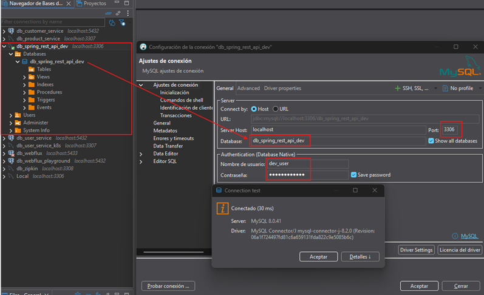
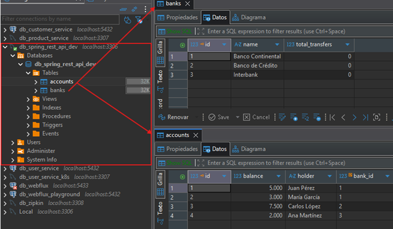

# 🌱 Spring Boot: REST API - Tests

Este proyecto corresponde a la etapa de aprendizaje de `pruebas en Spring Boot`. La idea es construir una aplicación
base con `Spring Boot` + `JPA` + `MySQL` y sobre ella aplicar diferentes tipos de pruebas:

- 🧪 Pruebas unitarias
- 🔗 Pruebas de integración

Además, hemos agregado `Swagger (OpenAPI)` para documentar y probar fácilmente nuestros endpoints REST.

---

# 🏗️ Fase 1 — Construcción del Proyecto Base (sin tests aún)

---

## ⚙️ Dependencias Iniciales

El proyecto fue generado desde
[Spring Initializr](https://start.spring.io/#!type=maven-project&language=java&platformVersion=3.5.6&packaging=jar&jvmVersion=21&groupId=dev.magadiflo&artifactId=spring-rest-api&name=spring-rest-api&description=Demo%20project%20for%20Spring%20Boot&packageName=dev.magadiflo.app&dependencies=web,data-jpa,lombok,mysql,validation).

📌 `Nota importante`: Al agregar `spring-boot-starter-web`, automáticamente se incluye `spring-boot-starter-test`,
el cual ya trae herramientas para pruebas como:

- ✅ JUnit 5
- ✅ Mockito
- ✅ AssertJ

Estas librerías serán claves para escribir nuestras pruebas.

### 📦 Dependencias en `pom.xml`

````xml
<!--Spring Boot 3.5.6-->
<!--Java 21-->
<!--lombok-mapstruct-binding.version 0.2.0-->
<!--openapi.version 2.8.13-->
<dependencies>
    <dependency>
        <groupId>org.springframework.boot</groupId>
        <artifactId>spring-boot-starter-data-jpa</artifactId>
    </dependency>
    <dependency>
        <groupId>org.springframework.boot</groupId>
        <artifactId>spring-boot-starter-validation</artifactId>
    </dependency>
    <dependency>
        <groupId>org.springframework.boot</groupId>
        <artifactId>spring-boot-starter-web</artifactId>
    </dependency>

    <!--Agregado manualmente-->
    <dependency>
        <groupId>org.springdoc</groupId>
        <artifactId>springdoc-openapi-starter-webmvc-ui</artifactId>
        <version>${openapi.version}</version>
    </dependency>
    <dependency>
        <groupId>org.mapstruct</groupId>
        <artifactId>mapstruct</artifactId>
        <version>${org.mapstruct.version}</version>
    </dependency>
    <!--/Agregado manualmente-->
    <dependency>
        <groupId>com.mysql</groupId>
        <artifactId>mysql-connector-j</artifactId>
        <scope>runtime</scope>
    </dependency>
    <dependency>
        <groupId>org.projectlombok</groupId>
        <artifactId>lombok</artifactId>
        <optional>true</optional>
    </dependency>
    <dependency>
        <groupId>org.springframework.boot</groupId>
        <artifactId>spring-boot-starter-test</artifactId>
        <scope>test</scope>
    </dependency>
</dependencies>
````

## 📚 Configurando Swagger (SpringDoc OpenAPI)

- [springdoc-openapi v2.8.13](https://springdoc.org/)
- [Spring Boot 3 + Spring Doc + Swagger : Un ejemplo](https://sacavix.com/2023/03/spring-boot-3-spring-doc-swagger-un-ejemplo/)

`Swagger` se integra en nuestro proyecto de `Spring Boot` con la siguiente dependencia, misma que agregamos en el
`pom.xml` anterior.

````xml

<dependency>
    <groupId>org.springdoc</groupId>
    <artifactId>springdoc-openapi-starter-webmvc-ui</artifactId>
    <version>${openapi.version}</version>
</dependency>
````

📌 No requiere configuración adicional, ya que se integra automáticamente con `Spring Boot`.

### 🌐 Endpoints disponibles

Según la documentación de esta dependencia ([springdoc-openapi v2.8.13](https://springdoc.org/)) nos dice que para la
integración entre `spring-boot` y `swagger-ui`, debemos agregar la dependencia a la lista de dependencias de
nuestro proyecto (no necesitamos configuración adicional).

Una vez levantada la aplicación (`mvn spring-boot:run`), se habilitan automáticamente los siguientes recursos:

- 📖 `Swagger UI` (interfaz gráfica): http://localhost:8080/swagger-ui/index.html
- 📄 `OpenAPI` en JSON: http://localhost:8080/v3/api-docs
- 📄 `OpenAPI` en YAML: http://localhost:8080/v3/api-docs.yaml

⚠️ Importante:

- `localhost` → host local
- `8080` → puerto por defecto de Spring Boot
- `context-path` → depende de tu configuración de la aplicación

### 🎯 ¿Por qué usar Swagger en este proyecto?

- 📌 Documentación automática de la API REST.
- 📌 Pruebas rápidas de endpoints sin depender de Postman o Curl.
- 📌 Facilita la comunicación con otros desarrolladores y equipos de QA.
- 📌 Exportación en `JSON/YAML`, útil para integraciones con otras herramientas.

> En este caso, aunque tenemos `Swagger UI` disponible, también utilizaremos `cURL` para ejecutar pruebas rápidas desde
> la terminal y registrar los resultados directamente en esta documentación.

## 🛡️ [Configurando Plugin con MapStruct](https://github.com/magadiflo/webflux-r2dbc-crud/blob/main/README.md)

Como vamos a trabajar con `MapStruct` necesitamos ampliar el `maven-compiler-plugin` para activar la generación de
código de `MapStruct`.

````xml

<plugins>
    <!--MapStruct-->
    <plugin>
        <groupId>org.apache.maven.plugins</groupId>
        <artifactId>maven-compiler-plugin</artifactId>
        <version>${maven-compiler-plugin.version}</version>
        <configuration>
            <source>${java.version}</source>
            <target>${java.version}</target>
            <annotationProcessorPaths>
                <path>
                    <groupId>org.projectlombok</groupId>
                    <artifactId>lombok</artifactId>
                    <version>${lombok.version}</version>
                </path>
                <path>
                    <groupId>org.mapstruct</groupId>
                    <artifactId>mapstruct-processor</artifactId>
                    <version>${org.mapstruct.version}</version>
                </path>
                <path>
                    <groupId>org.projectlombok</groupId>
                    <artifactId>lombok-mapstruct-binding</artifactId>
                    <version>${lombok-mapstruct-binding.version}</version>
                </path>
            </annotationProcessorPaths>
        </configuration>
    </plugin>
    <!--/MapStruct-->
</plugins>
````

## 🏦 Modelo de Datos — Entidades JPA

En esta primera parte definimos las `entidades del dominio principal` del sistema bancario:

- ➡️ Bank (banco)
- ➡️ Account (cuenta bancaria)

Ambas entidades están modeladas con `JPA (Jakarta Persistence API)` y usan `Lombok` para eliminar código repetitivo
(getters, setters, constructores, builder, etc.).

### 🔗 Relación Bidireccional `Bank ↔ Account`

El modelo de datos incluye una relación bidireccional entre `Bank` y `Account`:

- Un `Bank` puede tener múltiples `Account` asociadas.
- Cada `Account` pertenece a un único `Bank`.

````
Bank
 └─── Account
        ↳ bank_id (FK) 
````

- `Bank → Account`. Relación `@OneToMany` con `cascade = ALL` y `orphanRemoval = true`, lo que implica:
    - Si se elimina una cuenta de la lista, se elimina de la base.
    - Si se elimina el banco, se eliminan sus cuentas.
    - Ideal para mantener integridad y evitar cuentas huérfanas.


- `Account → Bank`. Relación `@ManyToOne` con `@JoinColumn(name = "bank_id")`, que:
    - Define la clave foránea en la tabla `accounts`.
    - Permite acceder al banco desde una cuenta.

### 🏛️ Entidad: Bank

Representa un banco dentro del sistema. Cada banco administra múltiples cuentas y registra el número total de
transferencias realizadas.

````java

@AllArgsConstructor
@NoArgsConstructor
@Builder
@Data
@Entity
@Table(name = "banks")
public class Bank {
    @Id
    @GeneratedValue(strategy = GenerationType.IDENTITY)
    private Long id;

    @Column(nullable = false, unique = true, length = 100)
    private String name;

    @Column(nullable = false)
    private Integer totalTransfers;

    @ToString.Exclude           // Evita ciclo infinito en toString()
    @EqualsAndHashCode.Exclude  // No usar la lista en equals/hashCode
    @Builder.Default            // Mantiene la inicialización (new ArrayList<>()) con @Builder
    @OneToMany(cascade = CascadeType.ALL, orphanRemoval = true, mappedBy = "bank")
    private List<Account> accounts = new ArrayList<>();

    // Métodos helper para mantener sincronizada la relación bidireccional
    public void addAccount(Account account) {
        this.accounts.add(account);
        account.setBank(this);
    }

    public void removeAccount(Account account) {
        this.accounts.remove(account);
        account.setBank(null);
    }
}
````

| Campo            | Tipo            | Descripción                                      |
|------------------|-----------------|--------------------------------------------------|
| `id`             | `Long`          | Identificador único del banco.                   |
| `name`           | `String`        | Nombre del banco (único, obligatorio).           |
| `totalTransfers` | `Integer`       | Total de transferencias realizadas por el banco. |
| `accounts`       | `List<Account>` | Lista de cuentas asociadas al banco.             |

#### 🔗 Relación con Account

- Anotación: `@OneToMany(mappedBy = "bank")`
- Define el lado inverso de la relación (la entidad `Account` contiene la `FK` `bank_id`).
- `cascade = CascadeType.ALL` → Esta propiedad indica que todas las operaciones de persistencia realizadas sobre la
  entidad padre (`Bank`) se propagan automáticamente a sus hijos (`Account`). Es decir, se propaga las operaciones
  (persist, merge, remove, refresh, detach).
- `orphanRemoval = true` → Esta propiedad indica que si una entidad hija (`Account`) se elimina de la colección del
  padre (`Bank`), también se elimina de la base de datos, aunque no se haya llamado explícitamente a
  `accountRepository.delete()`.
- `addAccount() / removeAccount()` → Métodos de conveniencia para mantener la consistencia bidireccional. Garantizan
  que ambas entidades se mantengan sincronizadas.

| Práctica                                          | Justificación                                                               |
|---------------------------------------------------|-----------------------------------------------------------------------------|
| `addAccount(...)`, `removeAccount(...)`           | Mantienen sincronía entre objetos en memoria, evitando relaciones rotas.    |
| `@ToString.Exclude`, `@EqualsAndHashCode.Exclude` | Previene ciclos infinitos y errores en colecciones bidireccionales.         |
| `@Builder.Default`                                | Evita que `Lombok` sobrescriba la inicialización de la lista en el builder. |

### 💰 Entidad: Account

Representa una cuenta bancaria asociada a un banco específico. Cada cuenta tiene un `titular (holder)` y
un `saldo (balance)`.

````java

@AllArgsConstructor
@NoArgsConstructor
@Builder
@Data
@Entity
@Table(name = "accounts")
public class Account {
    @Id
    @GeneratedValue(strategy = GenerationType.IDENTITY)
    private Long id;

    @Column(nullable = false, length = 100)
    private String holder;

    @Column(nullable = false, precision = 19, scale = 2)
    private BigDecimal balance;

    @ToString.Exclude                   // Evita ciclo infinito en toString()
    @EqualsAndHashCode.Exclude          // No usar la relación en equals/hashCode
    @ManyToOne(fetch = FetchType.LAZY)  // Mantener LAZY por buenas prácticas (default EAGER)
    @JoinColumn(name = "bank_id")
    private Bank bank;
}
````

| Campo     | Tipo         | Descripción                                            |
|-----------|--------------|--------------------------------------------------------|
| `id`      | `Long`       | Identificador único de la cuenta.                      |
| `holder`  | `String`     | Nombre del titular (máx. 100 caracteres, obligatorio). |
| `balance` | `BigDecimal` | Saldo monetario con alta precisión decimal.            |
| `bank`    | `Bank`       | Banco al que pertenece esta cuenta `(FK)`.             |

#### 💡 Detalle sobre `precision` y `scale`

- `precision = 19` → número total de dígitos significativos permitidos (enteros + decimales).
- `scale = 2` → cantidad de dígitos decimales (por ejemplo: centavos).
- Esto permite representar valores monetarios muy grandes, manteniendo la exactitud decimal.

> En términos prácticos, `según la configuración JPA definida en esta entidad`, el campo `balance` podrá almacenar
> hasta `17 dígitos enteros y 2 decimales`, por ejemplo: `99999999999999999.99`.
>
> Cabe resaltar que esta restricción proviene de la configuración `precision` y `scale` en la anotación `@Column`,
> no del tipo `BigDecimal` en sí.

## 📦 Capa de Transferencia de Datos (DTOs)

En esta sección se definen los `Data Transfer Objects (DTOs)` — clases que representan la información que viaja entre
el cliente y la API REST.

Su propósito es aislar la capa de presentación del modelo de dominio, aplicando validaciones que garanticen la
consistencia de los datos antes de llegar a la lógica de negocio.

### 🧾 AccountCreateRequest

DTO utilizado para crear una nueva cuenta bancaria. Incluye validaciones que aseguran la integridad y coherencia de los
datos enviados por el cliente.

````java
public record AccountCreateRequest(@NotBlank(message = "El nombre del titular no puede estar vacío")
                                   @Size(max = 100, message = "El nombre del titular no puede superar los 100 caracteres")
                                   String holder,

                                   @NotNull(message = "El saldo inicial es obligatorio")
                                   @DecimalMin(value = "0.00", message = "El saldo no puede ser negativo")
                                   @Digits(integer = 17, fraction = 2, message = "El saldo debe tener hasta 17 dígitos enteros y 2 decimales")
                                   BigDecimal balance,

                                   @NotNull(message = "Debe especificarse el banco asociado")
                                   @Positive(message = "El identificador del banco debe ser un número positivo")
                                   Long bankId) {
}
````

✅ Validaciones aplicadas

| Anotación             | Descripción                                                                            |
|-----------------------|----------------------------------------------------------------------------------------|
| `@NotBlank`           | El nombre del titular no puede ser nulo ni contener solo espacios.                     |
| `@Size(max = 100)`    | Restringe la longitud del nombre a un máximo de 100 caracteres.                        |
| `@NotNull`            | El saldo y el banco asociado no pueden ser nulos.                                      |
| `@DecimalMin("0.00")` | Evita valores negativos en el saldo inicial.                                           |
| `@Digits(17, 2)`      | Mantiene la precisión monetaria alineada con la configuración de la entidad `Account`. |
| `@Positive`           | Asegura que el identificador del banco sea mayor que cero.                             |

🧩 `Nota`: Este DTO no expone información sensible ni lógica de negocio; se usa exclusivamente para entrada de datos.

### 🔁 TransactionRequest

DTO que representa una transferencia bancaria entre dos cuentas. Garantiza que ambas cuentas y el monto de la operación
sean válidos antes de procesar la transacción.

````java
public record TransactionRequest(@NotNull(message = "Debe especificarse el ID de la cuenta de origen")
                                 @Positive(message = "El ID de la cuenta origen debe ser un número positivo")
                                 Long sourceAccountId,

                                 @NotNull(message = "Debe especificarse el ID de la cuenta de destino")
                                 @Positive(message = "El ID de la cuenta destino debe ser un número positivo")
                                 Long targetAccountId,

                                 @NotNull(message = "Debe especificar el monto a transferir")
                                 @DecimalMin(value = "0.01", message = "El monto mínimo de transferencia es 0.01")
                                 @Digits(integer = 17, fraction = 2, message = "El monto debe tener hasta 17 dígitos enteros y 2 decimales")
                                 BigDecimal amount) {
}
````

🧠 Consideraciones de negocio

- Las validaciones se realizan a nivel de DTO, antes de ejecutar la transacción.
- En la capa de servicio se deberá comprobar que ambas cuentas pertenezcan al mismo banco.
- El monto no puede ser negativo ni cero.

### 💳 AccountResponse

Representa la información que se devuelve al cliente tras consultar o crear una cuenta.
Contiene solo los datos públicos de la cuenta, sin exponer relaciones completas ni información sensible.

````java
public record AccountResponse(Long id,
                              String holder,
                              BigDecimal balance,
                              String bankName) {
}
````

🔒 Este DTO se utiliza para responder peticiones REST, manteniendo un nivel seguro y controlado de exposición de datos.

### ✏️ AccountUpdateRequest

DTO para actualizar el titular de una cuenta bancaria existente. Mantiene las mismas validaciones del campo holder que
el DTO de creación.

````java
public record AccountUpdateRequest(@NotBlank(message = "El nombre del titular no puede estar vacío")
                                   @Size(max = 100, message = "El nombre del titular no puede superar los 100 caracteres")
                                   String holder) {
}
````

📘 Nota: Este patrón de DTO reducido se usa cuando solo se actualizan campos puntuales.

### 💰 DepositRequest

DTO utilizado para realizar depósitos en una cuenta existente.

````java
public record DepositRequest(@NotNull(message = "Debe especificar el monto a depositar")
                             @DecimalMin(value = "0.01", message = "El monto mínimo es 0.01")
                             @Digits(integer = 17, fraction = 2, message = "El monto debe tener hasta 17 dígitos enteros y 2 decimales")
                             BigDecimal amount) {
}
````

🪙 Se aplica el mismo criterio de precisión que en `Account.balance`, garantizando coherencia entre dominio y capa de
entrada.

### 💸 WithdrawalRequest

DTO utilizado para realizar retiros desde una cuenta bancaria.

````java
public record WithdrawalRequest(@NotNull(message = "Debe especificar el monto a retirar")
                                @DecimalMin(value = "0.01", message = "El monto mínimo es 0.01")
                                @Digits(integer = 17, fraction = 2, message = "El monto debe tener hasta 17 dígitos enteros y 2 decimales")
                                BigDecimal amount) {
}
````

🚨 Las reglas de negocio sobre límites de retiro o fondos insuficientes se manejarán en la capa de servicio.

## 🧩 Capa de Persistencia (Repositorios)

Los repositorios son los encargados de la interacción directa con la base de datos, utilizando el poder de
`Spring Data JPA`. Extienden de `JpaRepository`, lo que nos brinda operaciones `CRUD` por defecto
(`findAll`, `findById`, `save`, `deleteById`, etc.), pero además se han definido consultas personalizadas para
cubrir escenarios específicos y reforzar el aprendizaje práctico.

### 💾 AccountRepository

Repositorio que gestiona las operaciones sobre la entidad `Account`. Incluye consultas tanto `JPQL` como `nativas`,
con el fin de practicar distintos enfoques en el acceso a datos.

````java
public interface AccountRepository extends JpaRepository<Account, Long> {

    /**
     * Obtiene todas las cuentas junto con el nombre del banco asociado.
     * <p>
     * Utiliza una proyección DTO ({@link dev.magadiflo.app.dto.AccountResponse})
     * directamente en la consulta JPQL.
     * </p>
     */
    @Query("""
            SELECT new dev.magadiflo.app.dto.AccountResponse(a.id, a.holder, a.balance, b.name)
            FROM Account AS a
                JOIN a.bank AS b
            """)
    List<AccountResponse> getAllAccounts();

    /**
     * Busca una cuenta por el nombre del titular.
     * <p>
     * Ejemplo de consulta JPQL con un parámetro nombrado.
     * </p>
     */
    @Query(value = """
            SELECT a
            FROM Account AS a
            WHERE a.holder = :holder
            """)
    Optional<Account> findAccountByHolder(String holder);

    /**
     * Actualiza el nombre del titular de una cuenta mediante una consulta SQL nativa.
     * <p>
     * Utiliza {@code @NativeQuery} (Spring Data JPA 3.4+) como atajo de {@code @Query(nativeQuery = true)},
     * junto con SpEL para acceder a las propiedades del objeto {@code account}.
     * </p>
     * <p>
     * Se aplica {@code clearAutomatically = true} para limpiar el contexto de persistencia
     * tras la ejecución del {@code UPDATE}, evitando inconsistencias si se accede a la entidad
     * modificada en el mismo contexto transaccional.
     * </p>
     *
     * @param account la entidad con los datos actualizados (debe contener id y holder)
     * @return número de filas afectadas (1 si la actualización fue exitosa, 0 si no se encontró la cuenta)
     * @implNote Este método debe ejecutarse dentro de un contexto {@code @Transactional}
     */
    @Modifying(clearAutomatically = true)
    @NativeQuery(value = """
            UPDATE accounts
            SET holder = :#{#account.holder}
            WHERE id = :#{#account.id}
            """)
    int updateAccountHolder(Account account);

    /**
     * Elimina una cuenta por su identificador mediante una consulta SQL nativa.
     * <p>
     * Aunque {@link JpaRepository} ya provee {@code deleteById()}, este método permite
     * personalizar la eliminación con SQL nativo.
     * </p>
     * <p>
     * Se aplica {@code clearAutomatically = true} para limpiar el {@code EntityManager}
     * tras el {@code DELETE}, asegurando que la entidad eliminada no permanezca en caché
     * durante el mismo contexto transaccional (especialmente útil en pruebas).
     * </p>
     *
     * @param accountId el identificador de la cuenta a eliminar
     * @return número de filas afectadas (1 si la eliminación fue exitosa, 0 si no se encontró la cuenta)
     * @implNote Este método debe ejecutarse dentro de un contexto {@code @Transactional}
     */
    @Modifying(clearAutomatically = true)
    @Query(value = """
            DELETE FROM accounts
            WHERE id = :accountId
            """, nativeQuery = true)
    int deleteAccountById(Long accountId);
}
````

✅ Notas técnicas y buenas prácticas

- Se usa `proyección directa hacia un record DTO` (`AccountResponse`) para evitar carga innecesaria de entidades.
- Las consultas con `@NativeQuery` permiten ejecutar `SQL` real, ideal para pruebas o sintaxis dependiente de la
  base de datos.
- Los parámetros `:#{#account...}` son una característica avanzada de `Spring Expression Language (SpEL)` para mapear
  atributos complejos en consultas.
- `@Modifying` indica operaciones de escritura (`INSERT`, `UPDATE`, `DELETE`) que deben ejecutarse dentro de un
  contexto `@Transactional`.
- Se recomienda usar `clearAutomatically = true` en métodos `@Modifying` con `SQL nativo` (`DELETE`, `UPDATE`) para
  limpiar el `EntityManager` tras la operación. Esto evita inconsistencias si se accede a la entidad modificada o
  eliminada dentro del mismo contexto transaccional (por ejemplo, en tests o servicios).
- Importante: `clearAutomatically` `no confirma` la operación ni afecta el `commit`. Si ocurre una excepción después,
  la transacción se revierte completamente, incluyendo el `DELETE` o `UPDATE`.
- En métodos de servicio anotados con `@Transactional`, el `EntityManager` se limpia automáticamente al finalizar la
  transacción. Sin embargo, si se accede a la entidad eliminada (o modificada) dentro del mismo método, puede aún seguir
  en caché si no se usa `clearAutomatically`. Por ejemplo:
    ````java
    @Transactional
    public void eliminarCuenta(Long id) {
        this.accountRepository.deleteAccountById(id);
        this.accountRepository.findById(id); // ❗ Podría devolver la cuenta si no se usó clearAutomatically
    }
    ````
  Aunque la cuenta fue eliminada en la base de datos, el `EntityManager` aún podría tenerla en caché si no se limpió
  automáticamente. Por eso se recomienda `clearAutomatically = true` en el repositorio.

### 🏦 BankRepository

Repositorio que maneja las operaciones sobre la entidad `Bank`. Aunque hereda todas las operaciones básicas de
`JpaRepository`, se agregan dos `Query Methods` útiles para validaciones y búsquedas.

````java
public interface BankRepository extends JpaRepository<Bank, Long> {
    /**
     * Busca un banco por su nombre.
     *
     * @param name nombre del banco
     * @return un {@link Optional} que contiene el banco si existe
     */
    Optional<Bank> findByName(String name);

    /**
     * Verifica si existe un banco con el nombre indicado.
     *
     * @param name nombre del banco
     * @return {@code true} si el banco existe, {@code false} en caso contrario
     */
    boolean existsByName(String name);
}
````

✅ Ventajas de los `Query Methods`

- `Spring Data JPA` interpreta automáticamente el nombre del método y genera la consulta.
- Simplifican búsquedas comunes sin necesidad de escribir `JPQL` ni `SQL`.

### 📘 En resumen:

- Hemos integrado consultas `JPQL`, `nativas` y `query methods` — un enfoque muy realista y completo.
- Incluímos `proyecciones DTO` modernas.
- Aprovechamos nuevas características de `Spring Data JPA 3.4+`, como `@NativeQuery`.
- Mantienes la orientación didáctica sin perder profesionalismo.

## 📦 Excepciones personalizadas

````java
/**
 * Excepción base para entidades no encontradas en el sistema.
 * <p>
 * Sirve como padre para excepciones más específicas como
 * {@link AccountNotFoundException} y {@link BankNotFoundException}.
 * </p>
 */
public class EntityNotFoundException extends RuntimeException {
    public EntityNotFoundException(String message) {
        super(message);
    }
}
````

````java
public class AccountNotFoundException extends EntityNotFoundException {
    public AccountNotFoundException(Long accountId) {
        super("No se encontró la cuenta con ID: %d".formatted(accountId));
    }

    public AccountNotFoundException(String holder) {
        super("No se encontró la cuenta del titular: %s".formatted(holder));
    }
}
````

````java
public class BankNotFoundException extends EntityNotFoundException {
    public BankNotFoundException(Long bankId) {
        super("No se encontró el banco con ID: %d".formatted(bankId));
    }

    public BankNotFoundException(String bankName) {
        super("No se encontró el banco con nombre: %s".formatted(bankName));
    }
}
````

````java
public class InsufficientBalanceException extends RuntimeException {
    public InsufficientBalanceException(Long accountId, String holder) {
        super("Saldo insuficiente en la cuenta del titular %s (ID: %d)".formatted(holder, accountId));
    }
}
````

````java
/**
 * Excepción lanzada cuando una transacción no cumple con las reglas de negocio.
 * <p>
 * Ejemplos de uso:
 * <ul>
 *   <li>Transferencia entre cuentas de diferentes bancos</li>
 *   <li>Transferencia de una cuenta a sí misma</li>
 *   <li>Monto de transferencia inválido</li>
 * </ul>
 * </p>
 */
public class InvalidTransactionException extends RuntimeException {
    public InvalidTransactionException(String message) {
        super(message);
    }
}
````

````java
public class DatabaseOperationException extends RuntimeException {
    public DatabaseOperationException(String operation) {
        super("Error al ejecutar operación de BD: %s. No se afectaron las filas esperadas".formatted(operation));
    }

    public DatabaseOperationException(String operation, Throwable cause) {
        super("Error al ejecutar operación de BD: %s".formatted(operation), cause);
    }
}
````

## Logs diferenciados por entorno y tipo de error

Según el perfil activo será el nivel de log que será aplicado.

| Entorno | Nivel de log para errores esperados | Nivel de log para errores inesperados |
|---------|-------------------------------------|---------------------------------------|
| dev     | `DEBUG` o `INFO`                    | `ERROR` con stack trace completo      |
| qa      | `WARN`                              | `ERROR` con stack trace               |
| prod    | `WARN` (si detalles sensibles)      | `ERROR` (sin stack trace al cliente)  |
| test    | `INFO` o `WARN`                     | `ERROR`                               |

💡 Nota: Los niveles de log se ajustarán en los perfiles (`application-dev.yml`, `application-prod.yml`, etc.)
usando:

- `logging.level.root`
- `logging.level.dev.magadiflo=DEBUG|INFO|WARN`

## DTO para respuestas de error

Creamos una estructura estandarizada para todas las respuestas de error:

````java

@JsonInclude(JsonInclude.Include.NON_NULL) // Solo incluye campos no nulos en el JSON
public record ErrorResponse(LocalDateTime timestamp,
                            int status,
                            String error,
                            String message,
                            String path,
                            Map<String, List<String>> validationErrors) { // Para errores de validación (@Valid)

    public static ErrorResponse create(int status, String error, String message, String path) {
        return new ErrorResponse(LocalDateTime.now(), status, error, message, path, null);
    }

    public static ErrorResponse create(int status, String error, String message, String path, Map<String, List<String>> validationErrors) {
        return new ErrorResponse(LocalDateTime.now(), status, error, message, path, validationErrors);
    }
}
````

## Manejo global de excepciones con `@RestControllerAdvice`

La API implementa un sistema centralizado de manejo de excepciones mediante `@RestControllerAdvice`, devolviendo
respuestas estandarizadas con estructura tipo:

```json
{
  "status": 404,
  "error": "Not Found",
  "message": "No se encontró la cuenta con ID: 5",
  "path": "/api/accounts/5",
  "timestamp": "2025-10-07T17:35:00"
}
```

````java

@Slf4j
@RestControllerAdvice
public class GlobalExceptionHandler {

    // ========== EXCEPCIONES DE NEGOCIO (ESPERADAS) - NIVEL WARN ==========
    @ExceptionHandler(AccountNotFoundException.class)
    public ResponseEntity<ErrorResponse> handleAccountNotFound(AccountNotFoundException ex, HttpServletRequest request) {
        return this.businessException("Cuenta no encontrada: {} | Excepción: {} | Path: {}", HttpStatus.NOT_FOUND, ex, request);
    }

    @ExceptionHandler(BankNotFoundException.class)
    public ResponseEntity<ErrorResponse> handleBankNotFound(BankNotFoundException ex, HttpServletRequest request) {
        return this.businessException("Banco no encontrado: {} | Excepción: {} | Path: {}", HttpStatus.NOT_FOUND, ex, request);
    }

    @ExceptionHandler(EntityNotFoundException.class)
    public ResponseEntity<ErrorResponse> handleEntityNotFound(EntityNotFoundException ex, HttpServletRequest request) {
        return this.businessException("Entidad no encontrada: {} | Excepción: {} | Path: {}", HttpStatus.NOT_FOUND, ex, request);
    }

    @ExceptionHandler(InsufficientBalanceException.class)
    public ResponseEntity<ErrorResponse> handleInsufficientBalance(InsufficientBalanceException ex, HttpServletRequest request) {
        return this.businessException("Operación rechazada por saldo insuficiente: {} | Excepción: {} | Path: {}", HttpStatus.BAD_REQUEST, ex, request);
    }

    @ExceptionHandler(InvalidTransactionException.class)
    public ResponseEntity<ErrorResponse> handleInvalidTransaction(InvalidTransactionException ex, HttpServletRequest request) {
        return this.businessException("Transacción inválida: {} | Excepción: {} | Path: {}", HttpStatus.BAD_REQUEST, ex, request);
    }

    // ========== VALIDACIONES DE BEAN VALIDATION (@Valid) ==========
    @ExceptionHandler(MethodArgumentNotValidException.class)
    public ResponseEntity<ErrorResponse> handleValidationErrors(MethodArgumentNotValidException ex, HttpServletRequest request) {
        Map<String, List<String>> validationErrors = ex.getBindingResult().getFieldErrors().stream()
                .collect(Collectors.groupingBy(
                        FieldError::getField,
                        Collectors.mapping(
                                DefaultMessageSourceResolvable::getDefaultMessage,
                                Collectors.toList()
                        )
                ));

        // Se registra a nivel INFO porque las validaciones fallidas son errores esperados del cliente.
        // En DEV (nivel DEBUG) y QA (nivel INFO) se mostrarán estos logs para depuración.
        // En PROD (nivel WARN) estos logs NO aparecerán, reduciendo ruido en logs de producción.
        log.info("Errores de validación en petición {} | Campos con errores: {} | Path: {}",
                request.getMethod(), validationErrors.keySet(), request.getRequestURI());

        ErrorResponse errorResponse = ErrorResponse.create(
                HttpStatus.BAD_REQUEST.value(),
                "Validation Failed",
                "Los datos enviados no cumplen con las validaciones requeridas",
                request.getRequestURI(),
                validationErrors
        );
        return ResponseEntity.status(HttpStatus.BAD_REQUEST).body(errorResponse);
    }

    // ========== EXCEPCIONES INESPERADAS (TÉCNICAS) - NIVEL ERROR ==========
    @ExceptionHandler(DatabaseOperationException.class)
    public ResponseEntity<ErrorResponse> handleDatabaseOperation(DatabaseOperationException ex, HttpServletRequest request) {
        log.error("Error de operación de base de datos: {} | Path: {}", ex.getMessage(), request.getRequestURI(), ex);

        ErrorResponse errorResponse = ErrorResponse.create(
                HttpStatus.INTERNAL_SERVER_ERROR.value(),
                HttpStatus.INTERNAL_SERVER_ERROR.getReasonPhrase(),
                "Error al procesar la operación en la base de datos",
                request.getRequestURI()
        );
        return ResponseEntity.status(HttpStatus.INTERNAL_SERVER_ERROR).body(errorResponse);
    }

    @ExceptionHandler(Exception.class)
    public ResponseEntity<ErrorResponse> handleGenericException(Exception ex, HttpServletRequest request) {
        log.error("Error inesperado del sistema: {} | Path: {} | Exception: {}",
                ex.getMessage(),
                request.getRequestURI(),
                ex.getClass().getSimpleName(),
                ex); // El stack trace completo se loguea aquí

        ErrorResponse errorResponse = ErrorResponse.create(
                HttpStatus.INTERNAL_SERVER_ERROR.value(),
                HttpStatus.INTERNAL_SERVER_ERROR.getReasonPhrase(),
                "Ocurrió un error interno del servidor. Por favor, contacte al administrador",
                request.getRequestURI()
        );
        return ResponseEntity.status(HttpStatus.INTERNAL_SERVER_ERROR).body(errorResponse);
    }

    /**
     * Método auxiliar para manejar excepciones de negocio esperadas.
     * <p>
     * Registra el error a nivel WARN y construye una respuesta HTTP estandarizada.
     * </p>
     *
     * @param logMessage mensaje para el log con placeholders {}
     * @param status     código HTTP de respuesta
     * @param ex         excepción lanzada
     * @param request    contexto de la petición HTTP
     * @return respuesta con el error formateado
     */
    private ResponseEntity<ErrorResponse> businessException(String logMessage, HttpStatus status, Exception ex, HttpServletRequest request) {
        log.warn(logMessage, ex.getMessage(), ex.getClass().getSimpleName(), request.getRequestURI());
        ErrorResponse errorResponse = ErrorResponse.create(
                status.value(),
                status.getReasonPhrase(),
                ex.getMessage(),
                request.getRequestURI()
        );
        return ResponseEntity.status(status).body(errorResponse);
    }
}
````

## Mapeo entre entidades y DTOs `(MapStruct)`

El mapeo entre las entidades y los distintos `DTOs (Data Transfer Objects)` se realiza mediante `MapStruct`,
un framework de mapeo por compilación que genera implementaciones optimizadas en `tiempo de compilación`.
De esta forma, evitamos el uso de librerías basadas en reflexión como ModelMapper, logrando un mejor rendimiento
y mayor seguridad en los tipos.

````java

@Mapper(componentModel = MappingConstants.ComponentModel.SPRING)
public interface AccountMapper {
    @Mapping(target = "bankName", source = "bank.name")
    AccountResponse toAccountResponse(Account account);

    @Mapping(target = "id", ignore = true)
    @Mapping(target = "bank", source = "bank")
    Account toAccount(AccountCreateRequest request, Bank bank);

    @Mapping(target = "id", ignore = true)
    @Mapping(target = "balance", ignore = true)
    @Mapping(target = "bank", ignore = true)
    Account toUpdateAccount(AccountUpdateRequest request, @MappingTarget Account account);
}
````

🧩 Consideraciones

- `@Mapper(componentModel = MappingConstants.ComponentModel.SPRING)`. Esto permite que Spring detecte automáticamente
  la implementación generada y la gestione como un bean `(@Component)`.
- `MapStruct` genera la implementación automáticamente en `target/generated-sources/annotations`.
- Colocar `@Mapping(target = "id", ignore = true)` en nuestro método `toAccount(...)` es la forma correcta y necesaria
  de indicarle a `MapStruct`:
    1. Ignora el campo `id` en el destino (`Account`).
    2. Evita que tome el valor de cualquier campo `id` coincidente de las fuentes (específicamente `Bank.id`).
- De esta manera, el nuevo objeto `Account` se crea con `id = null`, lo que asegura la correcta operación de inserción
  en la base de datos.

## 🧩 Interfaz `AccountService`

Define las operaciones disponibles para la gestión de cuentas bancarias, organizadas por tipo de responsabilidad.
El objetivo es mantener una capa de servicio clara, reutilizable y desacoplada del controlador y del repositorio.

````java
public interface AccountService {
    // ========= CONSULTAS =========
    List<AccountResponse> findAllAccounts();

    AccountResponse findAccountById(Long accountId);

    AccountResponse findAccountByHolder(String holder);

    BigDecimal getAccountBalance(Long accountId);

    // ========= OPERACIONES CRUD =========
    AccountResponse saveAccount(AccountCreateRequest accountRequest);

    AccountResponse updateAccount(Long accountId, AccountUpdateRequest accountRequest);

    void deleteAccount(Long accountId);

    // ========= OPERACIONES TRANSACCIONALES =========
    AccountResponse deposit(Long accountId, DepositRequest request);

    AccountResponse withdraw(Long accountId, WithdrawalRequest request);

    void transfer(TransactionRequest request);

    // ========= REPORTES / CONSULTAS AGREGADAS =========
    int countTotalTransfersToBank(Long bankId);
}
````

## 🧠 Servicio AccountServiceImpl

Implementación principal de la interfaz `AccountService`, responsable de la gestión de cuentas bancarias,
operaciones transaccionales y consultas agregadas. Sigue el patrón `Service Layer`, combinando `repositorios JPA`,
`mapeadores MapStruct` y manejo de excepciones personalizadas.

````java

@Slf4j
@RequiredArgsConstructor
@Transactional(readOnly = true)
@Service
public class AccountServiceImpl implements AccountService {

    private final AccountRepository accountRepository;
    private final BankRepository bankRepository;
    private final AccountMapper accountMapper;

    @Override
    public List<AccountResponse> findAllAccounts() {
        log.debug("Consultando todas las cuentas");
        List<AccountResponse> accounts = this.accountRepository.getAllAccounts();
        log.info("Se encontraron {} cuentas", accounts.size());
        return accounts;
    }

    @Override
    public AccountResponse findAccountById(Long accountId) {
        log.debug("Buscando cuenta con ID: {}", accountId);
        return this.accountRepository.findById(accountId)
                .map(account -> {
                    log.info("Cuenta encontrada | ID: {} | Titular: {}", accountId, account.getHolder());
                    return this.accountMapper.toAccountResponse(account);
                })
                .orElseThrow(() -> new AccountNotFoundException(accountId));
    }

    @Override
    public AccountResponse findAccountByHolder(String holder) {
        log.debug("Buscando cuenta del titular: {}", holder);
        return this.accountRepository.findAccountByHolder(holder)
                .map(account -> {
                    log.info("Cuenta encontrada | Titular: {} | ID: {}", account.getHolder(), account.getId());
                    return this.accountMapper.toAccountResponse(account);
                })
                .orElseThrow(() -> new AccountNotFoundException(holder));
    }

    @Override
    public BigDecimal getAccountBalance(Long accountId) {
        log.debug("Consultando saldo de la cuenta con ID: {}", accountId);
        return this.accountRepository.findById(accountId)
                .map(account -> {
                    log.info("Saldo consultado | Cuenta ID: {} | Saldo: {}", accountId, account.getBalance());
                    return account.getBalance();
                })
                .orElseThrow(() -> new AccountNotFoundException(accountId));
    }

    @Override
    @Transactional
    public AccountResponse saveAccount(AccountCreateRequest accountRequest) {
        log.debug("Iniciando registro de cuenta para el titular: {}", accountRequest.holder());

        Bank bank = this.bankRepository.findById(accountRequest.bankId())
                .orElseThrow(() -> new BankNotFoundException(accountRequest.bankId()));

        Account account = this.accountMapper.toAccount(accountRequest, bank);

        this.accountRepository.save(account);

        log.info("Cuenta registrada exitosamente | ID: {} | Titular: {} | Banco: {} | Saldo inicial: {}",
                account.getId(), account.getHolder(), bank.getName(), account.getBalance());
        return this.accountMapper.toAccountResponse(account);
    }

    @Override
    @Transactional
    public AccountResponse updateAccount(Long accountId, AccountUpdateRequest accountRequest) {
        log.debug("Iniciando actualización del titular para la cuenta con ID: {}", accountId);
        return this.accountRepository.findById(accountId)
                .map(account -> {
                    log.info("Cuenta encontrada | ID: {} | Titular actual: {}", accountId, account.getHolder());
                    return this.accountMapper.toUpdateAccount(accountRequest, account);
                })
                .map(this.accountRepository::save)
                .map(account -> {
                    log.info("Cuenta actualizada | ID: {} | Nuevo titular: {}", accountId, account.getHolder());
                    return this.accountMapper.toAccountResponse(account);
                })
                .orElseThrow(() -> new AccountNotFoundException(accountId));
    }

    @Override
    @Transactional
    public void deleteAccount(Long accountId) {
        log.debug("Iniciando eliminación de la cuenta con ID: {}", accountId);
        this.accountRepository.findById(accountId)
                .map(account -> this.accountRepository.deleteAccountById(account.getId()))
                .map(affectedRows -> {
                    if (affectedRows == 0) {
                        log.error("No se pudo eliminar la cuenta con ID: {}", accountId);
                        throw new DatabaseOperationException("DELETE cuenta");
                    }
                    log.info("Cuenta eliminada exitosamente | ID: {}", accountId);
                    return affectedRows;
                })
                .orElseThrow(() -> new AccountNotFoundException(accountId));
    }

    @Override
    @Transactional
    public AccountResponse deposit(Long accountId, DepositRequest request) {
        log.debug("Iniciando depósito a la cuenta con ID: {}, monto: {}", accountId, request.amount());
        return this.accountRepository.findById(accountId)
                .map(account -> this.makeADeposit(account, request.amount()))
                .map(this.accountRepository::save)
                .map(account -> {
                    log.info("Depósito exitoso | Cuenta ID: {} | Monto depositado: {} | Nuevo saldo: {}",
                            account.getId(), request.amount(), account.getBalance());
                    return this.accountMapper.toAccountResponse(account);
                })
                .orElseThrow(() -> new AccountNotFoundException(accountId));
    }

    @Override
    @Transactional
    public AccountResponse withdraw(Long accountId, WithdrawalRequest request) {
        log.debug("Iniciando retiro de la cuenta con ID: {}, monto: {}", accountId, request.amount());
        return this.accountRepository.findById(accountId)
                .map(account -> this.makeAWithdrawal(account, request.amount()))
                .map(this.accountRepository::save)
                .map(account -> {
                    log.info("Retiro exitoso | Cuenta ID: {} | Monto retirado: {} | Nuevo saldo: {}",
                            account.getId(), request.amount(), account.getBalance());
                    return this.accountMapper.toAccountResponse(account);
                })
                .orElseThrow(() -> new AccountNotFoundException(accountId));
    }

    @Override
    @Transactional
    public void transfer(TransactionRequest request) {
        log.debug("Iniciando transferencia | Origen: {} | Destino: {} | Monto: {}",
                request.sourceAccountId(), request.targetAccountId(), request.amount());

        if (request.sourceAccountId().equals(request.targetAccountId())) {
            log.warn("Intento de transferencia a la misma cuenta: {}", request.sourceAccountId());
            throw new InvalidTransactionException("No se puede hacer transferencia de una cuenta a sí misma");
        }

        Account sourceAccount = this.accountRepository.findById(request.sourceAccountId())
                .orElseThrow(() -> new AccountNotFoundException(request.sourceAccountId()));
        Account targetAccount = this.accountRepository.findById(request.targetAccountId())
                .orElseThrow(() -> new AccountNotFoundException(request.targetAccountId()));

        if (!sourceAccount.getBank().getId().equals(targetAccount.getBank().getId())) {
            log.warn("Intento de transferencia entre bancos diferentes | Banco origen: {} | Banco destino: {}",
                    sourceAccount.getBank().getName(), targetAccount.getBank().getName());
            throw new InvalidTransactionException("No se puede hacer transferencia entre cuentas de diferentes bancos");
        }

        Bank bank = sourceAccount.getBank();
        bank.setTotalTransfers(bank.getTotalTransfers() + 1);

        // Aunque las entidades Account y Bank están en estado MANAGED dentro de esta transacción,
        // usamos save(...) explícitamente para reforzar la intención de persistencia,
        // facilitar la trazabilidad del flujo y permitir verificación en tests unitarios.
        // JPA sincronizará los cambios al final del method, pero estos save(...) hacen visible el punto
        // de persistencia.
        this.accountRepository.save(this.makeAWithdrawal(sourceAccount, request.amount()));
        this.accountRepository.save(this.makeADeposit(targetAccount, request.amount()));
        this.bankRepository.save(bank);

        log.info("Transferencia exitosa | De: {} (ID: {}) | Para: {} (ID: {}) | Monto: {} | Banco: {} | Total transferencias: {}",
                sourceAccount.getHolder(), sourceAccount.getId(),
                targetAccount.getHolder(), targetAccount.getId(),
                request.amount(), bank.getName(), bank.getTotalTransfers());
    }

    @Override
    public int countTotalTransfersToBank(Long bankId) {
        log.debug("Consultando total de transferencias del banco con ID: {}", bankId);
        return this.bankRepository.findById(bankId)
                .map(bank -> {
                    log.info("Total de transferencias del banco {} (ID: {}): {}",
                            bank.getName(), bank.getId(), bank.getTotalTransfers());
                    return bank.getTotalTransfers();
                })
                .orElseThrow(() -> new BankNotFoundException(bankId));
    }

    private Account makeADeposit(Account account, BigDecimal amount) {
        log.info("Aplicando depósito a cuenta con ID: {}, saldo actual: {}, monto a agregar: {}",
                account.getId(), account.getBalance(), amount);

        account.setBalance(account.getBalance().add(amount));
        return account;
    }

    private Account makeAWithdrawal(Account account, BigDecimal amount) {
        log.info("Validando el retiro de saldo para la cuenta con ID: {}, saldo actual: {}, monto a retirar: {}",
                account.getId(), account.getBalance(), amount);

        if (amount.compareTo(account.getBalance()) > 0) {
            log.warn("Solicitud rechazada por saldo insuficiente | Cuenta ID: {} | Titular: {} | Saldo: {} | Monto solicitado: {}",
                    account.getId(), account.getHolder(), account.getBalance(), amount);
            throw new InsufficientBalanceException(account.getId(), account.getHolder());
        }

        account.setBalance(account.getBalance().subtract(amount));
        return account;
    }
}
````

## 📘 Controlador AccountController

Controlador principal para la gestión de cuentas bancarias dentro de la API REST. Expone los endpoints CRUD y las
operaciones financieras (depósitos, retiros y transferencias).

Cada método del controlador se apoya en el servicio `AccountService`, el cual encapsula la lógica de negocio y
validaciones transaccionales.

````java

@Slf4j
@RequiredArgsConstructor
@RestController
@RequestMapping(path = "/api/v1/accounts")
public class AccountController {

    private final AccountService accountService;

    @GetMapping
    public ResponseEntity<List<AccountResponse>> findAllAccounts() {
        return ResponseEntity.ok(this.accountService.findAllAccounts());
    }

    @GetMapping(path = "/{accountId}")
    public ResponseEntity<AccountResponse> findAccountById(@PathVariable Long accountId) {
        return ResponseEntity.ok(this.accountService.findAccountById(accountId));
    }

    @GetMapping(path = "/search")
    public ResponseEntity<AccountResponse> searchByHolder(@RequestParam String holder) {
        return ResponseEntity.ok(this.accountService.findAccountByHolder(holder));
    }

    @GetMapping(path = "/{accountId}/balance")
    public ResponseEntity<BigDecimal> getAccountBalance(@PathVariable Long accountId) {
        return ResponseEntity.ok(this.accountService.getAccountBalance(accountId));
    }

    @PostMapping
    public ResponseEntity<AccountResponse> saveAccount(@Valid @RequestBody AccountCreateRequest request) {
        AccountResponse account = this.accountService.saveAccount(request);
        URI location = ServletUriComponentsBuilder
                .fromCurrentRequest()
                .path("/{accountId}")
                .buildAndExpand(account.id())
                .toUri();
        return ResponseEntity.created(location).body(account);
    }

    @PutMapping(path = "/{accountId}")
    public ResponseEntity<AccountResponse> updateAccount(@PathVariable Long accountId, @Valid @RequestBody AccountUpdateRequest request) {
        return ResponseEntity.ok(this.accountService.updateAccount(accountId, request));
    }

    @DeleteMapping(path = "/{accountId}")
    public ResponseEntity<Void> deleteAccount(@PathVariable Long accountId) {
        this.accountService.deleteAccount(accountId);
        return ResponseEntity.noContent().build();
    }

    @PostMapping(path = "/{accountId}/deposit")
    public ResponseEntity<AccountResponse> deposit(@PathVariable Long accountId, @Valid @RequestBody DepositRequest request) {
        return ResponseEntity.ok(this.accountService.deposit(accountId, request));
    }

    @PostMapping(path = "/{accountId}/withdraw")
    public ResponseEntity<AccountResponse> withdraw(@PathVariable Long accountId, @Valid @RequestBody WithdrawalRequest request) {
        return ResponseEntity.ok(this.accountService.withdraw(accountId, request));
    }

    @PostMapping(path = "/transfer")
    public ResponseEntity<Void> transfer(@Valid @RequestBody TransactionRequest request) {
        this.accountService.transfer(request);
        return ResponseEntity.noContent().build();
    }
}
````

### 🏦 BankController

Controlador encargado de exponer la información relacionada con los bancos, particularmente la cantidad total de
transferencias realizadas.

````java

@Slf4j
@RequiredArgsConstructor
@RestController
@RequestMapping(path = "/api/v1/banks")
public class BankController {

    private final AccountService accountService;

    @GetMapping(path = "/{bankId}")
    public ResponseEntity<Integer> countTotalTransfersToBank(@PathVariable Long bankId) {
        return ResponseEntity.ok(this.accountService.countTotalTransfersToBank(bankId));
    }

}
````

## ⚙️ Gestión de configuraciones por perfiles en entornos reales

En un entorno empresarial, las aplicaciones `Spring Boot` se despliegan bajo distintos perfiles de ejecución
(`dev`, `qa`, `prod`, etc.), cada uno con configuraciones específicas que garantizan estabilidad, seguridad y
trazabilidad.

`Spring Boot` permite aislar la configuración de cada entorno en archivos separados, aplicando automáticamente
el perfil activo definido en el archivo `application.yml` principal.

📂 Estructura de configuración:

````
src/
└── main/
    └── resources/
        ├── application.yml             # Perfil por defecto
        ├── application-dev.yml         # Entorno de desarrollo
        ├── application-qa.yml          # Entorno de pruebas QA
        └── application-prod.yml        # Entorno de producción
````

### 🧩 1. Perfil Default (`application.yml`)

Este archivo actúa como `configuración base`, aplicable a todos los entornos. Define parámetros generales y el
perfil activo por defecto.

````yml
server:
  port: 8080

spring:
  application:
    name: spring-rest-api

  profiles:
    active: dev   # Activa el perfil de desarrollo por defecto

  jpa:
    open-in-view: false  # Desactiva "Open Session in View" (buena práctica)
````

💡 Notas profesionales

- `open-in-view: false` evita fugas de sesión y problemas de `LazyInitialization` (recomendación estándar en empresas).
- `profiles.active: dev` indica el perfil que Spring Boot cargará por defecto durante el desarrollo local.
- Este archivo `no debe contener credenciales` ni configuraciones sensibles; solo configuraciones transversales.

### 🧪 2. Perfil de Desarrollo (`application-dev.yml`)

Perfil utilizado en el entorno de desarrollo local, con logging detallado, inicialización automática de datos y
generación dinámica del esquema.

````yml
server:
  error:
    include-message: always  # Muestra mensajes de error en respuestas HTTP (útil para depurar)

spring:
  datasource:
    url: jdbc:mysql://localhost:3306/db_spring_rest_api_dev?serverTimezone=America/Lima
    username: dev_user
    password: dev_password

  jpa:
    hibernate:
      ddl-auto: update # Hibernate crea/actualiza tablas
    properties:
      hibernate:
        format_sql: true
    defer-datasource-initialization: true # Espera a que Hibernate cree tablas antes de ejecutar scripts SQL

  sql:
    init:
      mode: always # Ejecuta siempre scripts al iniciar
      data-locations: classpath:sql/data-dev.sql # Ruta al script de datos iniciales

logging:
  level:
    root: INFO
    dev.magadiflo.app: DEBUG                              # Tu paquete principal con máximo detalle
    org.hibernate.SQL: DEBUG                              # SQL generado
    org.hibernate.type.descriptor.sql.BasicBinder: TRACE  # Parámetros de SQL
    org.springframework.web: DEBUG                        # Requests HTTP
    org.springframework.transaction: DEBUG                # Transacciones
    org.springframework.data.jpa: DEBUG                   # Consultas JPA
````

💡 Notas profesionales

- `ddl-auto: update` solo debe usarse en desarrollo, nunca en QA o producción.
- Los scripts de inicialización (`sql/init/data-dev.sql`) facilitan datos base para pruebas locales.
- El nivel `DEBUG/TRACE` en logs permite visualizar cada interacción de la capa de persistencia.
- En empresas, los entornos `dev` suelen incluir herramientas como `H2` o `contenedores Docker` de `MySQL` para
  aislamiento rápido.

### 🧾 3. Perfil de Calidad (QA) (`application-qa.yml`)

Este entorno simula el comportamiento de producción, pero en un ambiente de `control de calidad` donde se ejecutan
pruebas de integración, UAT y validaciones de negocio.

````yml
server:
  error:
    include-message: always

spring:
  datasource:
    url: jdbc:mysql://localhost:3306/db_spring_rest_api_qa?serverTimezone=America/Lima
    username: ${DB_USERNAME}
    password: ${DB_PASSWORD}

  jpa:
    hibernate:
      ddl-auto: validate # Valida el esquema contra las entidades, no lo modifica

logging:
  level:
    root: INFO
    dev.magadiflo.app: INFO
    org.hibernate: WARN
    org.hibernate.SQL: WARN
    org.springframework.web: INFO
    org.springframework.transaction: INFO
    org.springframework.data.jpa: INFO
````

💡 Notas profesionales

- `ddl-auto: validate` asegura que el esquema sea correcto sin alterarlo.
- Esto es `clave en QA`: las migraciones se aplican con herramientas como `Flyway` o `Liquibase`.
- Uso de variables de entorno (`${DB_USERNAME}`) evita exponer credenciales sensibles.
- Nivel de log `INFO/WARN` reduce ruido y mejora la trazabilidad en pruebas.

### 🚀 4. Perfil de Producción (`application-prod.yml`)

Entorno de despliegue final. Prioriza seguridad, rendimiento y estabilidad. Aquí no se deben ejecutar scripts
ni generar/modificar tablas automáticamente.

````yml
server:
  error:
    include-message: never
    include-stacktrace: never
    include-exception: false

spring:
  datasource:
    url: jdbc:mysql://${DB_HOST}:${DB_PORT}/${DB_NAME}?serverTimezone=America/Lima&useSSL=true
    username: ${DB_USERNAME}
    password: ${DB_PASSWORD}

  jpa:
    hibernate:
      ddl-auto: none # No hace nada con el esquema de la BD.

logging:
  level:
    root: WARN
    dev.magadiflo.app: WARN
    org.hibernate: ERROR
    org.springframework: WARN
````

💡 Notas profesionales

- `ddl-auto: none` es obligatorio en producción; las migraciones deben gestionarse con herramientas externas.
- Variables de entorno `${DB_HOST}`, `${DB_PORT}`, etc., permiten integración `CI/CD` (`Jenkins`, `GitHub Actions`,
  etc.).
- Se ocultan los mensajes de error al cliente final (`include-message: never`) por seguridad.
- Nivel de log `WARN/ERROR` evita sobrecarga en disco y protege información sensible.

## 🧩 Script de datos iniciales (`data-dev.sql`)

- 📂 Ruta del archivo: `src/main/resources/sql/data-dev.sql`
- 💡 Contexto: Este script define un conjunto de datos iniciales que se cargarán automáticamente cuando la aplicación
  se ejecute con el perfil `dev`. Se usa principalmente para:
    - Disponer de información base durante el desarrollo.
    - Probar endpoints sin necesidad de crear datos manualmente.
    - Asegurar consistencia entre ejecuciones locales.

### ⚙️ Comportamiento en el entorno dev

Gracias a la configuración YAML:

````yml
spring:
  sql:
    init:
      mode: always
      data-locations: classpath:sql/data-dev.sql
````

El script se ejecuta automáticamente cada vez que la aplicación inicia, una vez que Hibernate ha generado o actualizado
el esquema (`ddl-auto: update`). Esto garantiza que los datos iniciales siempre existan en la base de datos del entorno
local.

### 🧾 Contenido del script

````sql
-- ============================================
-- LIMPIAR DATOS EXISTENTES Y RESETEAR IDS
-- ============================================

-- Desactivar verificación de llaves foráneas temporalmente
SET FOREIGN_KEY_CHECKS = 0;

-- Limpiar tablas (TRUNCATE resetea AUTO_INCREMENT automáticamente)
TRUNCATE TABLE accounts;
TRUNCATE TABLE banks;

-- Reactivar verificación de llaves foráneas
SET FOREIGN_KEY_CHECKS = 1;

-- ============================================
-- INSERTAR DATOS INICIALES
-- ============================================

-- Bancos
INSERT INTO banks(name, total_transfers)
VALUES('Banco Continental', 0),
('Banco de Crédito', 0),
('Interbank', 0);

-- Cuentas
INSERT INTO accounts(holder, balance, bank_id)
VALUES('Juan Pérez', 5000.00, 1),
('María García', 3000.00, 1),
('Carlos López', 7500.00, 2),
('Ana Martínez', 2000.00, 3);
````

💬 Explicación paso a paso

| Bloque                           | Descripción                                                                                                                                                                                                                                                                                      |
|:---------------------------------|:-------------------------------------------------------------------------------------------------------------------------------------------------------------------------------------------------------------------------------------------------------------------------------------------------|
| 🧹 **Limpieza de datos previos** | Antes de insertar los registros iniciales, se desactivan temporalmente las restricciones de llaves foráneas (`FOREIGN_KEY_CHECKS = 0`), se vacían las tablas con `TRUNCATE`, y luego se reactivan. Esto evita errores por dependencias entre entidades y garantiza que los IDs empiecen desde 1. |
| 🏦 **Inserción de bancos**       | Se crean tres bancos de prueba, cada uno con `total_transfers = 0`. Esto permite validar la lógica de transferencias interbancarias sin modificar datos manualmente.                                                                                                                             |
| 💰 **Inserción de cuentas**      | Se asocian cuatro cuentas distribuidas entre los bancos creados. Estos datos permiten probar depósitos, retiros, consultas y transferencias entre cuentas del mismo banco.                                                                                                                       |

## 🐬 Contenedor de Base de Datos MySQL para entorno dev

- 📂 Archivo: `compose.yml`
- 📦 Objetivo: Proveer una instancia `MySQL 8` local aislada para desarrollo, reproducible entre miembros del equipo
  y alineada con las configuraciones del perfil `dev`.

````yml
services:
  s-mysql:
    image: mysql:8.0.41-debian
    container_name: c-mysql
    restart: unless-stopped
    ports:
      - '3306:3306'
    environment:
      MYSQL_ROOT_PASSWORD: magadiflo
      MYSQL_DATABASE: db_spring_rest_api_dev
      MYSQL_USER: dev_user
      MYSQL_PASSWORD: dev_password
    networks:
      - docker-test-net

networks:
  docker-test-net:
    name: docker-test-net
````

### 🐋 Levantando el contenedor de base de datos MySQL (Entorno dev)

Antes de iniciar la aplicación Spring Boot, es necesario tener corriendo la base de datos MySQL en un contenedor Docker.
Esto permite un entorno de desarrollo aislado, reproducible y coherente con entornos reales de despliegue.

🚀 Ejecución del contenedor

````bash
D:\programming\spring\01.udemy\02.andres_guzman\03.junit_y_mockito_2023\java-spring-test-suite (feature/spring-rest-api)
$ docker compose -f ./docker/compose.yml up -d                                                                          
[+] Running 2/2                                                                                                         
 ✔ Network docker-test-net  Created                                                                                     
 ✔ Container c-mysql        Started                                                                                     
````

🔍 Verificando el contenedor activo

````bash
$ docker container ls -a
CONTAINER ID   IMAGE                 COMMAND                  CREATED          STATUS          PORTS                                         NAMES
d0d5997e6ff1   mysql:8.0.41-debian   "docker-entrypoint.s…"   19 seconds ago   Up 18 seconds   0.0.0.0:3306->3306/tcp, [::]:3306->3306/tcp   c-mysql 
````



## 📘 Log de arranque de la aplicación Spring Boot (perfil dev)

Cuando se ejecuta la aplicación, `Spring Boot` muestra una traza estructurada del proceso de inicialización.
A continuación se documentan las etapas más relevantes del startup con base en el log capturado.

````bash
  .   ____          _            __ _ _
 /\\ / ___'_ __ _ _(_)_ __  __ _ \ \ \ \
( ( )\___ | '_ | '_| | '_ \/ _` | \ \ \ \
 \\/  ___)| |_)| | | | | || (_| |  ) ) ) )
  '  |____| .__|_| |_|_| |_\__, | / / / /
 =========|_|==============|___/=/_/_/_/

 :: Spring Boot ::                (v3.5.6)

2025-10-10T11:57:57.570-05:00  INFO 13988 --- [spring-rest-api] [           main] d.m.app.SpringRestApiApplication         : Starting SpringRestApiApplication using Java 21.0.6 with PID 13988 (D:\programming\spring\01.udemy\02.andres_guzman\03.junit_y_mockito_2023\java-spring-test-suite\spring-rest-api\target\classes started by magadiflo in D:\programming\spring\01.udemy\02.andres_guzman\03.junit_y_mockito_2023\java-spring-test-suite)
2025-10-10T11:57:57.576-05:00 DEBUG 13988 --- [spring-rest-api] [           main] d.m.app.SpringRestApiApplication         : Running with Spring Boot v3.5.6, Spring v6.2.11
2025-10-10T11:57:57.576-05:00  INFO 13988 --- [spring-rest-api] [           main] d.m.app.SpringRestApiApplication         : The following 1 profile is active: "dev"
2025-10-10T11:57:58.976-05:00  INFO 13988 --- [spring-rest-api] [           main] .s.d.r.c.RepositoryConfigurationDelegate : Bootstrapping Spring Data JPA repositories in DEFAULT mode.
2025-10-10T11:57:59.056-05:00  INFO 13988 --- [spring-rest-api] [           main] .s.d.r.c.RepositoryConfigurationDelegate : Finished Spring Data repository scanning in 66 ms. Found 2 JPA repository interfaces.
2025-10-10T11:57:59.780-05:00  INFO 13988 --- [spring-rest-api] [           main] o.s.b.w.embedded.tomcat.TomcatWebServer  : Tomcat initialized with port 8080 (http)
2025-10-10T11:57:59.800-05:00  INFO 13988 --- [spring-rest-api] [           main] o.apache.catalina.core.StandardService   : Starting service [Tomcat]
2025-10-10T11:57:59.800-05:00  INFO 13988 --- [spring-rest-api] [           main] o.apache.catalina.core.StandardEngine    : Starting Servlet engine: [Apache Tomcat/10.1.46]
2025-10-10T11:57:59.893-05:00  INFO 13988 --- [spring-rest-api] [           main] o.a.c.c.C.[Tomcat].[localhost].[/]       : Initializing Spring embedded WebApplicationContext
2025-10-10T11:57:59.896-05:00  INFO 13988 --- [spring-rest-api] [           main] w.s.c.ServletWebServerApplicationContext : Root WebApplicationContext: initialization completed in 2257 ms
2025-10-10T11:58:00.153-05:00  INFO 13988 --- [spring-rest-api] [           main] o.hibernate.jpa.internal.util.LogHelper  : HHH000204: Processing PersistenceUnitInfo [name: default]
2025-10-10T11:58:00.250-05:00  INFO 13988 --- [spring-rest-api] [           main] org.hibernate.Version                    : HHH000412: Hibernate ORM core version 6.6.29.Final
2025-10-10T11:58:00.306-05:00  INFO 13988 --- [spring-rest-api] [           main] o.h.c.internal.RegionFactoryInitiator    : HHH000026: Second-level cache disabled
2025-10-10T11:58:00.793-05:00  INFO 13988 --- [spring-rest-api] [           main] o.s.o.j.p.SpringPersistenceUnitInfo      : No LoadTimeWeaver setup: ignoring JPA class transformer
2025-10-10T11:58:00.856-05:00  INFO 13988 --- [spring-rest-api] [           main] com.zaxxer.hikari.HikariDataSource       : HikariPool-1 - Starting...
2025-10-10T11:58:01.535-05:00  INFO 13988 --- [spring-rest-api] [           main] com.zaxxer.hikari.pool.HikariPool        : HikariPool-1 - Added connection com.mysql.cj.jdbc.ConnectionImpl@43778371
2025-10-10T11:58:01.536-05:00  INFO 13988 --- [spring-rest-api] [           main] com.zaxxer.hikari.HikariDataSource       : HikariPool-1 - Start completed.
2025-10-10T11:58:01.653-05:00  INFO 13988 --- [spring-rest-api] [           main] org.hibernate.orm.connections.pooling    : HHH10001005: Database info:
	Database JDBC URL [Connecting through datasource 'HikariDataSource (HikariPool-1)']
	Database driver: undefined/unknown
	Database version: 8.0.41
	Autocommit mode: undefined/unknown
	Isolation level: undefined/unknown
	Minimum pool size: undefined/unknown
	Maximum pool size: undefined/unknown
2025-10-10T11:58:02.716-05:00  INFO 13988 --- [spring-rest-api] [           main] o.h.e.t.j.p.i.JtaPlatformInitiator       : HHH000489: No JTA platform available (set 'hibernate.transaction.jta.platform' to enable JTA platform integration)
2025-10-10T11:58:02.771-05:00 DEBUG 13988 --- [spring-rest-api] [           main] org.hibernate.SQL                        : 
    create table accounts (
        id bigint not null auto_increment,
        balance decimal(19,2) not null,
        holder varchar(100) not null,
        bank_id bigint,
        primary key (id)
    ) engine=InnoDB
2025-10-10T11:58:02.832-05:00 DEBUG 13988 --- [spring-rest-api] [           main] org.hibernate.SQL                        : 
    create table banks (
        id bigint not null auto_increment,
        name varchar(100) not null,
        total_transfers integer not null,
        primary key (id)
    ) engine=InnoDB
2025-10-10T11:58:02.878-05:00 DEBUG 13988 --- [spring-rest-api] [           main] org.hibernate.SQL                        : 
    alter table banks 
       drop index UKgfnfs2s5a771weqm28yvb2h5
2025-10-10T11:58:03.251-05:00 DEBUG 13988 --- [spring-rest-api] [           main] org.hibernate.SQL                        : 
    alter table banks 
       add constraint UKgfnfs2s5a771weqm28yvb2h5 unique (name)
2025-10-10T11:58:03.292-05:00 DEBUG 13988 --- [spring-rest-api] [           main] org.hibernate.SQL                        : 
    alter table accounts 
       add constraint FKb78evw9x9jyy66ld572kl8rgx 
       foreign key (bank_id) 
       references banks (id)
2025-10-10T11:58:03.525-05:00  INFO 13988 --- [spring-rest-api] [           main] j.LocalContainerEntityManagerFactoryBean : Initialized JPA EntityManagerFactory for persistence unit 'default'
2025-10-10T11:58:03.583-05:00 DEBUG 13988 --- [spring-rest-api] [           main] .c.JpaMetamodelMappingContextFactoryBean : Initializing JpaMetamodelMappingContext…
2025-10-10T11:58:03.607-05:00 DEBUG 13988 --- [spring-rest-api] [           main] .c.JpaMetamodelMappingContextFactoryBean : Finished initializing JpaMetamodelMappingContext
2025-10-10T11:58:03.873-05:00 DEBUG 13988 --- [spring-rest-api] [           main] o.s.d.jpa.repository.query.NamedQuery    : Did not find named query Account.updateAccountHolder.count
2025-10-10T11:58:03.916-05:00  INFO 13988 --- [spring-rest-api] [           main] o.s.d.j.r.query.QueryEnhancerFactory     : Hibernate is in classpath; If applicable, HQL parser will be used.
2025-10-10T11:58:03.926-05:00 DEBUG 13988 --- [spring-rest-api] [           main] o.s.d.jpa.repository.query.NamedQuery    : Did not find named query Account.getAllAccounts.count
2025-10-10T11:58:04.708-05:00 DEBUG 13988 --- [spring-rest-api] [           main] o.s.d.jpa.repository.query.NamedQuery    : Did not find named query Account.findAccountByHolder.count
2025-10-10T11:58:04.739-05:00 DEBUG 13988 --- [spring-rest-api] [           main] o.s.d.jpa.repository.query.NamedQuery    : Did not find named query Account.deleteAccountById.count
2025-10-10T11:58:04.756-05:00 DEBUG 13988 --- [spring-rest-api] [           main] o.s.d.jpa.repository.query.NamedQuery    : Looking up named query 'Bank.findByName'
2025-10-10T11:58:04.756-05:00 DEBUG 13988 --- [spring-rest-api] [           main] o.s.d.jpa.repository.query.NamedQuery    : Did not find named query Bank.findByName
2025-10-10T11:58:04.796-05:00 DEBUG 13988 --- [spring-rest-api] [           main] o.s.d.jpa.repository.query.NamedQuery    : Looking up named query 'Bank.existsByName'
2025-10-10T11:58:04.796-05:00 DEBUG 13988 --- [spring-rest-api] [           main] o.s.d.jpa.repository.query.NamedQuery    : Did not find named query Bank.existsByName
2025-10-10T11:58:05.236-05:00 DEBUG 13988 --- [spring-rest-api] [           main] s.w.s.m.m.a.RequestMappingHandlerMapping : 17 mappings in 'requestMappingHandlerMapping'
2025-10-10T11:58:05.344-05:00 DEBUG 13988 --- [spring-rest-api] [           main] o.s.w.s.handler.SimpleUrlHandlerMapping  : Patterns [/webjars/**, /**, /swagger-ui*/*swagger-initializer.js, /swagger-ui*/**] in 'resourceHandlerMapping'
2025-10-10T11:58:05.377-05:00 DEBUG 13988 --- [spring-rest-api] [           main] s.w.s.m.m.a.RequestMappingHandlerAdapter : ControllerAdvice beans: 0 @ModelAttribute, 0 @InitBinder, 1 RequestBodyAdvice, 1 ResponseBodyAdvice
2025-10-10T11:58:05.446-05:00 DEBUG 13988 --- [spring-rest-api] [           main] .m.m.a.ExceptionHandlerExceptionResolver : ControllerAdvice beans: 2 @ExceptionHandler, 1 ResponseBodyAdvice
2025-10-10T11:58:05.964-05:00  INFO 13988 --- [spring-rest-api] [           main] o.s.b.w.embedded.tomcat.TomcatWebServer  : Tomcat started on port 8080 (http) with context path '/'
2025-10-10T11:58:05.972-05:00  INFO 13988 --- [spring-rest-api] [           main] d.m.app.SpringRestApiApplication         : Started SpringRestApiApplication in 9.204 seconds (process running for 10.501) 
````

- La ejecución confirma que el perfil activo es `dev`. Esto valida que la configuración está cargando desde
  `application-dev.yml`, tal como definimos en el archivo `application.yml`.
- `Spring Data` escanea los paquetes y detecta automáticamente 2 interfaces de repositorio JPA. Esto confirma que el
  contexto de persistencia (repositories, entities y transaction manager) está correctamente configurado.
- Escucha en el puerto `8080`, definido por defecto en el `application.yml`.
- `HikariCP` (el pool de conexiones por defecto de Spring Boot) establece la conexión con el contenedor MySQL.
- Se confirma la conexión exitosa al motor `MySQL 8.0.41`, levantado con `Docker Compose`.
- `Hibernate` detecta el proveedor JPA y desactiva el segundo nivel de caché, según la configuración por defecto.
- Debido a que en `application-dev.yml` se configuró `spring.jpa.hibernate.ddl-auto=update`, `Hibernate` crea o
  actualiza automáticamente las tablas `accounts` y `banks`.
- Spring inicializa el `EntityManagerFactory`, el núcleo de la gestión JPA. Esto confirma que las entidades,
  repositorios y transacciones están correctamente integrados.
- Se detectan 17 endpoints REST registrados por los controladores `AccountController` y `BankController`.
- Finalmente, Tomcat confirma que el servidor está activo y escuchando en el context path raíz `/`.

### ✅ Conclusión

Este log confirma que el `entorno de desarrollo (dev)` está correctamente configurado y operativo:

- 🔌 Conexión establecida con MySQL en contenedor Docker.
- ⚙️ Creación automática de tablas mediante Hibernate.
- 🌐 Registro exitoso de controladores REST.
- 🚀 Aplicación iniciada en ~9 segundos.

### 🧩 Verificación de creación de tablas y datos iniciales

Una vez que la aplicación ha arrancado correctamente con el perfil `dev`, es momento de verificar que `Hibernate` y el
script SQL (`sql/data-dev.sql`) hayan hecho su trabajo.



Estas tablas fueron generadas a partir de las entidades JPA `Bank` y `Account`, en función de la estrategia definida
en `spring.jpa.hibernate.ddl-auto=update`.

## Verificando funcionamiento de endpoints

````bash
$ curl -v http://localhost:8080/api/v1/accounts | jq
>
< HTTP/1.1 200
< Content-Type: application/json
< Transfer-Encoding: chunked
< Date: Fri, 10 Oct 2025 17:30:15 GMT
<
[
  {
    "id": 1,
    "holder": "Juan Pérez",
    "balance": 5000.00,
    "bankName": "Banco Continental"
  },
  {
    "id": 2,
    "holder": "María García",
    "balance": 3000.00,
    "bankName": "Banco Continental"
  },
  {
    "id": 3,
    "holder": "Carlos López",
    "balance": 7500.00,
    "bankName": "Banco de Crédito"
  },
  {
    "id": 4,
    "holder": "Ana Martínez",
    "balance": 2000.00,
    "bankName": "Interbank"
  }
]
````

````bash
$ curl -v http://localhost:8080/api/v1/accounts/1 | jq
>
< HTTP/1.1 200
< Content-Type: application/json
< Transfer-Encoding: chunked
< Date: Fri, 10 Oct 2025 17:34:07 GMT
<
{
  "id": 1,
  "holder": "Juan Pérez",
  "balance": 5000.00,
  "bankName": "Banco Continental"
}
````

````bash
$ curl -v http://localhost:8080/api/v1/accounts/2/balance | jq
>
< HTTP/1.1 200
< Content-Type: application/json
< Transfer-Encoding: chunked
< Date: Fri, 10 Oct 2025 17:39:23 GMT
<
3000.00
````

````bash
$ curl -v -X POST -H "Content-type: application/json" -d "{\"holder\": \"Rafael\", \"balance\": 0, \"bankId\": 1}" http://localhost:8080/api/v1/accounts | jq
>
< HTTP/1.1 201
< Location: http://localhost:8080/api/v1/accounts/5
< Content-Type: application/json
< Transfer-Encoding: chunked
< Date: Fri, 10 Oct 2025 17:57:36 GMT
<
{
  "id": 5,
  "holder": "Rafael",
  "balance": 0,
  "bankName": "Banco Continental"
}
````

````bash
$ curl -v -X PUT -H "Content-type: application/json" -d "{\"holder\": \"Lesly\"}" http://localhost:8080/api/v1/accounts/5 | jq
>
< HTTP/1.1 200
< Content-Type: application/json
< Transfer-Encoding: chunked
< Date: Fri, 10 Oct 2025 18:14:29 GMT
<
{
  "id": 5,
  "holder": "Lesly",
  "balance": 0.00,
  "bankName": "Banco Continental"
}
````

````bash
$ curl -v -X DELETE http://localhost:8080/api/v1/accounts/6 | jq
>
< HTTP/1.1 204
< Date: Fri, 10 Oct 2025 18:16:20 GMT
<
````

````bash
$ curl -v -X POST -H "Content-type: application/json" -d "{\"amount\": 5000}" http://localhost:8080/api/v1/accounts/5/deposit | jq
>
< HTTP/1.1 200
< Content-Type: application/json
< Transfer-Encoding: chunked
< Date: Fri, 10 Oct 2025 18:18:13 GMT
<
{
  "id": 5,
  "holder": "Lesly",
  "balance": 5000.00,
  "bankName": "Banco Continental"
}
````

````bash
$ curl -v -X POST -H "Content-type: application/json" -d "{\"amount\": 3000}" http://localhost:8080/api/v1/accounts/5/withdraw | jq
>
< HTTP/1.1 200
< Content-Type: application/json
< Transfer-Encoding: chunked
< Date: Fri, 10 Oct 2025 18:19:35 GMT
<
{
  "id": 5,
  "holder": "Lesly",
  "balance": 2000.00,
  "bankName": "Banco Continental"
}
````

````bash
$ curl -v -X POST -H "Content-type: application/json" -d "{\"sourceAccountId\": 1, \"targetAccountId\": 5, \"amount\": 4000}" http://localhost:8080/api/v1/accounts/transfer | jq
>
< HTTP/1.1 204
< Date: Fri, 10 Oct 2025 18:23:29 GMT
<
````

````bash
$ curl -v http://localhost:8080/api/v1/banks/1 | jq
>
< HTTP/1.1 200
< Content-Type: application/json
< Transfer-Encoding: chunked
< Date: Fri, 10 Oct 2025 18:25:19 GMT
<
1
````
